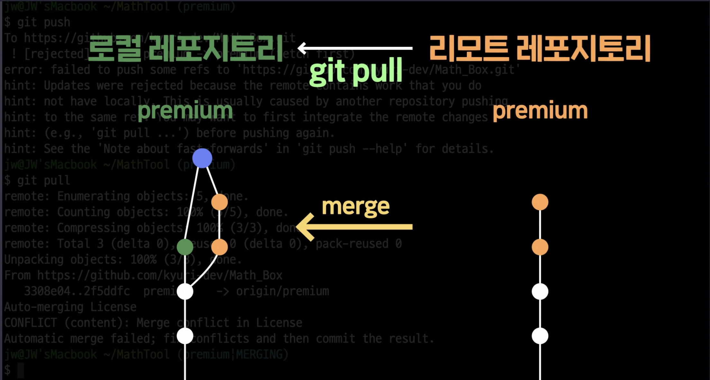

# Git으로 협업하기

## git push 전 git pull 하기

만약 내가 로컬 레포지토리를 수정하는 동안 다른 개발자가 리모트 레포지토리에 코드를 수정한 후 push하여 리모트 레포지토리에 변화가 생겼다면 바로 `git push`를 할 수 없다. 왜냐하면 내가 수정한 코드가 push되어 리모트 레포지토리에 반영될 경우 다른 개발자가 힘들게 반영한 코드가 전부 지워질 수 있기 때문이다.

위의 상황에서는 push전 우선 `git pull`을 진행해야한다.

위의 사진처럼 리모트 레포지토리의 내용을 내 로컬 레포지토리에 가져와 `merge`하는 과정까지가 `git pull`의 역할이기 때문에 pull을 할때 `conflict`가 발생할 수 있다.

즉, 다른 개발자가 이미 리모트 레포지토리에 새로운 사항을 push했다면 `git push`시 `conflict`가 발생하기 때문에 push전 먼저 `git pull`을 통해 다른 개발자가 리모트 레포지토리에 반영한 사항들을 내 로컬레포지토리에 가져와 merge한 이후 `git push`를 진행하면 된다. (아마 `git pull`을 하는 대부분에 과정에서 `conflict`가 발생할텐데 이전에 배운 내용처럼 파일을 수정하여 conflict를 해결한 후 push를 해주면 된다.)
