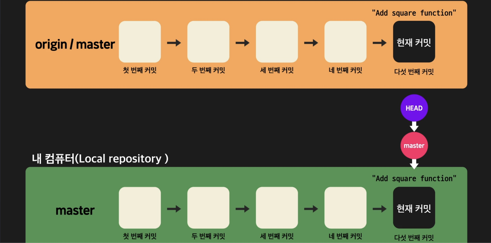
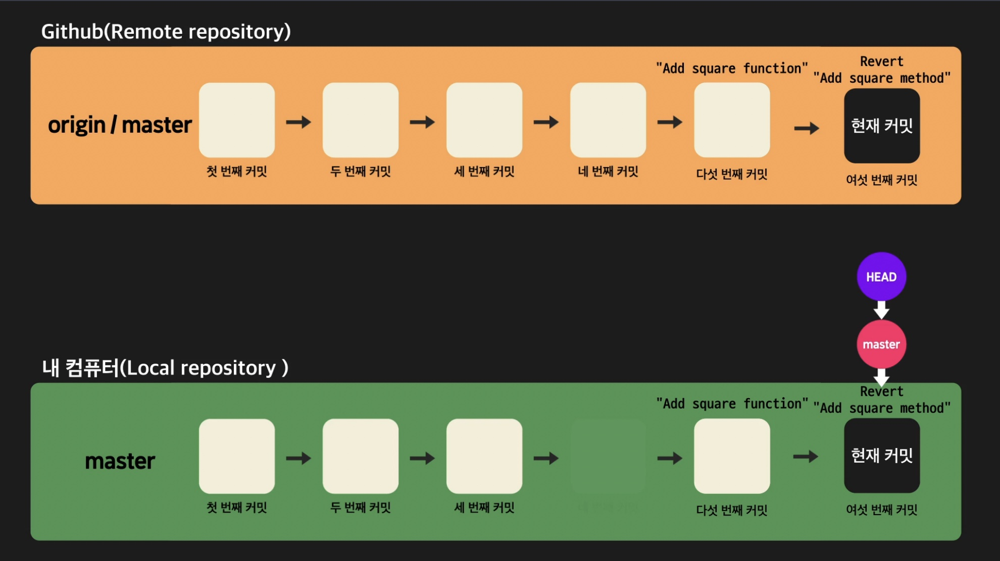
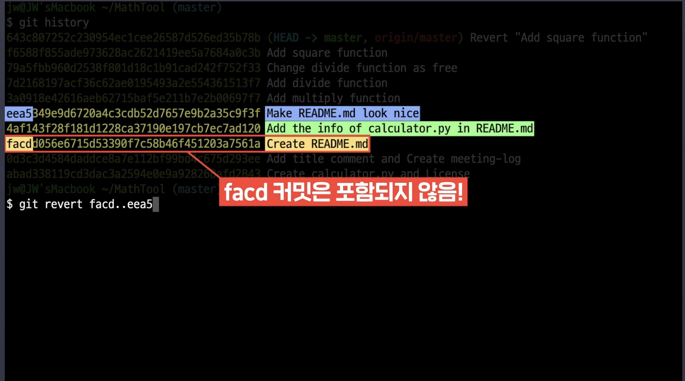
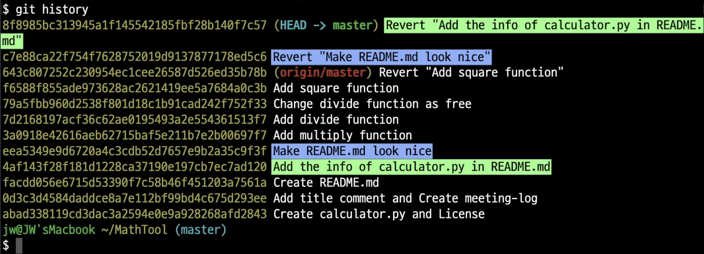
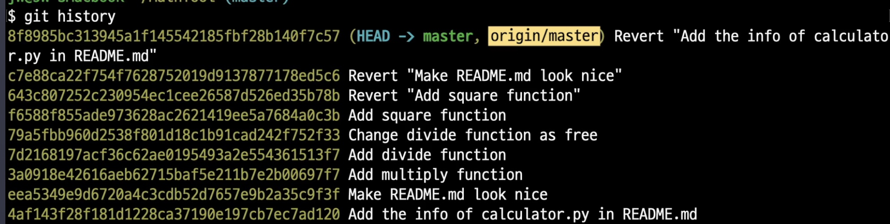

# Git으로 협업하기

## git push 전 git pull 하기

만약 내가 로컬 레포지토리를 수정하는 동안 다른 개발자가 리모트 레포지토리에 코드를 수정한 후 push하여 리모트 레포지토리에 변화가 생겼다면 바로 `git push`를 할 수 없다. 왜냐하면 내가 수정한 코드가 push되어 리모트 레포지토리에 반영될 경우 다른 개발자가 힘들게 반영한 코드가 전부 지워질 수 있기 때문이다.

위의 상황에서는 push전 우선 `git pull`을 진행해야한다.


위의 사진처럼 리모트 레포지토리의 내용을 내 로컬 레포지토리에 가져와 `merge`하는 과정까지가 `git pull`의 역할이기 때문에 pull을 할때 `conflict`가 발생할 수 있다.

즉, 다른 개발자가 이미 리모트 레포지토리에 새로운 사항을 push했다면 `git push`시 `conflict`가 발생하기 때문에 push전 먼저 `git pull`을 통해 다른 개발자가 리모트 레포지토리에 반영한 사항들을 내 로컬레포지토리에 가져와 merge한 이후 `git push`를 진행하면 된다. (아마 `git pull`을 하는 대부분에 과정에서 `conflict`가 발생할텐데 이전에 배운 내용처럼 파일을 수정하여 conflict를 해결한 후 push를 해주면 된다.)

## git fetch

만약 위에서 말한대로 `git pull`을 하는 과정에서 `merge`는 하지 않고 딱 브랜치를 가져오는 단계까지만 진행하기 위해선 `git fetch` 명령어를 사용하면 된다. 이는 리모트 레포지토리에 있는 브랜치의 내용을 일단 가져와서 살펴본 후에 머지하고 싶을 때 사용한다. (즉, `git pull`을 하게 될 내용이 조금 의심스러운 상황에 사용한다.)

이렇게 `git fetch`를 통해 만약 리모트 레포지토리의 브랜치에 문제가 있음을 확인한다면 이를 해결할 수 있는 방법이 2가지 있는데

1. 잘못된 코드를 추가한 개발자에게 함수를 지우고 다시 리모트 레포지토리에 올려달라고 하기
2. 잘못된 부분을 직접 해결하고 다시 `git push`하기

이다.

- `git fetch`를 사용한 경우 `git diff` 명령어를 통해 두 브랜치를 비교하며 확인하면 편리하다. (`git diff`는 커밋간의 차이뿐 아니라 브랜치간의 차이도 보여준다.)

정리히자면,

`git pull`은 `git fetch` + `merge`가 합쳐진 과정이며,

`git pull`은 리모트 레포지토리의 브랜치를 검토할 필요없이 바로 합치고 싶을때,

`git fetch`는 리모트 레포지토리의 브랜치를 검토해야할 때 사용한다.

## git blame

`git blame` 명령어를 사용하면 어떤 파일의 특정 코드를 누가 작성했는지 찾아낼 수 있다.

```
git blame [파일 명]
```

다음 명령어를 치면 해당 파일의 커밋 과정이 나타나는데 여기에는 커밋 아이디, 커밋한 사람, 커밋 날짜, 커밋 내용 등이 나타난다.

또한 목록 중 어떤 커밋을 좀 더 상세히 보고싶다면 아래 명령어를 사용하면 된다.

```
git show [해당 커밋 아이디]
```

## 이미 remote repository에 올라간 커밋 취소

만약 `remote repository`에 push한 내용을 빼고 싶다면 어떻게 하면 될까?

해당 코드를 삭제한 후 다시 push 할 수도 있지만, `git revert` 명령어를 사용해 좀 더 쉽게 처리할 수 있다.

```
git revert [되돌리고 싶은 커밋의 커밋아이디]
```

해당 명령어를 사용하면 해당 커밋의 내용을 원래대로 되돌리고 되돌린 내용을 다시 커밋하게 된다. 그리고 다시 `git push`를 하게 되면 remote repository에서 해당 내용을 지울 수 있는 것이다.

그렇다면 굳이 `git revert`말고 `git reset`을 사용하면 되지 않을까? 라고 생각할 수 있지만 다음의 내용 때문에 `git revert`를 사용해야 한다.

아래와 같은 상황을 가정하자.



이 상태에서 `git reset`을 사용할 경우, HEAD가 가리키던 master 브랜치가 직전 커밋인 '네 번째 커밋'을 가리키게 되고 이렇게 되면 리모트 레포지토리에 더 최신 커밋이 존재하기 때문에 `git push`를 할 수가 없다. (`git pull`을 해야 가능)

하지만 `git revert` 사용시 새로운 커밋이 생기고 로컬 레포지토리가 리모트 레포지토리보다 최신이기 때문에 `git push`가 가능해지게 된다. 즉 push를 하게 되면 아래와 같은 상태가 된다.



즉, 네 번쨰 커밋과 여섯 번째의 커밋의 결과물은 같지만 이미 리모트 레포지토리의 다섯 번째 커밋의 결과물이 올라와있고 이 때문에 `git reset` 후 push를 할 수 없게 된다. 따라서 이와 같은 이유로 `git revert`를 사용해야 한다.

## 여러 커밋 취소

위에서 배운 `git revert`를 통해 하나씩이 아닌 좀 더 넓은 범위의 커밋을 취소할 수 있다.

```
git revert [해당 커밋 다음 커밋부터]..[해당 커밋까지]
```

위의 명령어를 사용하면 되는데, 아래 사진을 보자.



위의 명령어처럼 입력할 경우 'facd' 커밋의 다음 커밋부터 'eea5'커밋 까지 최신 커밋부터 커밋을 취소한다.

명령어 실행 후 결과인 아래 사진을 보자.



커밋 히스토리를 보면 커밋했던 순서와는 거꾸로 즉, 가장 최근에 한 커밋부터 revert된 것을 확인할 수 있다.

이 상태에서 코드를 `git push`하면, 아래 사진처럼 로컬 레포지토리에서 범위적으로 커밋을 취소한 후 이를 리모트 레포지토리에 반영할 수 있다.



## 커맨드 정리

- `git fetch` : 로컬 레포지토리에서 현재 HEAD가 가리키는 브랜치의 업스트림(upstream) 브랜치로부터 최신 커밋들을 가져옴(가져오기만 한다는 점에서, 가져와서 머지까지 하는 `git pull`과는 차이가 있음)
- `git blame` : 특정 파일의 내용 한줄한줄이 어떤 커밋에 의해 생긴 것인지 출력
- `git revert` : 특정 커밋에서 이루어진 작업을 되돌리는(취소하는) **커밋을 새로 생성** (이전 커밋으로 돌아가는 `git reset`과는 다르게 새로운 커밋을 생성하므로 즉, 로컬 레포지토리가 리모트 레포지토리보다 최신이므로 해당 명령어 이후 `git push`가 가능)
