# 브랜치

## 브랜치(branch)란?

`브랜치(branch)`란 '하나의 코드 관리 흐름'으로 나뭇가지라는 뜻을 가지고 있다. 여기서 나뭇가지란 git은 맨 처음 커밋인 root commit을 시작으로 가지가 갈라지는 나무 모양을 하고있는데 이 가지 하나하나를 브랜치라고 생각하면 된다. 예를 들어 하나의 프로젝트에서 유료버전과 무료버전을 제공할때 이를 따로따로 만들기 보다는 유료, 무료로 브랜치를 2개로 나눈 후 이 안에서 또 브랜치를 나눠가며 만드는 것이 효율적이다.

처음 커밋을 하게 되면 `메인(master) 브랜치`위에 있게되는데 이는 레포지토리를 만들고 커밋을 하면 자동으로 생기는 기본 브랜치이다.

브랜치를 만들기 위한 명령어는 아래와 같다.

```
git branch [브랜치 명]
```

위처럼 브랜치를 만들면 지금까지 작업한 내용들이 모두 해당 브랜치에도 속하게된다. 브랜치를 만들고 그 위에서 작업하기 위해서는 반드시 아래 명령어를 통해 만든 브랜치로 먼저 이동을 해야한다.

```
git checkout [브랜치 명]
```

`git status` 명령어를 통해서 현재 브랜치 위치를 파악할 수 있다.

## 브랜치 다루기

- `git branch` : 브랜치 조회
- `git branch [브랜치 명]` : 브랜치 생성
- `git branch -d [브랜치 명]` : 해당 브랜치 삭제
- `git checkout -b [브랜치 명]` : 브랜치를 새로 만들고 그 브랜치로 이동 (보통 브랜치를 만들고 바로 이동해서 작업하므로 자주 쓰이는 명령어)

## 브랜치 merge

만약, 무료 버전과 유료 버전을 브랜치로 나눠 작업하는 경우에 무료 버전의 모든 기능이 유료 버전에서도 있어야한다면 무료 버전에 기능들을 유료 버전의 브랜치로 이동한 후 복사하는 방법을 생각할 수 있다. 하지만 git에서는 다른 브랜치에서 한 커밋을 그대로 다른 브랜치에도 반영하는게 가능하며 이러한 작업을 `branch merge`라고 한다.

`merge`기능을 사용하기 위해서는 아래와 같은 명령어를 사용하면 된다.

```
git merge [반영하고 싶은 브랜치 이름]
```

즉 a 브랜치에서 `git merge b` 명령어를 사용할 경우 '현재 위치인 a 브랜치에 b 브랜치를 합치겠다' 라는 의미가된다. (먼저 작업할 브랜치로 이동한 후, 합병할 브랜치를 명령어로 머지)

명령어 입력 후 나타나는 텍스트 에디터에서 `:wq`를 통해 저장하면 머지가 되었다는 문구가 출력되며 머지가 완료된다.

## conflict

머지를 진행할 경우 파일간 충돌이 일어날 수 있는데 이를 `conflict`라고 한다. 예를 들어, 각각의 브랜치에서 같은 함수를 서로 다른 이름으로 표기했을 경우 이와 같은 일이 일어날 수 있는데 이러한 상황에서 두 브랜치를 merge하려할 경우 git이 둘 중 무엇을 반영해야할지 알 수 없으므로 `conflict`가 발생하게 된다.


위를 보면 HEAD 부분은 현재 작업하고 있는 브랜치이고, 가운데 ===== 선을 기준으로 아래 부분은 합병할 브랜치내에서 충돌이 일어난 부분이다.

이를 해결하기 위해서는

1. 컨플릭트가 발생한 파일을 열고
2. 머지의 결과가 되었으면 하는 모습대로 코드를 수정한 후
3. 커밋을 진행

하면된다.

또한, conflict를 해결하고 싶지 않고 '머지를 시도하기 이전의 상태로 돌아가고 싶다'라고 한다면 아래 명령어를 통해 merge 자체를 취소할 수 있다.

```
git merge --abort
```

conflict 발생시 위의 명령어를 실행하면 해당 브랜치에서 작업 하던 원래 모습 그대로 즉, 머지를 시도하기 이전 모습으로 파일이 돌아오는 것을 확인할 수 있다.

보통 꼭 머지를 해야하는 상황이라면 conflict를 해결하고 커밋을 하는게 정석이지만

- `conflict`가 발생한 파일이 너무 많아 `conflict`를 최소화할 수 있는 방식으로 파일들을 다시 수정하고 커밋한 다음 `merge`를 하고 싶은 경우
- 굳이 지금이 아니더라도 좀 더 나중에 `merge`해도 되는 경우

라면 위의 명령어를 통해 `merge` 자체를 취소해도 된다.

실무에서는 여러 개의 파일을 수정하다보니 머지할 때 conflict도 파일 여러 개에서 나는 경우가 많은데 이럴때도 파일 하나일때와 마찬가지로 원리는 같다. 즉,

- 파일 하나씩 `conflict`를 해결하고 `git add [파일 이름]` 커맨드로 하나씩 `staging area`에 올리거나(중간중간에 `git status` 커맨드로 현재 상태 확인하면서)
- 모든 파일들의 `conflict`를 다 해결하고, `git add .` 커맨드로 한번에 staging area에 올린 후

커밋을 하면 된다.

## remote repository의 브랜치

처음 깃허브를 시작할때

GitHub에서 Math_Box라는 리모트 레포지토리(remote repository)를 만들고 로컬 레포지토리(local repository)의 내용을 그 리모트 레포지토리에 보내기위해 아래와 같은 커맨드 2개를 실행했었는데

```
git remote add origin [주소]

git push -u origin master
```

그 의미를 알아보자.

### origin이란?

먼저 첫 번째 커맨드를 살펴보자.

```
git remote add origin [주소]
```

이 커맨드에서 `remote`는 리모트 레포지토리에 관한 작업을 할 때 쓰는 커맨드이며, 그 뒤의 `add`는 새로운 리모트 레포지토리를 등록하겠다는 뜻이다.

그 다음에는 `origin [주소]`인데, 이 표현은 해당 주소 리모트 레포지토리를 `origin`이라는 이름으로 등록하겠다는 뜻이다.

그러니까 이 커맨드를 실행하고 나면 해당 주소를 `origin`으로 간단하게 나타낼 수 있게 되는 것인데, 왜 하필 origin이라고 하는 걸까?

origin이 아닌 원하는 다른 단어를 입력해도 큰 상관은 없지만 Git에서는 리모트 레포지토리를 최초로 추가할 때 origin이라는 이름으로 가리키는 것이 관례화되어있다.

origin은 ‘근원’, ‘기원’이라는 뜻을 가지는데 다른 사람의 리모트 레포지토리를 자신의 컴퓨터로 가져와서 작업을 하는 사람의 입장에서는 리모트 레포지토리가 프로젝트의 근원이 되는 존재이기 때문에 그런 관습이 생긴 것으로 추측된다.

사실 아래와 같이

```
 git remote add hello [주소]
```

처럼 origin 대신 우리가 원하는 단어(hello)를 써도 상관은 없지만, 되도록 관례에 따라 origin을 써주는 게 좋다.

### Remote Repositoy에 있는 브랜치

이제 두 번째 커맨드를 살펴보자.

```
git push -u origin master
```

이 커맨드의 뜻은 현재 로컬 레포지토리에 있는 `master` 브랜치의 내용(=master 브랜치와 관계된 모든 커밋들)을
`origin`이라는 리모트 레포지토리로 보낸다는 뜻이다.

이때 같은 이름의 브랜치로 전송하게 되는데 만약 `origin`이라는 리모트 레포지토리에 `master` 브랜치가 없으면 `master` 브랜치를 새로 생성하고 푸시한다.

그런데 여기서 옵션 `-u`는 무엇일까? `-u`는 `--set-upstream`이라는 옵션의 약자로, 해당 옵션을 주면
로컬 레포지토리에 있는 `master` 브랜치가
`origin`에 있는 `master` 브랜치를 `tracking(추적)`하는 걸로 설정된다.

`tracking`이라는 건 로컬 레포지토리의 한 브랜치가 리모트 레포지토리의 한 브랜치와 연결되어 그것을 계속 바라보는 상태가 되는 것이라고 생각하면 된다. 이렇게 맺어진 연결 상태를 `tracking connection`이라고 한다.

만약

로컬 레포지토리에 A라는 브랜치가 있고,
리모트 레포지토리에 B라는 브랜치가 있을 때
이런 `tracking connection`이 서로 맺어진 경우,
**B 브랜치를 A 브랜치의 `upstream branch`라고 합니다.**
지금은 구별하기 위해서 A와 B라고 표현했지만 보통은 같은 이름인 경우가 대부분이다.

이렇게 `tracking connection`이 한번 설정되고 나면, 사용자가 현재 `master` 브랜치에 위치해있을 때,

```
git push
```

라고만 써도 자동으로 리모트 레포지토리의 `master` 브랜치를 대상으로 `git push`가 동작하고,

```
git pull
```

라고만 써도 리모트 레포지토리의 `master` 브랜치를 대상으로 `git pull`이 동작한다.

사실 `--set-upstream(-u)` 옵션을 주지 않아도 그 후에 `git push`와 `git pull`을 할 수 있지만 맨 처음, 이 옵션을 주지 않으면 `tracking connection`이 없기 때문에 나중에 `git push`를 하고 싶을 때

```
git push origin master:master
```

이런 식으로 적어줘야 한다.

여기서 `origin`은 리모트 레포지토리를 나타내고,
`master:master`에서 더 먼저 나오는 master는 로컬 레포지토리의 master 브랜치(~에서)/더 뒤에 나오는 master는 리모트 레포지토리의 master 브랜치(~으로)를 나타낸다.
그러니까 `tracking connection`이 없으면 매번 이런 식으로 `git push`를 해줘야 한다. `git pull`도 마찬가지로 이런 식의 복잡한 표현이 필요하게 된다.

그러므로 그냥 처음부터 `tracking connection`을 설정하고 그 이후부터는 `git push`, `git pull`이라고만 써서 편하게 푸시와 풀을 하는 게 좋다.

### origin/master의 의미

위에서 살펴본대로 로컬 레포지토리의 master 브랜치, 리모트 레포지토리의 master 브랜치 이렇게 같은 이름이지만, 서로 다른 2개의 브랜치가 있다는 걸 알 수 있다.

그럼 리모트 레포지토리에 있는 master 브랜치는 어떻게 볼 수 있을까?이는 GitHub 페이지에서 보면 되지만 본인의 컴퓨터에서도 확인할 수 있는 방법이 있다. 잠깐 커밋 히스토리를 살펴보면


위 그림에서

`master`가 로컬 레포지토리의 master 브랜치를 나타내고,
`origin/master`가 리모트 레포지토리의 master 브랜치를 나타낸다.

위의 경우 로컬 레포지토리의 master 브랜치에서 여러 커밋을 했지만 그러고나서 `git push`를 하지 않아 `origin/master`가 `master`보다 이전의 커밋을 가리키고 있다.

## HEAD와 bracn의 관계

HEAD와 마찬가지로 branch 역시 '어떤 커밋을 가리키는 존재'이다.

깃에서 처음 커밋을 하게 되면 마스터 브랜치가 해당 커밋을 가리키며 이후 커밋을 할때마다 해당 커밋을 가리키게 된다.


이전에 HEAD 역시 '어떤 커밋을 가리키는 존재'라고 설명했는데 이는 좀 더 정확히 말하면 HEAD는 branch를 가리키게 된다.


위의 사진을 보면 HEAD는 master branch를 통해 간접적으로 커밋을 가리키고 있는 것을 확인할 수 있다. 이후 커밋을 하면 master 브랜치는 해당 커밋을 가리키며 HEAD는 master 브랜치를 가리키게 때문에 HEAD 역시 해당 커밋을 가리키게 되는 것이다.

여기서 새로운 브랜치를 만들고 `git checkout`을 통해 해당 브랜치로 이동하게 되면 아래 사진처럼 HEAD가 해당 브랜치를 가리키게된다. 즉 `git checkout`은 HEAD가 가리키는 브랜치를 바꾸는 작업인 것이다.


이후 만든 새로운 브랜치에서 커밋을 하고 다시 checkout을 통해 HEAD를 master로 옮기면 아래 그림이 되는데

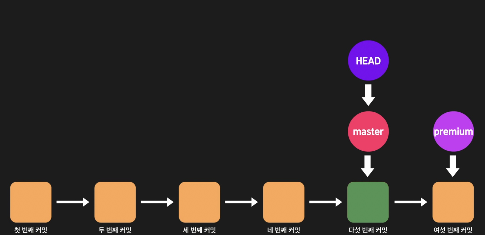

이후 새롭게 커밋을 하게 되면 커밋 히스토리의 흐름이 아래처럼 바뀌며 이를 `분기한다`라고 한다.


이후 각 브랜치에서 개별적으로 몇 번의 커밋을 더 진행한 후 이를 merge하면 아래와 같이 된다.

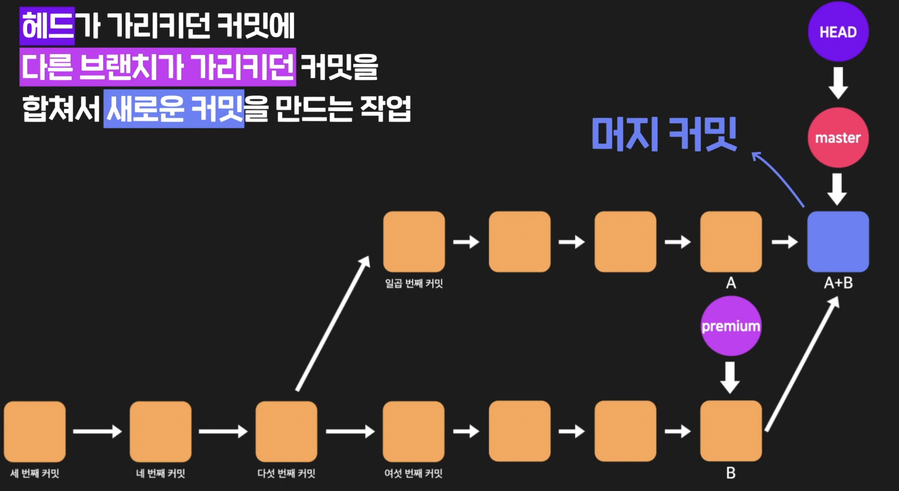

위를 보면 두 브랜치를 merge하면 '머지 커밋'이 생기게 된다. 즉 merge란 **헤드가 가리키던 커밋에 다른 브랜치가 가리키던 커밋을 합쳐 새로운 커밋을 만드는 작업**임을 알 수 있다.

## git reset

위의 내용을 정리하면

- 사실 브랜치(branch)는 커밋을 가리키는 존재(포인터)이고,
- HEAD는 이런 브랜치를 통해 커밋을 간접적으로 가리키는 존재(포인터)

인데 설명한 내용을 토대로 `git reset` 명령어를 살펴보자.

### git reset시 HEAD의 변화

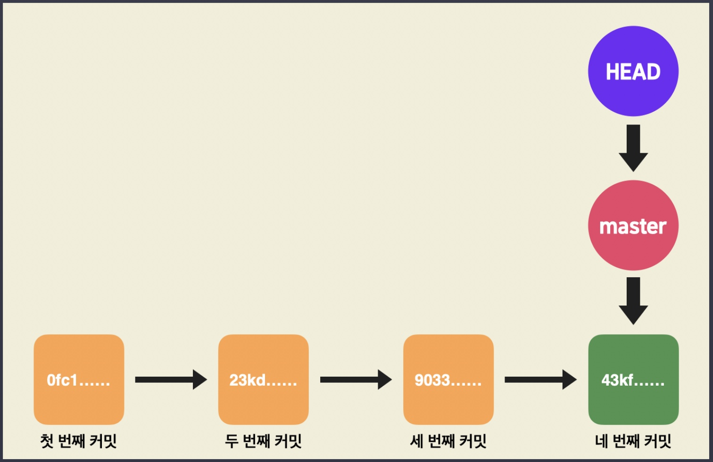

위와 같이 커밋이된 상황을 가정하자. 이 상태에서

```
git reset [옵션] 9033
```

명령을 실행할 경우 아래와 같은 결과가 된다.

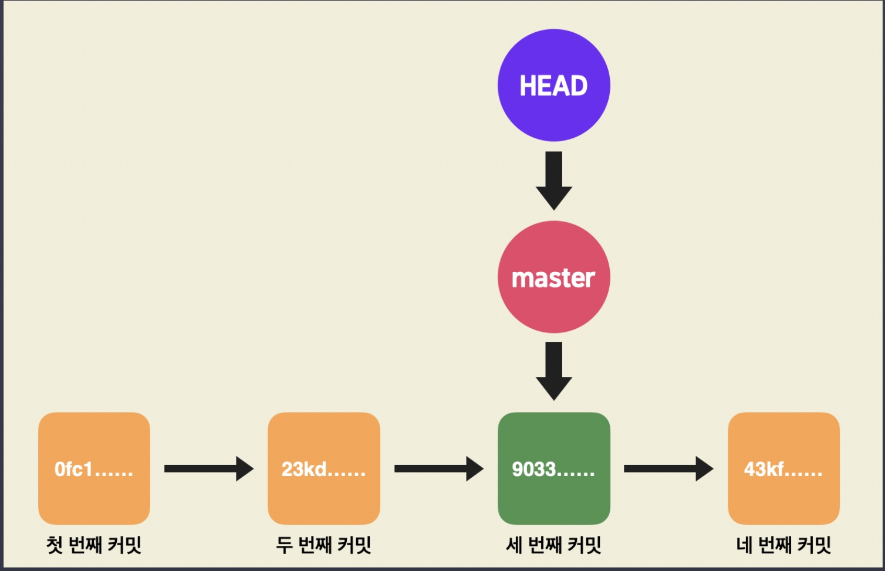

이를 살펴보면 HEAD는 여전히 master 브랜치를 가리키며 대신 master 브랜치가 가리키던 커밋이 바뀌었는데 이를 정리하면 **`git reset`커맨드를 사용할 경우**

1. HEAD는 여전히 같은 브랜치를 가리키고,
2. HEAD가 가리키는 브랜치가 다른 특정 커밋을 가리키게 된다.
3. 이 때문에 결국 HEAD가 간접적으로 가리키던 커밋도 바뀌게 되는 것.

### git reset 이후 커밋이 사라질까?

결론적으로 말하면 그렇지 않다. 위에서 9033 커밋 아이디로 reset 이후 네 번째 커밋인 43kf 커밋은 그대로 남아있으며 `git reset`을 사용하면 과거의 커밋으로만 가는 것이 아니라 현재 커밋 이후의 커밋으로도 리셋이 가능하다. 예를 들어 위의 사진에서 다시

```
git reset 43kf
```

을 실행할 경우 다시 처음 상태인 아래 사진과 같은 상태가 된다.


정리하자면,

1. 과거의 커밋으로 git reset을 한다고 그 이후의 커밋들이 삭제되는 게 아니다.
2. git reset은 과거의 커밋뿐만 아니라 현재 HEAD가 가리키는 커밋 이후의 커밋으로도 할 수 있다.

## git reset과 git checkout의 차이

위에서 `git reset`을 사용할때, HEAD가 가리키는 브랜치를 통해서 간접적으로 커밋을 가리킨다는 사실을 알게되었는데 HEAD 자체가 가리키는 것을 바꿀 수도 있다. 즉 HEAD가 아예 커밋을 직접적으로 가리키게 하는 것이 가능한데 `git checkout` 명령어를 사용하면 된다.

예를 들어, 아래 상태에서


`git checkout 9033`을 사용할 경우

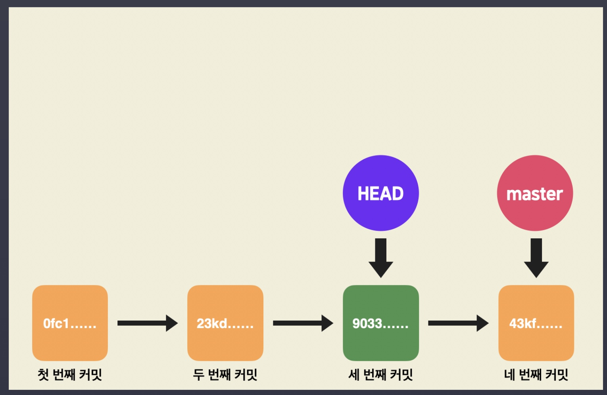

위와 같이 HEAD가 직접 9033 커밋을 가리키고 있는 상태가 된다.

이렇게 브랜치를 통해 커밋을 가리키는 것이 아닌 본인이 직접 커밋을 가리키고 있는 상태의 HEAD를 가리키는 말을 `Detached HEAD`라고 한다.

이렇게 HEAD가 특정 커밋을 직접 가리키게 하는 이유는 여러가지가 있을 수 있는데, 그 중에서 주된 이유 한 가지는 바로 과거의 특정 커밋에서 새로운 브랜치를 만들고 싶을 때이다.

예를 들어 지금 위의 그림과 같이 Detached HEAD인 상태에서

```
git branch premium
```

으로 premium 브랜치를 새로 만들면 아래 그림과 같은 결과가 됩니다.

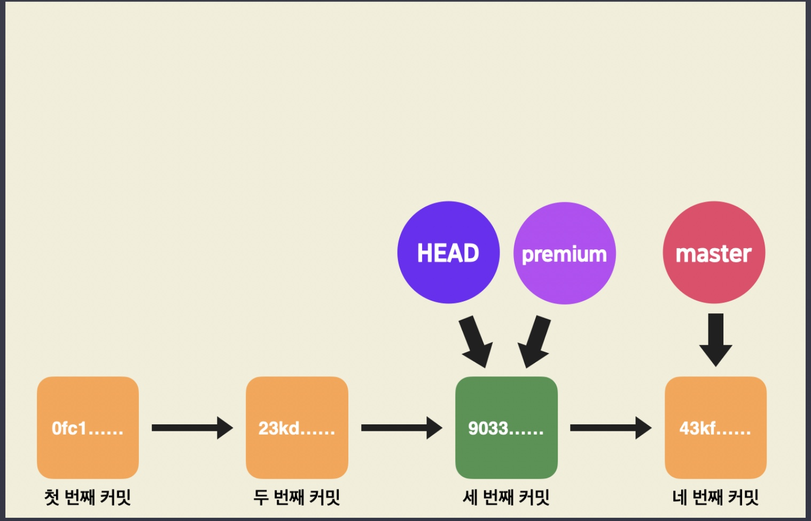

지금 premium이라는 브랜치가 새로 생성되었고
premium 브랜치는 HEAD가 가리키던 커밋을 똑같이 가리키게 된다.
또한 `git checkout` 커맨드로는 HEAD가 커밋을 직접적으로 가리키게 할 수도 있을 뿐만 아니라 브랜치를 직접 가리키게 만들 수도 있다.
예를들어, HEAD가 브랜치를 가리키도록 하기 위해 이렇게 쓰면

```
git checkout premium
```

HEAD가 premium 브랜치를 가리키게 됩니다.

그러니까 아래 그림과 같이 이제 HEAD가 premium 브랜치를 가리키게 되는 것이다. 그리고 이것은 곧 Detached HEAD 상태에서 벗어나 HEAD가 브랜치를 가리키는 정상적인 상태로 돌아오는 것이기도 하다.

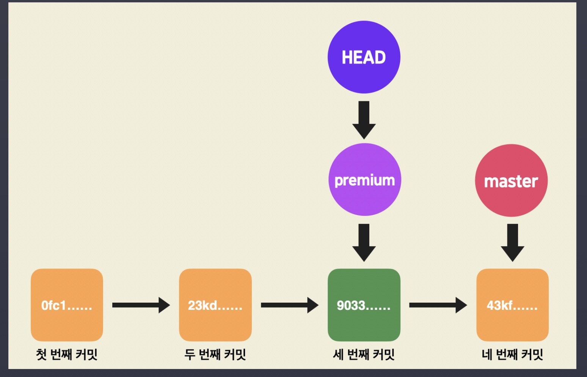

그리고 이렇게 HEAD가 premium 브랜치를 가리키는 상태일 때 새 커밋을 하면

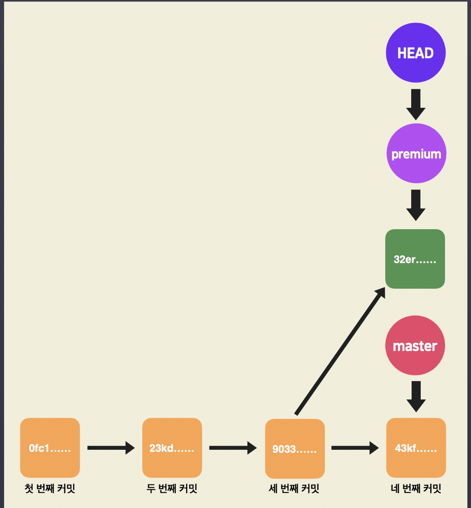

위와 같이 premium 브랜치로 master 브랜치와 다른 새로운 코드 관리 흐름을 가져갈 수 있게 된다.

방금 한 것처럼 특정 커밋을 시작점으로 하는 새로운 브랜치를 만들고 싶을 때 HEAD를 잠시 Detached HEAD 상태로 두는 경우가 많다.

이 내용을 정리하면,

1. `git checkout` 커맨드로는 HEAD가 직접적으로 가리키는 것을 바꿀 수 있고
2. `git checkout` 뒤에는 `커밋 아이디` 또는 `브랜치의 이름`을 줘서 HEAD가 직접 커밋을 가리키거나, 브랜치를 가리키도록 할 수 있다는 뜻이다.

그렇기 때문에 `git checkout [브랜치 명]` 명령어를 통해 브랜치를 변경할 수 있었던 것이며 이를 다시 정리하면 아래와 같다.

```
git checkout master
```

이 커맨드의 뜻은

= master 브랜치로 이동하라

= HEAD가 master 브랜치를 가리키도록 하라

= HEAD가 master 브랜치가 가리키던 커밋을 간접적으로 가리키게 됨으로써

= working directory의 내부도 그 커밋에 맞게 변함으로써

= master 브랜치로 이동한 것을 사용자는 실감하게 됨

### git reset vs git checkout

`git reset`

1. HEAD가 가리키던 브랜치가 다른 커밋을 가리키도록 한다
2. HEAD도 결국 간접적으로 다른 커밋을 가리키게되는 효과가 생긴다

`git checkout`

1. HEAD 자체가 다른 커밋이나 브랜치를 가리키도록 한다
2. 브랜치를 통하지 않고, 커밋을 직접적으로 가리키는 HEAD를 Detached HEAD라고 한다

## 커밋을 만들지 않는 merge

위에서 머지를 하면 새로운 커밋이 생기며 이를 `머지 커밋(merge commit)`이라고 부른다고 했다. 하지만 머지를 한다고 반드시 새로운 커밋이 생기는 것은 아니다.
아래 그림을 보면


마스터 브랜치에 있는 상태에서

```
git merge premium
```

명령어를 실행할 경우 아래 그림처럼 premium 브랜치가 가리키던 커밋을, master 커밋도 똑같이 가리키게 된다.

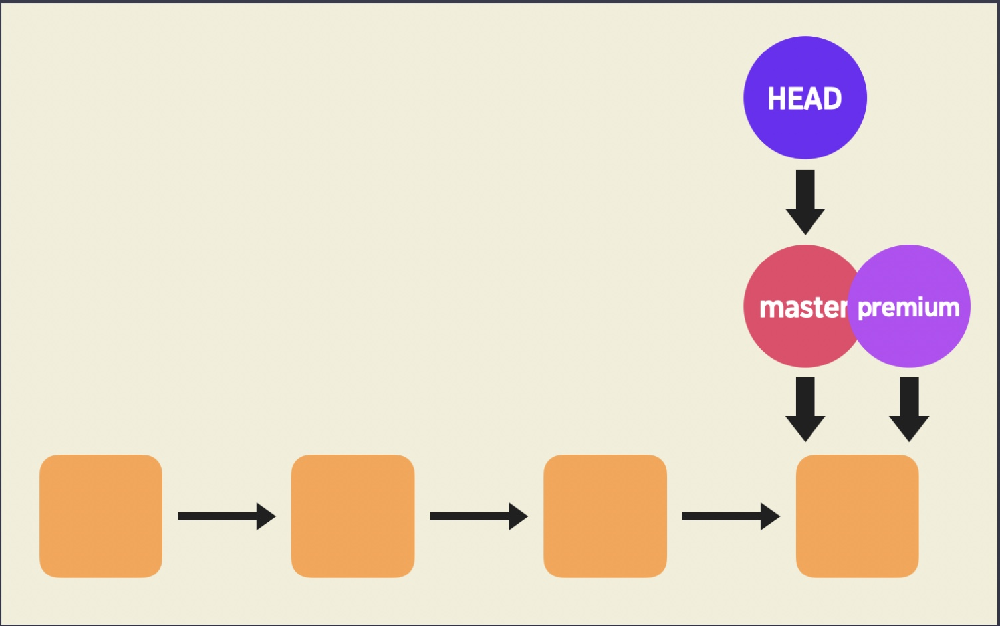

이렇게 새로운 커밋이 생기는 게 아니라 단지 브랜치가 이동하게 되는 머지를 `Fast-forward 머지`라고 한다. `Fast-forward`는 어떤 영상이나 소리를 빨리감기(앞으로 감기)한다는 뜻인데, 지금 master 브랜치가 더 최신 커밋으로 이동하는 모습이 꼭 빨리감기같다고 할 수 있기 때문이다.

그렇다면 어떤 경우에 이렇게 되는 걸까?

커밋 히스토리에서 같은 선(line) 상에 있는 브랜치를 머지할 때 Fast-forward 머지가 이루어진다. 방금 전에는 master 브랜치와 premium 브랜치가 둘다 같은 선 상에 있었기 때문에 이런식으로 머지가 진행된 것이다.

만약 아래 그림과 같이 두 브랜치가, 커밋 히스토리 상에서 분리된 2개의 선에 각각 존재할 때 머지를 하면 머지 커밋이 새롭게 생기게 된다.

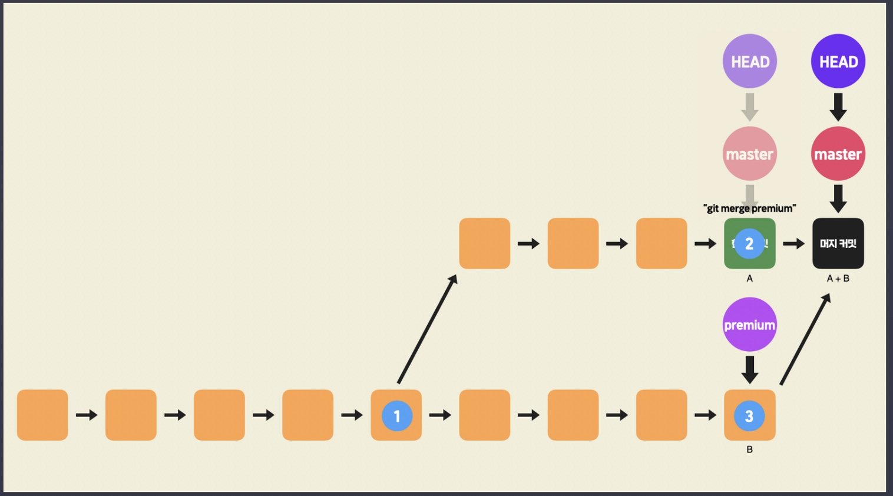

그리고 이런 머지는 `3-way merge`라고 한다. 이름이 3-way인 이유는 지금 1, 2, 3 표시한 3가지 커밋을 고려해서 머지를 하기 때문인데,

(1)번 : 두 갈래로 갈라지기 전 공통 조상이 되는커밋
(2)번 : 한 브랜치가 가리키는 커밋
(3)번 : 다른 브랜치가 가리키는 커밋
`3-way merge`는 자신만의 방식을 갖고 이 3가지 커밋을 기준으로 머지 커밋을 자동으로 만들어낸다.

한 상황별로 그 결과가 정리하면

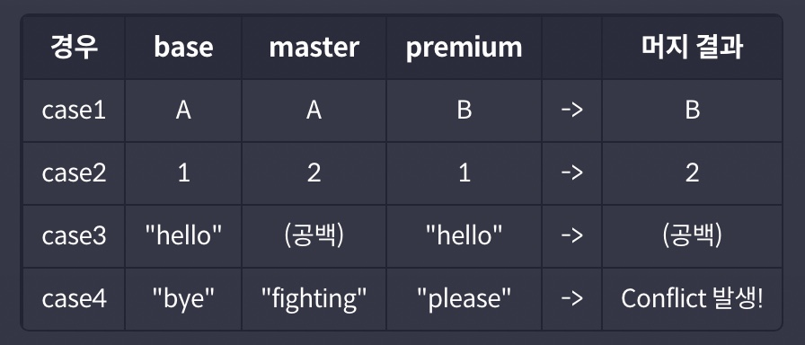

각 컬럼(column, 열)에 대해서 설명하기 위해 지금 모든 커밋에 sample.txt 파일이 있다고 가정하자.

1. base : 두 브랜치의 공통 부모 커밋의 sample.txt 파일의 내용 중 일부 = 위 그림 (1)번
2. master : 마스터 브랜치의 최신 커밋의 sample.txt 파일의 내용 중 일부 = 위 그림 (2)번
3. premium : 프리미엄 브랜치의 sample.txt 파일의 내용 중 일부 = 위 그림 (3)번
4. 머지 결과 : master 브랜치에서 premium 브랜치를 머지했을 때의 최종 결과
   자, 각각의 경우에 왜 표와 같은 머지 결과가 생기는 건지 설명해드릴게요.

**case1**

지금 base가 A이고, master는 A, premium은 B이다. 그럼 base를 기준으로 볼 때, master에서는 변화가 없었지만, premium에서는 A가 B로 변경된 상태이다. `3-way merge`는 base에서 변화가 발생한 것을 우선 채택한다. 따라서 머지 결과는 'B'가 된다.

**case2**

지금 base가 1이고, master는 2, premium은 1이다. 이 경우에도 base에서 변화가 발생한 2가 머지 결과가 된다.

**case3**

지금 base가 "hello"이고, master는 "hello"를 삭제한 공백 상태, premium은 "hello"이다. "hello"를 삭제해서 공백 상태가 된 것이 변화가 더 발생한 것이기 때문에 머지 결과는 공백이 된다.

**case4**

지금 base가 "bye", master가 "fighting", premium이 "please" 이다. 이전 경우들과 달리, 둘 다 base 때와는 다른 변화가 일어났는데 이렇게 두 브랜치에서 다 변화가 있을 때 Git은 어떤 변화를 선택해야할까? 정답은 바로 'Git도 모른다' 인데 사실, 바로 이런 경우에 이전에 배운 `Conflict`가 발생한다. 이전에 `Conflict`가 발생했을 때 그것을 해결하고 머지를 마무리했던 것이 이러한 경우이다.

base때의 내용과 비교했을 때 달라진 부분이 있는 것이 우선시되고,
두 브랜치에서 둘다 변화가 일어났을 때는 `Conflict`를 발생시켜서 사용자가 스스로 선택하게끔 한다는 걸 기억하면 된다.

## 커맨드 정리

- `git branch [새 브랜치 이름]` : 새로운 브랜치를 생성
- `git checkout -b [새 브랜치 이름]` : 새로운 브랜치를 생성하고 그 브랜치로 바로 이동
- `git branch -d [기존 브랜치 이름]` : 브랜치 삭제
- `git checkout [기존 브랜치 이름]` : 그 브랜치로 이동
- `git merge [기존 브랜치 이름]` : 현재 브랜치에 다른 브랜치를 머지
- `git merge --abort` : 머지를 하다가 conflict가 발생했을 때, 일단은 머지 작업을 취소하고 이전 상태로 돌아감
