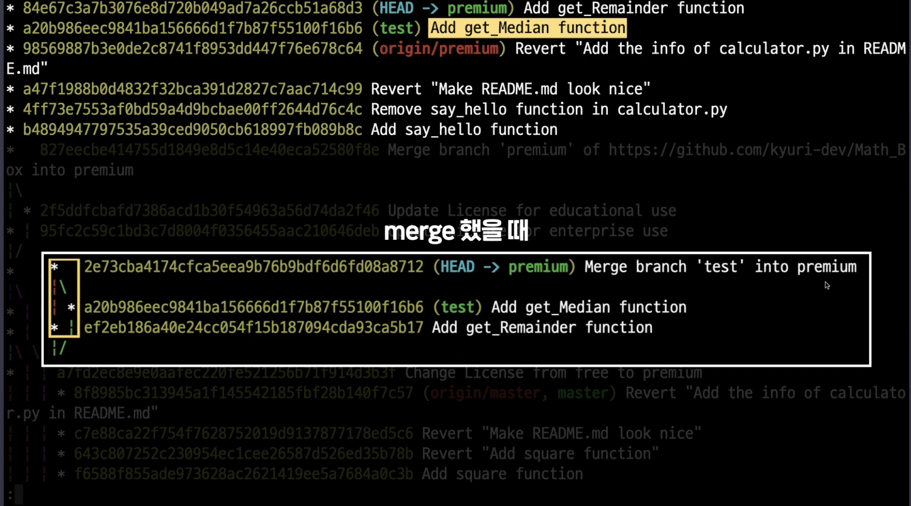
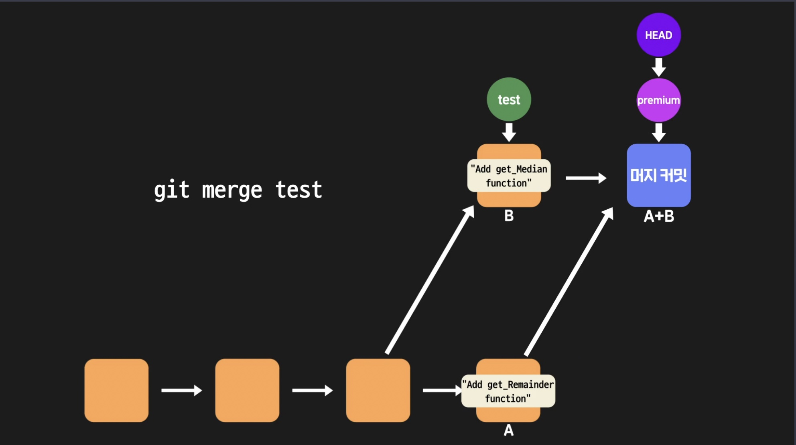
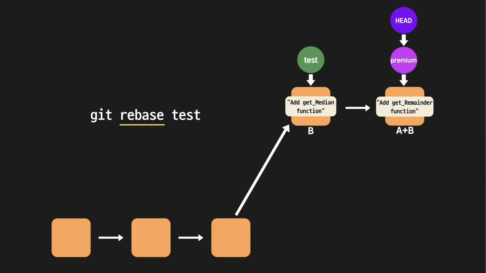

# Git 자유자재로 활용하기

## git reset후 돌아오려면?

`git reset`으로 과거의 커밋으로 이동하면 그 사이의 커밋들은 사라지는 것일까?

**결론적으론 그렇지 않다.** 단지 HEAD가 가리키던 브랜치가 새로운 커밋을 가리키는 것일뿐 커밋들이 삭제되는 것은 아니다. 그렇다면 다시 원래의 커밋으로 reset하려면 어떻게 해야할까?

```
git reset [옵션] [커밋 아이디]
```

를 통해 최신 커밋으로 리셋할수도 있지만 이렇게 하기 위해선 `git history`로 커밋 아이디를 알고있어야 한다. 이보단 아래 명령어를 사용하면 수월한데

```
git reflog
```

`reflog`는 `refernce log`의 줄임말인데 이는 '헤드가 이때까지 가리켜왔던 커밋'들을 기록한 정보이다. 해당 명령어를 실행하면 헤드가 가리켜왔던 커밋들의 리스트가 쭉 출력되는데, 이를 확인하고 마찬가지로

```
git reset [옵션] [커밋 아이디]
```

명령어를 실행하면 된다.

## 커밋 히스토리를 보는 다양한 방법

이전에 명시한대로 커밋의 로그를 한줄로 정리하여 보기 위해선

```
git log --pretty=oneline
```

명령어를 실행하면되고 지금까지는 이를 `git history`로 aliasing 하여 사용해왔다. 이를 통해 출력되는 결과물을 보면 현재 브랜치에 해댱하는 내용들만 출력되는데 만약 현재 브랜치뿐만이 아닌 전체 브랜치에 관한 모든 내용을 확인하기 위해선 뒤에 `--all` 옵션을 추가로 붙여주면 되는데 즉,

```
git log --pretty=oneline -all
```

이런식으로 사용하면 된다. 실행하면 모든 브랜치에 대한 커밋 히스토리를 확인할 수 있지만 각 브랜치에 대한 커밋 로그들을 구분하여 보기가 힘들다는 단점이 있다. 이를 해결하기 위해서 git은 `--graph` 옵션을 제공하는데, 이를 활용하면 커밋 히스토리가 각 브랜치와의 관계가 잘 드러나도록 그래프 형식으로 출력이된다.


위의 사진을 보면 별표 하나가 각각 커밋 하나씩이며, 갈라진 부분은 여러 브랜치로 코드 관리 흐름이 갈라지는 모습이다. 반대로 두 선이 하나로 합쳐지는 모습은 merge되는 부분이다.

위의 사진처럼 해당 명령어를 사용하면 커밋과 브랜치의 흐름을 좀 더 정확하게 볼 수 있기 때문에 자주 쓰이는 옵션 중 하나이다.

## Git GUI 환경에서 사용

지금까지 CLI(Command Line Interface) 환경에서 Git을 사용했지만
GUI(Graphic User Interface) 환경에서 Git을 사용하도록 도와주는 프로그램도 있다. 대표적인 프로그램들은 GitKraken, Sourcetree 등이며 이 중에서도 꽤 널리 쓰이고 있는 프로그램은 **Sourcetree**이다.

Sourcetree는 Atlassian이라는 회사에서 만든 프로그램으로 깔끔하고 직관적인 UI로 유명한데, 아래 링크에서 다운받을 수 있다.

- https://www.sourcetreeapp.com/

이런 GUI 프로그램을 사용하면 터미널에 Git 커맨드를 치지 않아도 Git을 사용할 수 있으며 CLI 환경에서 필요했던 커맨드를 몰라도 Git을 사용할 수 있다. 뿐만 아니라 커밋 히스토리를 터미널에서 봤던 커밋 히스토리보다 더 깔끔한 모습으로 볼 수 있다는 장점도 있다.

하지만 아직 Git 커맨드를 사용하는 방법도 모르는데 바로 이런 프로그램을 사용하는 건 좋지 않다. 일단 커맨드부터 하나씩 배워야 나중에 이런 프로그램을 사용하다가 문제가 생기더라도 현명하게 대처할 수 있기 때문이다.
어느 정도 Git 커맨드에 익숙해진다면 그 후에는 GUI 프로그램도 한번 사용해보면 좋으며 특히, Sourcetree는 실무에서도 많이 쓰이는 프로그램이므로 혹시 Sourcetree를 좀더 제대로 배우고 싶으면 아래 문서를 참고하면 도움이 될 것이다.

- https://support.atlassian.com/bitbucket-cloud/docs/tutorial-learn-bitbucket-with-sourcetree/

또 만약 sourcetree가 아니더라도 아래 링크를 참고하여 원하는 GUI 프로그램을 사용해도 좋다.

- https://git-scm.com/downloads/guis

## git rebase vs merge

`git rebase [브랜치 명]`란 커밋을 재배치하는 것을 뜻하는데, 이는 **현재 위치한 브랜치의 베이스를 해당 브랜치로 재지정**한다는 의미이다. 아래 내용을 좀 더 참고하자.

merge의 경우에는 커밋을 해주지만 rebase의 경우에는 아래 명령어를 사용한다.

```
git rebase --continue
```

위 커맨드는 conflict가 발생해서 제대로 진행되지 못한 리베이스를 계속 진행하라는 의미이다.

해당 명령어를 입력하면 아래와 같은 상태가 되는데



머지했을때처럼 새로운 커밋이 생기는것이 아닌 원래 해당 브랜치에서 작업한 것처럼 보여지는데 이를 좀 더 쉽게 설명하기 위해 아래 사진을 참고하자.



우선 merge 한 경우인데, 이를 보면 새로운 머짓 커밋이 생기는 것을 볼 수 있다. 하지만 rebase를 할 경우는 아래와 같다.



위 사진을 보면 새로운 커밋이 생기는 것이 아닌 마치 preminum 브랜치가 'add get' 함수를 거쳐온 것 처럼 커밋 히스토리의 구조 자체가 바뀌게 된다. 즉, 위의 상황에서는 rebase의 말 뜻 그대로 test 브랜치가 가리키는 커밋을 preminum 브랜치가 자신의 새로운 base로 만드는 것이다.

이를 정리하면 merge와 rebase의 차이는 다음과 같다.

1. rebase는 merge와 달리 새로운 커밋을 만들지 않는다.
2. rebase로 만들어진 커밋 히스토리는 merge로 만들어진 커밋 히스토리보다 좀 더 깔끔
3. rebase나 merge나 결과물은 같음 (커밋 히스토리를 깔끔하게 만들기 위해선 rebase 사용)

`merge` : 두 브랜치를 합쳤다는 정보가 커밋 히스토리에 꼭 남아야하는 경우

`rebase` : 커밋 히스토리를 깔끔하게 유지하는게 더 중요한 경우

## 작업 내용 임시 저장

브랜치에서 작업 도중 `git checkout`으로 head가 가리키는 바꾸면 그에 따라 working directory의 내용도 달라지기 때문에 이전 브랜치에서 작업하던 내용이 모두 사라질 수 있다.

위의 상황을 예방하기 위해 `git stash` 명령어를 사용할 수 있는데 이를 사용하면 working directory에서 작업하던 내용을 git이 `stack`에 따로 보관하게 된다. (스택이므로 가장 먼저 저장한 내용이 스택의 가장 아래에 위치) stash를 사용하여 작업 내용을 저장한 후 이를 보고 싶으면 아래 명령어를 사용하면 된다.

```
git stash list
```

이를 사용하면 stash를 통해 stack에 저장된 목록들이 출력된다.

이후 작업하던 파일을 다시 살펴보면 작업하기 이전으로 돌아가있는 것을 확인할 수 있는데 이는 `git stash` 사용시 **최근 커밋 이후로 작업했던 내용은 모두 스택에 옮겨지고 working directory 내부는 다시 최근 커밋 상태로 초기화 되기 때문**이다.

이후 stash를 통해 저장한 내용을 가져오고 싶을때는 아래 명령어를 사용하면 된다.

```
git stash apply
```

만약 stash한 내용이 많다면 `git stash list`를 통해 stash 정보를 확인 후 적용하고 싶은 내용을 찾아 아래 명령어를 사용하면 된다.

```
git stash apply stash@{해당 번호}
```

그리고 가장 최근 저장한 내용을 꺼내고 싶다면 아래 명령어를 사용하면 된다.

```
git stash pop
```

즉, 정리하자면 `git stash`란 어떤 브랜치에서 하던 작업을 아직 커밋하지 않았는데 다른 브랜치로 가야하는 상황에서 쓸데없는 커밋을 하지 않고 작업 내용을 임시적으로 저장하기 위해서 사용한다.

## 잘못된 브랜치에서 작업하고 있었다면?

위에서 `git stash`에 대해 언급했는데 이를 활용하는 또 다른 상황은 '잘못된 브랜치에서 작업했을 때'이다.

만약 a 브랜치에서 작업하다 해당 작업 내역이 a 브랜치가 아닌 b 브랜치에 적용해야 하는 내용임을 알게됬다면 즉, 잘못된 브랜치에서 작업하고 있음을 알았다면 아래와 같이 `git stash`를 활용하면 된다.

1. `git stash`로 작업 내용을 stack에 저장한다.
2. 올바른 브랜치로 가서 다시 `git stash apply`를 적용한다.

stash를 통해 너무 많은 작업 내용을 저장한 경우, 나중에 어떤 내용을 사용해야할지 보기 어려울 수 있다. 그래서 이미 적용한 작업 내용은 미리미리 지워주는게 좋은데 `git stash apply` 사용 후 적용한 stash 아이디를 아래 명령어를 통해 목록에서 지워주면 된다.

```
git stash drop stash@{번호}
```

또한 아래 명령어를 사용하면 stack에 있는 모든 목록들을 제거할 수 있다.

```
git stash clear
```

### 적용한 작업 내용 스택에서 지우기

위에서 언급한 내용을 정리하면 아래와 같다.

1. 작업 내용 저장

```
git stash
```

2. 작업 내용 조회(=스택 살펴보기)

```
git stash list
```

3. 작업 내용 적용

```
git stash apply [작업 내용의 아이디]
```

- 작업 내용의 아이디를 생략하면 가장 최근의 작업 내용이 적용됨

4. 작업 내용 제거

```
git stash drop [작업 내용의 아이디]
```

- 작업 내용의 아이디를 생략하면 가장 최근의 작업 내용이 제거됨

또한 apply한 내용은 바로바로 drop해주는 것이 좋다고 했는데 사실 이렇게 번거롭게 일일히 drop해주는 것보다 아래 방법을 사용하면 수월하다.

```
git stash pop [작업 내용의 아이디]

git stash pop
```

위 커맨드를 사용하면 특정 작업 내용을 저장함과 동시에 그것을 스택에서 제거한다.

그리고, `git stash pop` 커맨드는 `[작업 내용의 아이디]`를 인자로 주면, 특정 작업 내용을 적용하면서 스택에서 제거하고 `[작업 내용의 아이디]`를 인자로 주지 않으면, 가장 최근에 한 작업 내용을 적용하면서 스택에서 제거한다.

그러므로 스택에 저장된 작업 내용을 working directory에 적용할 때,

- 그 작업 내용을 나중에 또 쓸 필요가 있다면 `git stash apply`를
- 나중에 또 쓸 필요가 없다면 `git stash pop`을 쓰면 된다.

## 필요한 커밋만 가져오기

만약 1부터 n까지의 숫자 합을 구해주는 함수를 현재 브랜치에 추가하는 작업을 해야한다 가정하자. 가장 좋은 방법을 찾기 위해 test 브랜치를 만든 후 이 안에서 테스트를 진행하는데 함수 버전1을 하나 만든 후 이를 커밋하고 또 다른 함수 버전2를 만들어 이를 커밋한다고 생각하자. 이후 작업 중인 브랜치로 돌아와서 각 함수를 테스트하여 효율적인 함수를 선택했다면 이 함수외의 다른 함수들은 필요없는 상황일 것이다.

`git cherry-pick` 명령어를 사용하면 **자신이 원하는 작업이 들어있는 커밋들만 가져와서 현재 브랜치에 추가**할 수 있는데 아래와 같이 사용하면 된다.

```
git cherry-pick [가져오고 싶은 커밋 아이디]
```

위에서 가정한 상황에서 `git cherry-pick` 명령어를 사용하면 번거롭게 test 브랜치에서 여러 함수를 만들어 테스트한 후 이를 머지하고 필요없는 함수들은 삭제하지 않고 커밋한 함수들 중에서 사용하고 싶은 작업만 옮기고 싶은 브랜치에 적용할 수 있다.

## 여러 커밋을 하나의 커밋으로 만들기

만약 특정 브랜치에서 작업하던 중 커밋을 한 이후 같은 내용을 이전 작업 내용보다 효율적인 내용으로 변경하여 새롭게 커밋한 경우 이전의 커밋 내역은 불필요할 수 있다.

이를 해결하기 위해서는 이전에 언급한 `git reset` 명령어를 사용하면 된다. 해당 명령어에는 3가지 옵션이 있으며 이 중 working directory의 상태를 건드리지 않는 옵션은 `--mixed`와 `--soft`인데

1. 우선 아래 명령어를 통해 불필요해진 커밋으로 reset한다.

```
git reset --soft [돌아가고 싶은 커밋 아이디]
```

2. 이러면 해당 커밋으로 reset되었지만 --soft 옵션을 통해 working directory는 최신이므로 더 효율적인 코드는 아직 현재 파일에 그대로 남아있을 것이다. 따라서 해당 내용을 커밋하기 위해

```
git add .

git commit -m [커밋 메시지]
```

명령어를 통해 이를 커밋해준 후 커밋 내역을 살펴보면 커밋 내역이 불필요하게 중복되지 않고 하나이며 작업 하던 파일의 코드도 최신 상태를 유지하게 된다.

즉, 정리하자면 없애고 싶은 자잘한 커밋 이전으로 --mixed 혹은 --soft 옵션으로 reset 하게되면 head는 이전 커밋을 가리키지만 working directory는 최신이므로 이 상태에서 하나의 커밋을 추가하면 된다.

## git이 무시하는 파일들

보통 working directory에 있는 파일들을

```
git add
git commit
```

하면서 프로젝트를 버전을 관리한다. 그런데 working directory 안에 있음에도 불구하고 Git에 의해 그 존재 자체가 무시되는 파일들이 있다.

github에서 레포지토리를 만들때 하단에 `Add .gitignore: None` 라는 설정 탭을 확인할 수 있다. 이 말은 `.gitignore` 파일을 만들지 않겠다는 뜻인데 `.gitignore` 파일이 무엇일까?

`.gitignore` 파일은 **working directory 내에 존재하는 파일들 중에서 마치 존재하지 않는 것처럼 Git이 인식해야할 파일들의 목록이 적힌 파일**이다. 말그대로 Git이 ignore(무시)하는 파일들의 이름이 적혀있는 파일인데. 이 탭을 클릭해보면, 알파벳 A부터 순서대로 그 알파벳으로 시작하는 단어들이 등장하며 이 단어들은 모두 프로그램이 실행되는 플랫폼이나 프로그래밍 언어들을 말한다. 이런 것들 중 하나를 선택하면

- 그 플랫폼에서 실행될 프로그램을 만들거나,
- 해당 프로그래밍 언어로 코드를 작성할 때
- (보통 자동으로) 생성되는 파일들

중에서 굳이 Git에 의해 버전 관리될 필요가 없는, 불필요한 파일들의 이름이 정리된 `.gitignore `파일을 자동으로 생성해준다. 예를 들어 python을 선택 후 레포지토리를 생성하면 ignore 파일이 생성되며 해당 파일의 내역에는 여러 파일 이름 또는 디렉토리 이름이 보이는데, 이 중에서 몇 가지를 살펴보면 다음과 같다.

- `*.py[cod]` : .pyc 또는 .pyo 또는 pyd로 끝나는 파일명

- `*$py.class` : $py.class로 끝나는 파일명

- `*.so` : .so로 끝나는 파일명

여기에 해당하는 파일들은 모두 Git이 그냥 무시하게 된다.

또한,

- build/
- develop-eggs/

처럼 이름 맨 뒤에 슬래시(/)가 붙은 것은 디렉토리를 말하며 이 2가지는 `build 디렉토리`에 있는 모든 파일과, `develop-eggs 디렉토리`에 있는 모든 파일들도 Git이 무시한다는 뜻이다.

이렇게 Python의 `.gitignore` 파일에는 파이썬으로 작업을 하다보면 생겨나는 여러가지 전형적인 부산물들의 이름이 적혀있다.

이것들은 딱히

- 버전 관리를 할 정도의 가치가 없고,
- 오히려 버전 관리를 하면 용량만 더 차지하고,
- 나중에 각 버전을 살펴볼 때 가독성을 떨어뜨리기만 하기 때문에

이렇게 Git이 무시하도록 설정한 것인데, 이후 해당 조건을 만족하는 파일 혹은 해당 디렉토리 내부의 파일들은 git에서 상관하지 않고 무시하게 된다.

## 모든 챕터별 커맨드 정리

### Git 써보기

- `git init` : 현재 디렉토리를 Git이 관리하는 프로젝트 디렉토리(=working directory)로 설정하고 그 안에 레포지토리(.git 디렉토리) 생성

- `git config user.name 'codeit'` : 현재 사용자의 아이디를 'codeit'으로 설정(커밋할 때 필요한 정보)

- `git config user.email 'teacher@codeit.kr'` : 현재 사용자의 이메일 주소를 'teacher@codeit.kr'로 설정(커밋할 때 필요한 정보)

- `git add [파일 이름]` : 수정사항이 있는 특정 파일을 staging area에 올리기

- `git add [디렉토리명]` : 해당 디렉토리 내에서 수정사항이 있는 모든 파일들을 staging area에 올리기

- `git add .` : working directory 내의 수정사항이 있는 모든 파일들을 staging area에 올리기

- `git reset [파일 이름]` : staging area에 올렸던 파일 다시 내리기

- `git status` : Git이 현재 인식하고 있는 프로젝트 관련 내용들 출력(문제 상황이 발생했을 때 현재 상태를 파악하기 위해 활용하면 좋음)

- `git commit -m "커밋 메시지"` : 현재 staging area에 있는 것들 커밋으로 남기기

- `git help [커맨드 이름]` : 사용법이 궁금한 Git 커맨드의 공식 메뉴얼 내용 출력

### GitHub 시작하기

- `git push -u(또는 --set-upstream) origin master` : 로컬 레포지토리의 내용을 처음으로 리모트 레포지토리에 올릴 때 사용.

- `git push` : 위의 커맨드를 한번 실행하고 난 후에는 git push라고만 쳐도 로컬 레포지토리의 내용을 리모트 레포지토리에 올릴 수 있다.

- `git pull` : 바로 위의 위에 있는 커맨드를 한번 실행하고 난 후에는 git pull이라고만 쳐도 리모트 레포지토리의 내용을 로컬 레포지토리로 가져옵니다.

- `git clone [프로젝트의 GitHub 상 주소]` : GitHub에 있는 프로젝트를 내 컴퓨터로 가져오기

### Git에서 커밋 다루기

- `git log` : 커밋 히스토리를 출력
- `git log --pretty=oneline` : --pretty 옵션을 사용하면 커밋 히스토리를 다양한 방식으로 출력할 수 있다. --pretty 옵션에 oneline이라는 값을 주면 커밋 하나당 한 줄씩 출력.
- `git show [커밋 아이디]` : 특정 커밋에서 어떤 변경사항이 있었는지 확인
- `git commit --amend` : 최신 커밋을 다시 수정해서 새로운 커밋으로 만듦
- `git config alias.[별명] [커맨드]` : 길이가 긴 커맨드에 별명을 붙여서 이후로는 별명으로도 해당 커맨드를 실행할 수 있게 설정
- `git diff [커밋 A의 아이디] [커밋 B의 아이디]` : 두 커밋 간의 차이 비교
- `git reset [옵션] [커밋 아이디]` : 옵션에 따라 하는 작업이 달라짐(옵션을 생략하면 --mixed 옵션이 적용됨)

      (1) HEAD가 특정 커밋을 가리키도록 이동시킴(--soft는 여기까지 수행)

      (2) staging area도 특정 커밋처럼 리셋(--mixed는 여기까지 수행)

      (3) working directory도 특정 커밋처럼 리셋(--hard는 여기까지 수행)

      그리고 이때 커밋 아이디 대신 HEAD의 위치를 기준으로 한 표기법(예 : HEAD^, HEAD~3)을 사용해도 됨

- `git tag [태그 이름] [커밋 아이디]` : 특정 커밋에 태그를 붙임

### Git에서 브랜치 사용하기

- `git branch [새 브랜치 이름]` : 새로운 브랜치를 생성
- `git checkout -b [새 브랜치 이름]` : 새로운 브랜치를 생성하고 그 브랜치로 바로 이동
- `git branch -d [기존 브랜치 이름]` : 브랜치 삭제
- `git checkout [기존 브랜치 이름]` : 그 브랜치로 이동
- `git merge [기존 브랜치 이름]` : 현재 브랜치에 다른 브랜치를 머지
- `git merge --abort` : 머지를 하다가 conflict가 발생했을 때, 일단은 머지 작업을 취소하고 이전 상태로 돌아감

### Git 실전 I

- `git fetch` : 로컬 레포지토리에서 현재 HEAD가 가리키는 브랜치의 업스트림(upstream) 브랜치로부터 최신 커밋들을 가져옴(가져오기만 한다는 점에서, 가져와서 머지까지 하는 git pull과는 차이가 있음)
- `git blame` : 특정 파일의 내용 한줄한줄이 어떤 커밋에 의해 생긴 것인지 출력
- `git revert` : 특정 커밋에서 이루어진 작업을 되돌리는(취소하는) 커밋을 새로 생성

### Git 실전 Ⅱ

- `git reflog` : HEAD가 그동안 가리켜왔던 커밋들의 기록을 출력
- `git log --all --graph` : 모든 브랜치의 커밋 히스토리를, 커밋 간의 관계가 잘 드러나도록 그래프 형식으로 출력
- `git rebase [브랜치 이름]` : A, B 브랜치가 있는 상태에서 지금 HEAD가 A 브랜치를 가리킬 때, git rebase B를 실행하면 A, B 브랜치가 분기하는 시작점이 된 공통 커밋 이후로부터 존재하는 A 브랜치 상의 커밋들이 그대로 B 브랜치의 최신 커밋 이후로 이어붙여짐(git merge와 같은 효과를 가지지만 커밋 히스토리가 한 줄로 깔끔하게 된다는 차이점이 있음)
- `git stash` : 현재 작업 내용을 스택 영역에 저장
- `git stash apply [커밋 아이디]` : 스택 영역에 저장된 가장 최근의(혹은 특정) 작업 내용을 working directory에 적용
- `git stash drop [커밋 아이디]` : 스택 영역에 저장된 가장 최근의(혹은 특정) 작업 내용을 스택에서 삭제
- `git stash pop [커밋 아이디]` : 스택 영역에 저장된 가장 최근의(혹은 특정) 작업 내용을 working directory에 적용하면서 스택에서 삭제
- `git cherry-pick [커밋 아이디]` : 특정 커밋의 내용을 현재 커밋에 반영
