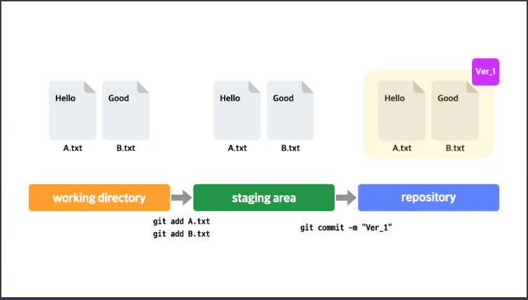
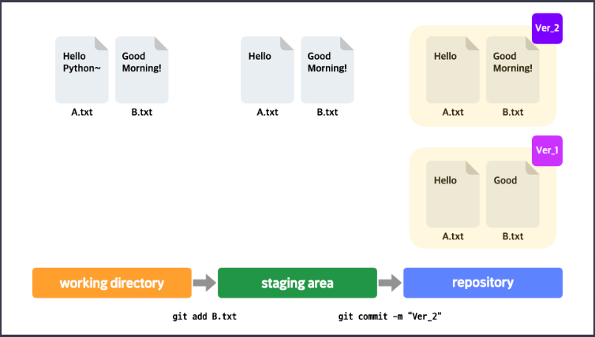

# Git 사용

## git 사용시 알아야할 개념

### 1. repository (저장소)

프로젝트 진행시 필요한 파일을 담은 프로젝트 디렉토리가 있다 가정하자. git으로 프로젝트 디렉토리의 버전을 관리하면 원하는 시점마다 디렉토리의 안에 어떤 것들이 있는지 어떻게 변하는지 기록할 수 있다. git이 이러한 정보들을 기록하는 곳을 레포지토리라고 한다.

즉, 레포지토리 안에는 프로젝트의 초기 모습부터 최근 모습까지 버전별로 담기게 된다. git 사용시 프로젝트안에 .git이라는 디렉토리가 만들어지는데 이 디렉토리를 레포지토리라고 한다. (버전별 프로젝트 모습, 버전별 변경 사항에 대한 설명등과 같은 사항들이 저장되어 있다. -> 프로젝트 디렉토리와 레포지토리는 다른 개념)

### 2. commit (커밋)

프로젝트 디렉토리 안에서 작업을 진행하다보면 현재의 모습을 하나의 버전으로 남기고 싶을때가 있다. 이때 프로젝트 디렉토리의 모습을 하나의 버전으로 남기는 작업을 '커밋한다'라고 표현한다. 커밋을 하게될 경우 프로젝트 당시의 모습이 사진처럼 레포지토리에 저장되며 이때 고정된 결과물 자체도 커밋이라 한다. (레포지토리에 저장된 커밋을 참조하면 과거의 프로젝트 디렉토리의 모습을 볼 수 있음)

### 정리

==**커밋**: 프로젝트 디렉토리의 특정 모습을 하나의 버전으로 남기는 행위 & 그 결과물==

==**레포지토리**: 커밋이 저장되는 곳 (.git 디렉토리, 프로젝트 디렉토리와 별개)==

## git 사용

터미널에서 'MathTool'이라는 프로젝트 생성

```
mkdir MathTool
```

git으로 버전관리를 하기 위해 다음 명령어 실행

```
git init
```

현재 폴더에 비어있는 레포지토리를 생성 (.git)

만든 MathTool 디렉토리에서 파일을 하나 생성 후 저장 (예시로 calculator.js을 만듬)

커밋을 하기 전에 반드시 `config` 명령어를 통해 깃에게 커밋한 사람을 알려줘야 한다.

```
git config user.name "codeit"
git config user.email "cloud@codeit.kr"
```

이후 커밋 (현재 디렉토리의 모습을 레포지토리에 하나의 버전으로 저장)
커밋에는 이름, 이메일 뿐만 아니라 커밋에 대한 정보(어떤 내용을 커밋했는지: 커밋 메시지)도 포함되어야함.

```
git commit -m "Create calculator.js"
```

다음과 같은 에러가 발생할 수 있는데 아직 깃으로 작업을 하지 않았기 때문에 버전 관리의 대상이 아니라는 에러 문구이다. (untracked -> git에 의해 추적되지 않고 있다.)

```
nothing added to commit but untracked files present (use "git add" to track)
```

위의 에러가 발생한 이유는 커밋을 할 때 커밋할 파일을 미리 지정해줘야 하기 때문이다. 즉, 파일을 생성하거나 수정하면 해당 파일의 새로운 모습이 커밋에 포함될 것이라 지정해줘야 커밋이 가능하며 이러한 사전 작업을 'add'라고 한다.

add 명령어 (커밋에 반영하고 싶은 파일을 지정)

```
git add calculator.js
```

이후 다시 커밋을 하면 정상적으로 커밋이 되는 걸 확인할 수 있다.
(아래 메시지의 root-commit은 프로젝트의 첫 번째 커밋이라는 의미이다.)

```
[master (root-commit) 29d433f] Create calculator.js
 1 file changed, 7 insertions(+)
 create mode 100644 calculator.js
```

### 정리 (커밋에 관한 주의사항)

1. 처음으로 커밋을 하기 전 `config` 명령어로 사용자의 이름과 이메일 주소를 설정
2. 커밋할 파일을 `git add`로 지정
3. 커밋 메시지 남기기 (`git commit -m`)

## git의 3가지 작업 영역

git은 내부적으로 크게 다음과 같은 3가지 종류의 작업 영역을 두고 동작함.

**1. working directory**
**2. staging area**
**3. repository**

첫 번째 영역인 working directory란 작업을 하는 프로젝트 디렉토리를 말한다. (위의 작업을 예시로 들면 MathTool이 이에 해당)

두 번째 영역인 staging area는 git add한 파일들이 존재하는 영역. 커밋을 하게되면 staging area에 있는 파일들만 커밋에 반영된다.

세 번째 영역인 repository는 working directory의 변경 이력들이 저장되어 있는 영역. 즉, 커밋들이 저장되는 영역을 말한다.

- working directory에서 작업 후,
- 작업한 파일들을 git add,
- 커밋을 하면 staging area에 있던 파일들의 모습이 스냅샷처럼 레포지토리(.git 디렉토리)에 저장됨





**만약 working directory에서 여러 파일을 수정하는 작업을 하고 일부만 커밋에 반영하고 싶을때, 반영하고 싶은 파일들만 git add를 통해 staging area에 올리고 커밋에 반영할 수 있기 때문에 staging area가 필요하다.**

working directory는 working tree, staging area는 index라고도 한다.
