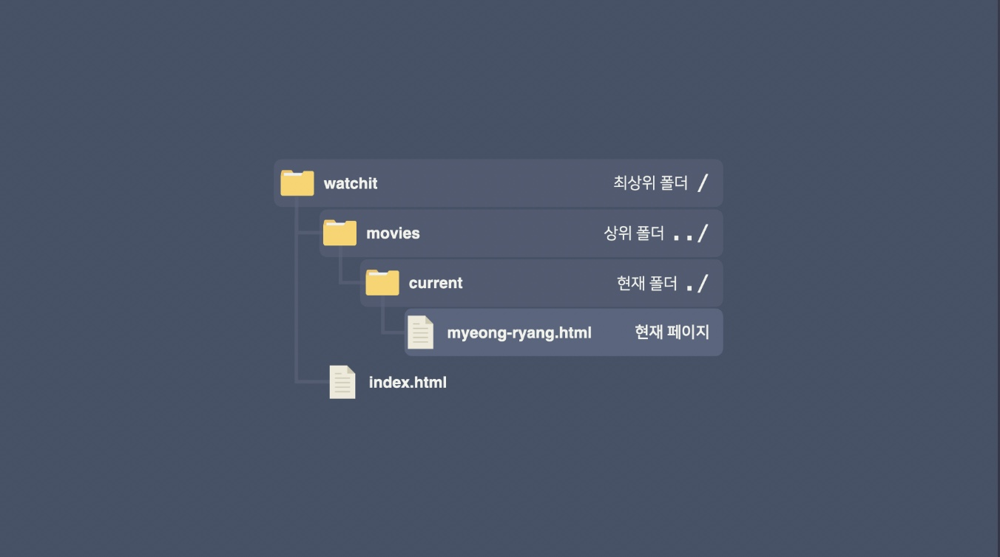

# 링크

## 링크의 상대 주소(Relative URL)

- 현재 폴더는 점 한 개(`./`)로 표시하고, 상위 폴더는 점 두 개(`../`)로 표시.
- 최상위 폴더는 경로 맨 앞에 `/` 로 시작.
- 특별히 `index.html` 파일은 이름을 생략하고 폴더 이름만 쓸 수 있다.



`myeong-ryang.html`에서 최상위 폴더에 있는 `index.html`로 연결하는 링크 예시

```html
<a href="../../index.html">홈페이지로 가기</a>
<a href="../../">홈페이지로 가기</a>
<a href="/index.html">홈페이지로 가기</a>
<a href="/">홈페이지로 가기</a>
```

## URL 프래그먼트(URL Fragment)

페이지의 특정 부분을 가리키는 주소. 원하는 곳에 `id` 속성을 지정해 두고, 링크 주소로 사용할 때는 맨 끝에 `#`으로 시작하는 `#아이디-이름 `을 쓰면 된다.

```html
팀 버너스리는 "인터넷 사용 자체가 인권"<a href="#note-1">[1]</a>이라고 말했다.
...

<p id="note-1">[1] 서울디지털포럼 2013 기조연설</p>
```

## target 속성

새 창(새 탭)으로 열거나 현재 창 또는 내가 원하는 창으로 열 수 있다.

```html
<a href="https://movie.naver.com" target="_blank"
  ><!-- 새 창으로 열기 -->
  네이버 영화
</a>
<a href="https://movie.naver.com" target="_self"
  ><!-- 현재 창 -->
  네이버 영화
</a>

<!-- movie속성 값을 가진 창이 새롭게 하나 열림 -->
<a href="https://movie.naver.com" target="movie"
  ><!-- 내가 원하는 창 -->
  네이버 영화
</a>

<!-- 위에서 연 movie 창이 해당 페이지 링크로 변경됨-->
<a href="https://movie.daum.net" target="movie"
  ><!-- 내가 원하는 창 -->
  다음 영화
</a>

<!-- 마찬가지로 movie 창이 해당 페이지 링크로 변경 -->
<a href="https://imbd.com" target="movie"
  ><!-- 내가 원하는 창 -->
  imbd
</a>
```

## 다양한 링크 동작

### 이메일 보내기

`mailto:<이메일 주소>`라는 걸 사용하면 이메일을 보낼 수 있다. 이 링크를 클릭하면 이메일 프로그램이나 이메일 앱을 열 수 있고, 받는 사람 주소에 링크에 적힌 이메일 주소를 자동으로 입력해 준다.

```html
<!-- test@example.com으로 이메일 보내기 -->
<a href="mailto:test@example.com">메일 보내기</a>
```

### 전화 걸기

`tel:<전화번호>`를 사용하면 전화를 걸 수 있다. 데스크톱 컴퓨터에서는 전화 기능이 없을 수 있지만, 스마트폰에서 이 링크를 클릭하면 전화 앱으로 연결된다.

```html
<!-- 한국의 010-1234-0123으로 전화걸기 -->
<a href="tel:+821012340123">전화 걸기</a>
```
