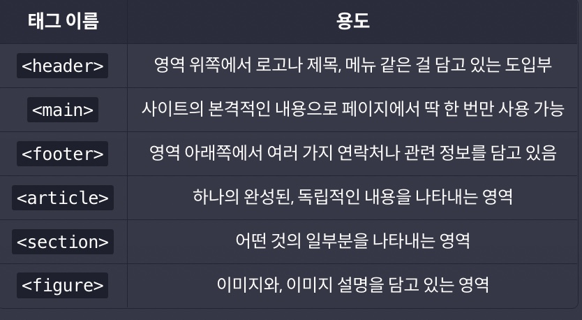

# 의미있는 HTML 만들기

## `<head>` 태그

페이지에 대한 정보(메타데이터)를 담고 있는 태그. 주로 이 페이지에 대한 데이터를 담고 있는데, 화면에 보여 주기보다는 웹 브라우저가 읽어서 처리하는 용도.

```html
<head>
  <meta charset="utf-8" />
  <title>코드잇 캠핑장</title>
  <link rel="stylesheet" href="style.css" />
  <link rel="favicon" href="favicon.ico" />
</head>
```

## 시맨틱 태그

**`<div>`와 기능은 똑같지만, 의미가 담겨있는 태그들을 '시맨틱 태그'라고 한다.** 엄격한 사용법이 있는 건 아니고, 작성하는 사람의 의도가 중요한데 시맨틱 태그를 잘 활용하면 검색 엔진 최적화(SEO)나 접근성(Accessibility)을 높이는데 도움이 된다.



**중요한 점은 main 태그는 페이지에서 딱 한번만 사용 가능하다는 것이다.**

### 시멘틱 태그 사용시 장점

1. 검색 최적화

   `<head>` 태그안에 `<meta>` 태그를 꼼꼼히 작성하고 시멘틱 태그가 잘 작성되어 있으면 검색 엔진이 사이트를 더 정확하게 파악할 수 있음

2. 웹 접근성

   '스크린 리더' 등의 프로그램을 통해서 인터넷을 사용하는 시각 장애인을 예시로, 시멘틱 태그가 잘 작성되어 있으면 시각 장애인들이 '스크린 리더'같은 프로그램들을 사용하여 main 태그와 nav 태그 등으로 이동하는데 도움을 줄 수 있으며 이는 장벽 없는 인터넷을 만드는데 기여한다.

3. 코드 이해

   개발자간에 서로 간의 코드를 살펴볼떄도 단순히 div 태그로만 이루어진 코드보단 시멘틱 태그로 작성되어 있는 코드가 훨씬 이해하기 쉽고 개발자의 생산성을 높일 수 있다.
