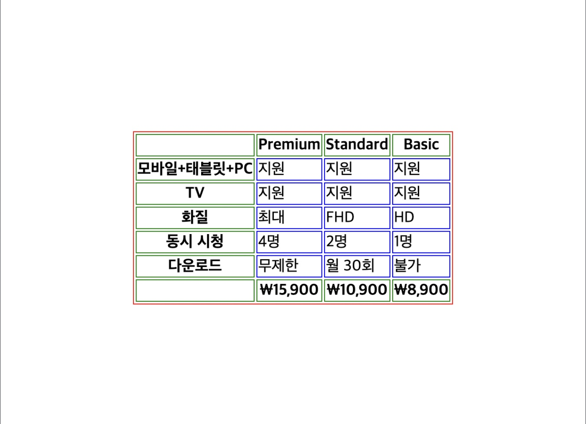
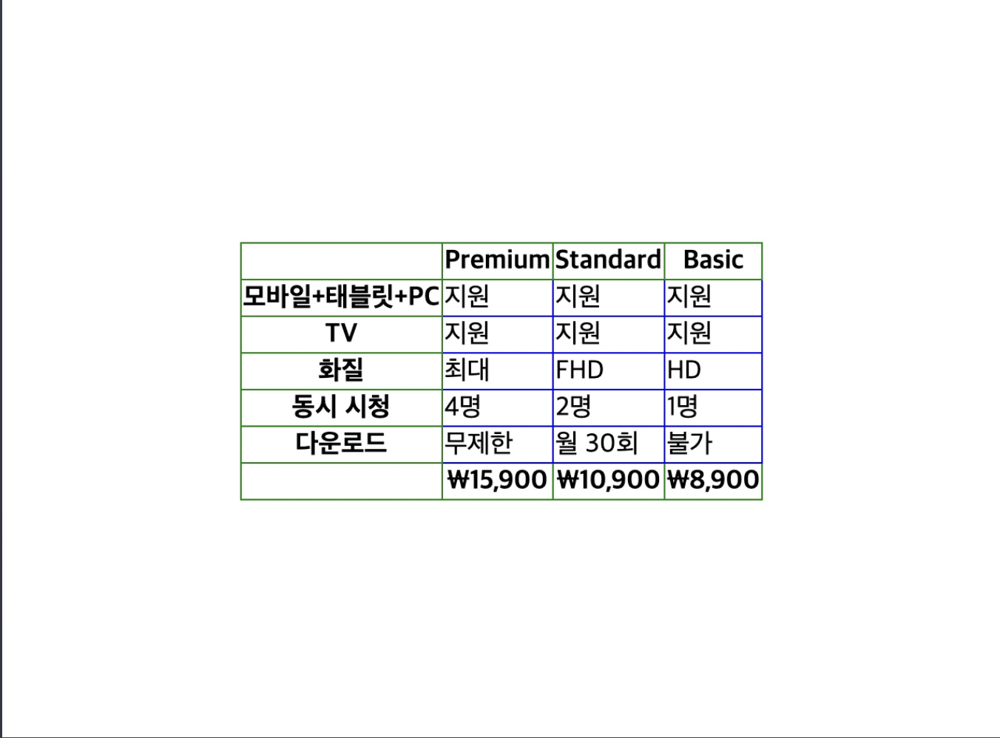
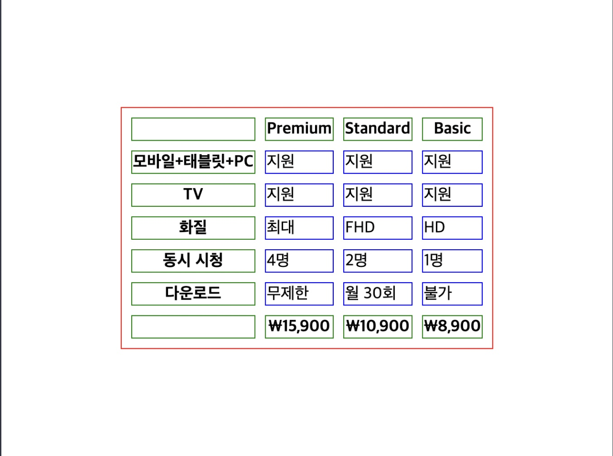

# 테이블

정보를 표로 나타낼 때는 `<table>` 태그를 사용. 테이블의 행은 `<tr>` (Table Row)태그로 감쌉니다. 각 데이터들은 `<td>` (Table Data) 태그로 넣습니다.

```html
<table>
  <tr>
    <td></td>
    <td>Premium</td>
    <td>Standard</td>
    <td>Basic</td>
  </tr>
  <tr>
    <td></td>
    <td>₩15,900</td>
    <td>₩10,900</td>
    <td>₩8,900</td>
  </tr>
  <tr>
    <td>화질</td>
    <td>최대</td>
    <td>FHD</td>
    <td>HD</td>
  </tr>
  <tr>
    <td>다운로드</td>
    <td>무제한</td>
    <td>월 30회</td>
    <td>불가</td>
  </tr>
</table>
```

## 머리글

표에서 머리글은 `<thead>` 태그로 감싸고, 행은 `<tr>` 태그로 감싸 면 된다. 각 행 안에 있는 것들은 제목이기 때문에 `<td>`가 아니라 `<th>`라는 태그를 넣는다. 본문에 해당하는 행들은 `<tbody>`라는 태그로 감쌉니다.

<thead>
  <tr>
    <th></th>
    <th>Premium</th>
    <th>Standard</th>
    <th>Basic</th>
  </tr>
  <tr>
    <th></th>
    <th>₩15,900</th>
    <th>₩10,900</th>
    <th>₩8,900</th>
  </tr>
</thead>
<tbody>
  <tr> ... </tr>
  ...
</tbody>
```

## 바닥글

표에서 바닥글은 `<tfoot>` 태그로 감싸면 된다. `<thead>`와 마찬가지로 행은 `<tr>`로 감싼다. 제목으로 쓰는 칸은 `<th>` 태그를 넣는다.

```html
<table>
  <thead>
    <tr>
      <th></th>
      <th>Premium</th>
      <th>Standard</th>
      <th>Basic</th>
    </tr>
  </thead>
  <tbody>
    ...
  </tbody>
  <tfoot>
    <tr>
      <th></th>
      <th>₩15,900</th>
      <th>₩10,900</th>
      <th>₩8,900</th>
    </tr>
  </tfoot>
</table>
```

## 테이블 스타일링

### 테두리 넣기

`border` 속성을 사용해서 테두리를 넣을 수 있다. 이때 표 전체에 테두리를 넣고 싶으면 `<table>` 태그에 적용하고, 각 셀에 적용하고 싶으면 `<td>` 태그에 적용하면 된다.

```css
table {
  border: 1px solid red; /* 표 전체의 테두리를 빨간색으로 */
}

th {
  border: 1px solid green; /* 제목 셀의 테두리를 초록색으로 */
}

td {
  border: 1px solid blue; /* 각 셀의 테두리를 파란색으로 */
}
```



### 테두리 겹치기

기본적으로 표의 테두리는 서로 간격이 있어서 표 전체, 각 셀마다 보이는데, 이 간격을 없애고 테두리끼리 겹치고 싶다면 `border-collapse` 속성을 활용하면 된다.

```css
table {
  border: 1px solid red;
  border-collapse: collapse;
}

th {
  border: 1px solid green;
}

td {
  border: 1px solid blue;
}
```



### 테두리 간격

테두리 사이의 간격을 직접 조절하고 싶다면 `border-spacing`이라는 속성을 사용하면 된다.

```css
table {
  border: 1px solid red;
  border-spacing: 10px;
}

th {
  border: 1px solid green;
}

td {
  border: 1px solid blue;
}
```


