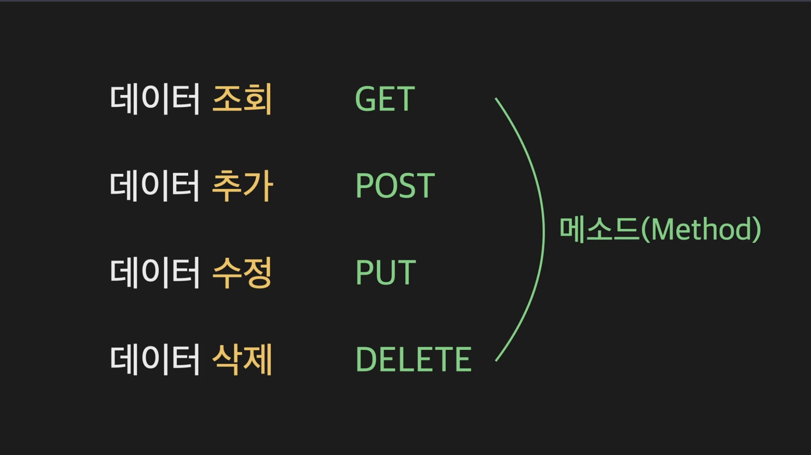

# Web API

## JSON

**`JavaScript Object Notation`의 약자로 어떤 정보를 교환하기 위해 사용되는 데이터 포맷으로 JS언어의 문법을 빌려 만들어진 데이터 포맷을 말한다.**

### JS 객체 표기법과 JSON 문법의 차이

1. JSON에는 프로퍼티의 이름과 값을 표현하는 방식에 제한이 있다.

(1) JSON에서는 각 프로퍼티의 이름을 반드시 큰따옴표(")로 감싸줘야 한다.

```js
const member = {
  name: "Michael Kim",
  height: 180,
  weight: 70,
  hobbies: ["Basketball", "Listening to music"],
};
```

자바스크립트에는 객체를 생성할 수 있는 여러 가지 방법이 있는데, 그중 한 가지는 이런 식으로 중괄호('`{ }`') 안에 객체의 프로퍼티의 이름(키)과 값(밸류)쌍을 순서대로 나열해서 생성하는 방법이다. 지금 보이는 표기를 `Object Literal`이라고 하는데, Object Literal을 쓸 때는 문법에 약간의 유연함이 있다. 저는 지금 member 객체의 각 프로퍼티의 이름인 `name, height, weight, hobbies`에 큰따옴표를 붙이지 않았는데, Object Literal에서는 이렇게 프로퍼티의 이름에 큰따옴표를 붙이지 않아도 되고,

```js
const member = {
  name: "Michael Kim",
  height: 180,
  weight: 70,
  hobbies: ["Basketball", "Listening to music"],
};
```

이렇게 큰따옴표를 붙여도 된다.

하지만 **JSON의 경우에는 프로퍼티의 이름에 반드시 큰따옴표를 붙여줘야만 한다.**

```json
{
  "name": "Michael Kim",
  "height": 180,
  "weight": 70,
  "hobbies": ["Basketball", "Listening to music"]
}
```

지금 각 프로퍼티의 이름이 모두 큰따옴표로 둘러싸여 있는데, 이렇게 JSON에서는 각 프로퍼티의 이름을 반드시 큰따옴표로 감싸주어야 한다. 큰따옴표로 감싸주지 않으면 JSON을 처리하려고 할 때 에러가 난다.

(2) JSON에서는 값이 문자열인 경우 큰따옴표(")를 사용해야 한다.

```js
const member = {
  name: "Michael Kim",
  height: 180,
  weight: 70,
  hobbies: ["Basketball", "Listening to music"],
};
```

잠깐 member 객체를 다시 보자. 지금 `name` 프로퍼티의 값으로 `'Michael Kim'`이라는 문자열이 들어가 있는데, 자바스크립트에서는 문자열을 나타낼 때, 이렇게 작은따옴표(')를 써도 되고, 큰따옴표(")를 써서 `"Michael Kim"`이라고 써도 된다.

하지만 JSON에서는 문자열 값을

```json
{
  "name": "Michael Kim",
  "height": 180,
  "weight": 70,
  "hobbies": ["Basketball", "Listening to music"]
}
```

지금 보이는 `"Michael Kim", "Basketball", "Listening to music"`처럼 항상 큰따옴표로 감싸서 적어줘야만 한다.

2. JSON에서는 표현할 수 없는 값들이 있다.

자바스크립트에서는 프로퍼티의 값으로 사용할 수 있는 `undefined, NaN, Infinity` 등을 JSON에서는 사용할 수 없다. 참고로, JSON은 비록 자바스크립트로부터 비롯된 데이터 포맷이지만, 그 탄생 목적은 언어나 환경에 종속되지 않고, 언제 어디서든 사용할 수 있는 데이터 포맷이 되는 것이었다. 따라서 자바스크립트의 문법에서만 유효한 개념을 JSON에서는 나타낼 수 없다는 것은 어찌 보면 당연한 결과라고 볼 수 있다.

3. JSON에는 주석을 추가할 수 없습니다.

JSON은 코드가 아니라 데이터 포맷이기 때문에 그 안에 주석을 포함시킬 수 없다.

### JSON 데이터 객체로 변환

JS의 기본 내장 객체인 `JSON.parse` 문법을 통해 string type의 JSON 데이터를 JS 객체로 변환할 수 있다. (이렇게 해야 해당 객체 안의 데이터를 간편하게 사용하고 처리할 수 있다.)

```js
fetch("주소")
  .then((response) => response.text())
  .then((result) => {
    const users = JSON.parse(result);
    console.log(users.length);
    users.forEach((user) => {
      console.log(user.name);
    });
  });
```

## 메소드

데이터를 조회, 추가, 수정, 삭제 하는 등 어떤 request가 무엇에 해당하는지는 request 존재하는 `method` 정보를 통해 알 수 있다.



## request의 Head와 Body

`Head` : Request에 대한 부가 정보가 들어있는 부분 (메소드 역시 Head 존재)

`Body` : 실제 데이터를 담는 부분


보통, 데이터를 수정하거나 삭제하는 `POST, PUT` 메소드들의 경우에는 Body에 데이터를 실어보내고 `GET, DELETE` 같이 단순히 데이터를 조회하거나 삭제하는 경우에는 Body가 필요하지 않다.


## POST request

여러 메소드 중 개발자 도구의 Network탭에서 POST 리퀘스트의 경우를 살펴보자.


위와 같이 새 직원 정보를 POST 리퀘스토로 추가한다 생각하고 Network 탭을 살펴보자.


그러면 보낸 POST 리퀘스트와 받은 리스폰스 쌍을 의미하는 한 줄(members)를 클릭하고 오른쪽에 Request Method 부분에 POST라고 써있는 것을 확인할 수 있다.


또한 위와 같이 Body도 확인할 수 있다. (새 직원 정보를 나타내는 JSON 데이터가 잘 들어가 있는 모습)


그리고 response 탭을 누르면 실제로 추가된 직원 정보가 JSON 데이터로 잘 온 것을 확인 가능하다.

## 모범적인 Web API, REST API

우리는 이제 웹 브라우저가 리퀘스트를 보낼 때,

1. 어느 URL로 리퀘스트를 보내는지
2. 무슨 메소드(GET, POST, PUT, DELETE 등)가 그 헤드에 설정되어있는지가

중요하다는 것을 배웠다.

그런데 우리가 어떤 리퀘스트를 보냈을 때, 무슨 리스폰스를 받는지는 어떻게 설계되는 걸까? 개발자들이 실제로 개발을 할 때 이 부분을 어떻게 만들고 있는지 살펴보자.

### Web API

우리가 어떤 리퀘스트를 보냈을 때, 무슨 리스폰스를 받는지는 모두 그 서비스를 만드는 개발자들이 정하는 부분이다. 잠깐 실제 개발 현장에서 일어나는 경우를 살펴보자. 개발자에는 크게 두 가지 종류가 있다. 첫 번째는 사용자가 직접 서비스 화면을 보는 웹 페이지나 앱 등을 만드는 프론트엔드(Front-end) 개발자, 두 번째는 웹 브라우저나 앱이 보내는 리퀘스트를 받아서 적절한 처리를 한 후 리스폰스를 주는 서버의 프로그램을 만드는 백엔드(Back-end) 개발자, 이 두 가지이다.

하나의 서비스를 만들 때는 프론트엔드 개발자들과 백엔드 개발자들이 모여 '프론트엔드에서 이 URL로 이렇게 생긴 리퀘스트를 보내면, 백엔드에서 이런 처리를 하고 이런 리스폰스를 보내주는 것으로 정합시다'와 같은 논의를 하고, 이런 내용들을 정리한 후에 개발을 시작한다.

이것을 **'Web API 설계'**라고 하는데, **API**란 Application Programming Interface의 약자로, 원래는 '개발할 때 사용할 수 있도록 특정 라이브러리나 플랫폼 등이 제공하는 데이터나 함수 등'을 의미합니다. **웹 개발에서는 어느 URL로 어떤 리퀘스트를 보냈을 때, 무슨 처리가 수행되고 어떤 리스폰스가 오는지에 관해 미리 정해진 규격을 Web API**라고도 한다.

Web API를 설계한다는 것은 서비스에서 사용될 모든 URL들을 나열하고, 각각의 URL에 관한 예상 리퀘스트와 리스폰스의 내용을 정리한다는 뜻. 예를 들어, 이전 영상에서 사용한 학습용 URL(`https://learn.codeit.kr/api/members`)에서 직원 정보 추가 기능을 설계한다면 다음과 같이 할 수 있는 것이다.

```json
...

3. 직원 정보 추가

https://learn.codeit.kr/api/members

(1) Request
- Head
Method : POST
...

- Body
{
  "name": "Jerry",
  "email: "jerry@codeitshopping.kr",
  "department": "engineering",
}
...

(2) Response
Success인 경우 :
- Head
...
- Body
{
  "id": "[부여된 고유 식별자 값]",
  "name": "Jerry",
  "email": "jerry@codeshopping.kr"
  "department": "engineering",
}
Fail인 경우 :
...
```

이렇게 해당 서비스에서 제공되는 각 URL에, 어떤 리퀘스트를 보내면, 서버는 어떤 리스폰스를 보내야 하는지를 일일이 설계하는 것이 Web API 설계인 것이다. 물론 실무에서는 지금 보이는 예시보다 훨씬 체계적이고 단정한 방식으로, 상용 툴 등을 사용해서 정리한다. 이런 식으로 Web API가 설계되고 나면, 그때 프론트엔드/백엔드 개발자들이 해당 설계에 맞게 각자 코드를 작성하기 시작하는 것이다. 물론 설계와 개발이 동시에 진행되기도 하고, 설계 내용이 중간에 수정되기도 한다.

오늘날 많은 회사 내의 개발팀은 이런 식으로 Web API를 설계하고 웹 서비스를 만든다. 그런데 문제가 하나 있는데 그건 바로 Web API는 어떻게 설계해도 동작하는 데는 아무런 지장이 없다는 문제이다.

이전에는 직원 정보를 추가하기 위해

1. `'https://learn.codeit.kr/api/members'` URL로
2. 리퀘스트의 헤드에 POST 메소드를 설정하고,
3. 리퀘스트의 바디에 새 직원 정보를 넣어서 보내면 된다

는 내용의 설계를 했다면,

어떤 회사는 같은 기능을 이런 식으로 설계할 수도 있다.

1.  `'https://learn.codeit.kr/api/members'` URL로
2.  리퀘스트의 헤더에 GET 메소드를 설정하고,
3.  리퀘스트의 바디에 새 직원 정보를 넣어서 보내면 된다

어느 방식으로 설계해도 서비스가 동작하는 데는 아무런 문제가 없다. 하지만 기능적으로 아무런 문제가 없다고 해도 Web API를 아무렇게나 설계해도 되는 것은 아니다. 사실 Web API가 잘 설계되었는지에 관한 기준으로는 보통 \**REST API*8라는 기준이 사용되고 있는데, 많은 개발자들이 Web API를 개발할 때 이 REST API를 준수하기 위해 노력하고 있다.

### REST API

**REST API는 오늘날 많은 웹 개발자들이 Web API 설계를 할 때, 준수하기 위해 노력하는 일종의 가이드라이다.** REST API를 이해하기 위해서는 일단 `REST architecture`가 무엇인지부터 알아야 하는데, 일단 `REST architecture`에 대해 살펴보자

`REST architecture`란 미국의 컴퓨터 과학자인 Roy Fielding이 본인의 박사 논문 'Architectural Styles and the Design of Network-based Software Architectures'에서 제시한 개념인데, 그는 웹이 갖추어야 할 이상적인 아키텍처(구조)로 REST architecture라는 개념을 제시했다. 여기서 REST는 Representational State Transfer(표현적인 상태 이전)의 줄임말로, 해석하면 '표현적인, 상태 이전'이라는 뜻이다.

이게 무슨 말일까? 이 용어는 Roy Fielding이 고안한 용어인데, 웹 서핑을 할 때를 생각해보자. 만약 웹을 하나의 거대한 컴퓨터 프로그램이라고 생각한다면, 각각의 웹 페이지는 그 프로그램의 내부 상태를 나타낸다고 할 수 있다. 그렇다면 우리가 웹 페이지들을 계속 옮겨 다니면서 보게 되는 내용은, 웹이라는 프로그램의 매번 새로운 상태를 나타내는 표현이라고 할 수 있는데, 그래서 이것을 '표현적인, 상태 이전'이라고 하는 것이다.

그럼 `REST architecture`가 되기 위한 조건에는 어떤 것들이 있을까? 다음과 같은 6가지 기준을 충족하면 REST architecture로 인정된다.

1. Client-Server
2. Stateless
3. Cache
4. Uniform Interface
5. Layered System
6. Code on Demand

각 기준에 대해 간략하게 설명해보자면 `REST architecture`는,

1. (**Client-Server**) Client-Server 구조를 통해 양측의 관심사를 분리해야 한다. 지금까지의 내용에서는 웹 브라우저가 실행되고 있는 컴퓨터가 Client, 서비스를 제공하는 컴퓨터가 Server에 해당하는데, 이렇게 분리를 해놓으면 Client 측은 사용자에게 어떻게 하면 더 좋은 화면을 보여줄지, 다양한 기기에 어떻게 적절하게 대처해야할지 등의 문제에 집중할 수 있고, Server 측은 서비스에 적합한 구조, 확장 가능한 구조를 어떻게 구축할 것인지 등의 문제에 집중할 수 있다. 이렇게 각자가 서로를 신경쓰지 않고 독립적으로 운영될 수 있는 것이다.

2. (**Stateless**) Client가 보낸 각 리퀘스트에 관해서 Server는 그 어떤 맥락(context)도 저장하지 않는다. 즉, 매 리퀘스트는 각각 독립적인 것으로 취급된다는 뜻. 이 때문에 리퀘스트에는 항상 필요한 모든 정보가 담겨야한다.

3. (**Cache**) Cache를 활용해서 네트워크 비용을 절감해야 한다. Server는 리스폰스에, Client가 리스폰스를 재활용해도 되는지 여부(Cacheable)를 담아서 보내야한다.

4. (**Uniform Interface**) Client가 Server와 통신하는 인터페이스는 다음과 같은 하위 조건 4가지를 준수해야 한다. 이 조건이 REST API와 연관이 깊은 조건이다. 어떤 4가지 하위 조건들이 있는지 살펴보자.

   - `identification of resources` : 리소스(resource)는 웹상에 존재하는 데이터를 나타내는 용어인데, 이것은 리소스(resource)를 URI(Uniform Resource Identifier)로 식별할 수 있어야 한다는 조건이다. URI는 URL의 상위 개념으로 일단 지금은 URL이라고 생각하자.

   - `manipulation of resources through representations` : Client와 Server는 둘 다 리소스를 직접적으로 다루는 게 아니라 리소스의 '표현(representations)'을 다뤄야 한다. 예를 들어, Server에 '오늘 날씨`'(/today/weather)`라는 리소스를 요청했을 때, 어떤 Client는 HTML 파일을 받을 수도 있고, 어떤 Client는 이미지 파일인 PNG 파일을 받도록 구현할 수도 있는데, 이때 HTML 파일과 PNG 파일 같은 것들이 바로 리소스의 '표현'이다. 즉, 동일한 리소스라도 여러 개의 표현이 있을 수 있다는 뜻. **사실, 리소스는 웹에 존재하는 특정 데이터를 나타내는 추상적인 개념이다. 실제로 우리가 다루게 되는 것은 리소스의 표현들뿐**인데, 이렇게 '리소스'와 '리소스의 표현'이라는 개념 2개를 서로 엄격하게 구분하는 것이 REST architecture의 특징이다.

   - `self-descriptive messages` : self-descriptive는 '자기설명적인'이라는 뜻인데, 위에서 살펴본 2. Stateless 조건 때문에 Client는 매 리퀘스트마다 필요한 모든 정보를 담아서 전송해야 한다. 그리고 이때 Client의 리퀘스트와 Server의 리스폰스 모두 그 자체에 있는 정보만으로 모든 것을 해석할 수 있어야 한다는 뜻이다.

   - `hypermedia as the engine of application state` : REST architecture는 웹이 갖추어야 할 이상적인 아키텍처이다. 이때 '웹'을 좀더 어려운 말로 풀어써 보자면 '분산 하이퍼미디어 시스템'(Distributed Hypermedia System)이라고도 할 수 있는데, 여기서 하이퍼미디어(Hypermedia)는 하이퍼텍스트(Hypertext)처럼 서로 연결된 '문서'에 국한된 것이 아니라 이미지, 소리, 영상 등까지도 모두 포괄하는 더 넓은 개념의 단어이다. 즉, 웹은 수많은 컴퓨터에 하이퍼미디어들이 분산되어 있는 형태이기 때문에, '분산 하이퍼미디어 시스템'에 해당합니다. 이 조건은 웹을 하나의 프로그램으로 간주했을 때, Server의 리스폰스에는 현재 상태에서 다른 상태로 이전할 수 있는 링크를 포함하고 있어야 한다는 조건이다. 즉, 리스폰스에는 리소스의 표현, 각종 메타 정보들뿐만 아니라 계속 새로운 상태로 넘어갈 수 있도록 해주는 링크들도 포함되어 있어야 한다는 것.

여기까지가 Uniform Interface의 4가지 하위 조건이다. 사실, 오늘날 우리가 Web API를 설계할 때 위의 하위 조건들을 모두 제대로 이해하고 준수하는 것은 쉽지 않은 일인데, 일단 아직 남은 5, 6번 조건들을 마저 살펴보고, 4번에 관해 그나마 우리가 실천할 수 있는 규칙들을 아래에서 살펴보자.

5. (**Layered System**) Client와 Server 사이에는 프록시(proxy), 게이트웨이(gateway)와 같은 중간 매개 요소를 두고, 보안, 로드 밸런싱 등을 수행할 수 있어야 한다. 이를 통해 Client와 Server 사이에는 계층형 층(hierarchical layers)들이 형성된다.

6. (**Code-On-Demand**) Client는 받아서 바로 실행할 수 있는 applet이나 script 파일을 Server로부터 받을 수 있어야 한다. 이 조건은 Optional한 조건으로 REST architecture가 되기 위해 이 조건이 반드시 만족될 필요는 없다.

이때까지 REST architecture가 되기 위해 충족해야 하는 조건들을 배웠는데 기억해야 할 사실은, **REST API는 바로 이런 REST architecture에 부합하는 API를 의미한다**는 사실이다. 참고로 이런 **REST API를 사용하는 웹 서비스를 RESTful 서비스**라고 한다.

그렇다면 구체적으로 어떤 식으로 Web API를 설계해야 REST API가 될 수 있는 걸까? 사실 Roy Fielding의 논문에는 이것에 관한 구체적이고 실천적인 내용들은 제시되어 있지 않다. 하지만 많은 개발자들의 경험과 논의를 통해 형성된 사실상의(de facto) 규칙들이 존재하는데,

우리는 그중에서도 조건 4. Uniform Interface의 하위 조건인 (4-1) identificaton of resources 에 관해서 특히 개발자들이 강조하는 규칙, 2가지만 살펴보자.

1. URL은 리소스를 나타내기 위해서만 사용하고, 리소스에 대한 처리는 메소드로 표현해야 한다.

이 규칙은 조금 다르게 설명하자면, URL에서 리소스에 대한 처리를 드러내면 안 된다는 규칙인데, 이게 무슨 말인지 1. Web API 부분에서 마지막에 언급했던 예시를 통해 이해해보자.

예를 들어, 새 직원 정보를 추가하기 위해서

(1) 'https://learn.codeit.kr/api/members' URL로

(2) 리퀘스트의 헤드에 POST 메소드를 설정하고,

(3) 리퀘스트의 바디에 새 직원 정보를 넣어서 보내면 된다.

고 하는 경우는, URL은 리소스만 나타내고, 리소스에 대한 처리(리소스 추가)는 메소드 값인 POST로 나타냈기 때문에 이 규칙을 준수한 것이다.

하지만

(1) 'https://learn.codeit.kr/api/members/add' URL로

(2) 리퀘스트의 헤더에 GET 메소드를 설정하고,

(3) 리퀘스트의 바디에 새 직원 정보를 넣어서 보내면 된다

고 하는 이 경우는 URL에서 리소스뿐만 아니라, 해당 리소스에 대한 처리(add, 추가하다)까지도 나타내고 있다. 그리고 정작 메소드 값으로는 리소스 추가가 아닌 리소스 조회를 의미하는 GET을 설정했기 때문에 이 규칙을 어긴 것이다.

**URL은 리소스를 나타내는 용도로만 사용하고, 리소스에 대한 처리는 메소드로 표현해야 한다는 사실**을 꼭 기억하자.

2. 도큐먼트는 단수 명사로, 컬렉션은 복수 명사로 표시.

또 다른 규칙 하나를 살펴보자. 이 규칙은 URL로 리소스를 나타내는 방식에 관한 규칙인데, URL에서는

```
https://www.soccer.com/europe/teams/manchester-united/players/pogba
```

이런 식으로 path 부분에서 특정 리소스(pogba, 축구 선수 포그바의 정보)를 나타낼 때 슬래시(/)를 사용해서 계층적인 형태로 나타낸다. 지금 위 URL의 path 부분을 보면 '유럽의', '축구팀들 중에서', '맨체스터 유나이티드 팀의', '선수들 중에서', '포그바'라는 선수의 정보를 의미하는 리소스라는 걸 한눈에 알 수 있는데, 이렇게 계층적 관계를 잘 나타내면, URL만으로 무슨 리소스를 의미하는지를 누구나 쉽게 이해할 수 있다.

**Web API를 설계할 때는 이렇게 가독성 좋고, 이해하기 쉬운 URL을 설계해야 하는데**, 그런데 이때 지켜야 할 규칙이 있다.

사실 리소스는 그 특징에 따라 여러 종류로 나눠볼 수 있다. 이 중에서 우리는 '컬렉션(collection)'과 '도큐먼트(document)'를 살펴보자.

보통 우리가 하나의 객체로 표현할 수 있는 리소스를 '도큐먼트'라고 한다. 그리고 여러 개의 '도큐먼트'를 담을 수 있는 리소스를 '컬렉션'이라고 하는데, 쉽게 비유하자면, 도큐먼트는 하나의 '파일', 컬렉션은 여러 '파일'들을 담을 수 있는 하나의 '디렉토리'에 해당하는 개념이다.

그리고 이에 관한 규칙은 바로, **URL에서 '도큐먼트'를 나타낼 때는 단수형 명사를, '컬렉션'을 나타낼 때는 복수형 명사를 사용해야 한다**는 규칙이다.

지금 위 URL에서 europe, manchester-united, pogba가 '도큐먼트'에 해당하고, teams, players가 '컬렉션'에 해당한다.
(도큐먼트는 단수 명사로, 컬렉션은 복수 명사로 표현한 것)

이 규칙을 잠깐 이전 내용을 토대로 생각해보자. 예를 들어,

- 전체 직원 정보 조회 - GET
- 새 직원 정보 추가 - POST

이 작업들을 수행하기 위해 사용했던 `'https://learn.codeit.kr/api/members'` URL에서도
직원 전체를 의미하는 members는 이렇게 복수 명사를 사용했다는 것을 알 수 있다. members는 member들을 담을 수 있는 컬렉션에 해당하는 개념이기 때문.

그리고,

- 특정 직원 정보 조회 - GET
- 기존 직원 정보 수정 - PUT
- 기존 직원 정보 삭제 - DELETE

이 작업들을 수행하기 위해 사용했던 `https://learn.codeit.kr/api/members/3` URL에서는
도큐먼트를 나타내기 위해 단수 명사 대신 직원 고유 식별자인 id 값을 썼는데, 이렇게 숫자를 쓰는 경우에는 단복수 문제가 없다.

'도큐먼트', '컬렉션' 개념을 우리가 배운 메소드 종류와 연결해서 모든 경우의 수를 생각해보면 다음과 같다.


지금 표에서 보이는 것처럼, 전체 직원 정보를 대상으로 PUT 리퀘스트 또는 DELETE 리퀘스트를 보내는 것은 전체 직원 정보를 모두 수정 또는 모두 삭제한다는 뜻이기 때문에 사실상 잘 쓰이지 않는다. 위험한 동작이기 때문에 애초에 Web API 설계에 반영하지도 않고, 서버에서 허용하지 않을 때가 일반적이다.

그리고 또 여기서 주목할 점은 **POST 리퀘스트를 보낼 때, 컬렉션(members) 타입의 리소스를 대상으로 작업을 수행한다는 점**이다. 이 부분이 조금 헷갈릴 수도 있는데, POST 리퀘스트를 보낼 때는 우리가 전체 직원 정보를 의미하는 컬렉션에 하나의 직원 정보(하나의 도큐먼트)를 추가하는 것이기 때문에 URL로는 컬렉션까지만 `/members` 이렇게 표현해줘야 한다. 따라서 `/members/3` 이렇게 특정 도큐먼트를 나타내는 URL에 POST 리퀘스트를 보내는 것은 문맥상 맞지 않는 표현이다. 그리고 지금 같은 경우는 추가될 직원 정보가 어떤 `id` 값을 할당받을지 알 수도 없기 때문에 애초에 `/members/[id]`에 `id` 값을 지정한다는 것도 불가능하다.

이 도큐먼트와 컬렉션 개념을 잘 기억하고 있으면 나중에 URL에서 단수 명사를 써야 할지, 복수 명사를 써야 할지 고민이 될 때 답을 얻을 수 있을 것이다.

REST API는 개발자들이 Web API를 설계할 때 굉장히 중요하게 고려하는 가이드라인이기는 하지만, 앞서 제시한 6가지 조건을 모두 만족시켜가면서까지 100% 준수해야 할 필요성이 있는지에 관해서는 의견이 많다.

## JSON 데이터 다루기

자바스크립트 객체를 string 타입의 JSON 데이터로 변환하는 것은 영어로 **Serialization, 우리말로는 직렬화**라고 한다.
그리고 이와 반대로 string 타입의 JSON 데이터를 자바스크립트 객체로 변환하는 것을 영어로는**Deserialization, 우리말로는 역직렬화**라고 하는데, 그리고 이것들을 동사로 표현하면 Serialize한다, Deserialize한다고 표현할 수 있다.

이 Serialization과 Deserialization은 자바스크립트뿐만 아니라 모든 프로그래밍 언어에서 중요하게 다뤄지는 개념이다. 왜냐하면 어떤 언어든지 리퀘스트를 보내거나, 리스폰스를 받을 때 이런 작업을 수행해줘야하기 때문이다. 이번 노트에서는 Serialization과 Deserialization에 대해 좀 더 자세하게 살펴보자.

### string 타입의 JSON 데이터 vs 자바스크립트 객체

지금까지 Serialization을 수행하기 위해 JSON이라는 자바스크립트 기본 내장 객체의 stringify 메소드를 사용했고,
Deserialization을 수행하기 위해 JSON 객체의 parse 메소드를 사용했다.

혼동을 막기 위해서, 앞으로 데이터 포맷으로서의 json은 이렇게 소문자로,
stringify 메소드, parse 메소드를 갖고 있는 JSON 객체는 이렇게 대문자로 쓰도록 하겠다.

이제 string 타입의 json 데이터와 자바스크립트 객체 사이에 구체적으로 어떤 차이가 있는 건지, 각 작업이 왜 필요한지 그 이유를 생각해보자.

```js
const obj = { x: 1, y: 2 };
const jsonString = JSON.stringify(obj);
```

지금 x 프로퍼티와 y 프로퍼티를 가진 `obj`라는 객체를 **Serialize**했는데,
이 코드를 실행하고 `obj`와 `jsonString`을 순서대로 조회해보면


이렇게 `obj`는 자바스크립트 객체이고, 이것을 **Serialize**한 결과인 jsonString은 string 타입이라는 걸 알 수 있다.
`obj` 객체 왼쪽의 화살표를 클릭해보면


이렇게 `obj` 객체는 자바스크립트 객체로서, 우리가 직접 정의하지는 않았지만, 기본으로 내장하는 프로퍼티들이 존재한다는 것을 알 수 있다. 이런 것들은 자바스크립트 실행 환경에서, 객체라면 가지는 프로퍼티들일 뿐 서버에는 전혀 보낼 필요가 없는 것들dlek. 그리고 특히 이 객체의 메소드 같은 경우 서버에서 이를 인식 가능하도록 보낼 수 있는 방법도 없다.

바로 이러한 이유 때문에 우리는 객체(object)가 가진 데이터만을 string 타입으로 변환하는 Serialization 작업을 해야하는 것이다.(Serialization이 왜 필요한지에 대해서 제대로 이해하려면 컴퓨터 공학에 관한 깊은 지식이 필요하다. 지금은 자바스크립트 실행 환경에서만 인식되는 객체라는 존재를 어느 환경에서든 해석될 수 있는 포맷으로 변환하기 위해 Serialize를 한다는 정도로만 이해해두자.)

그럼 이번엔 반대로 **Deserialize**를 해보자.

```js
const jsonString = '{"x": 1, "y": 2}';
const obj = JSON.parse(jsonString);
```

이번엔 코드 순서가 반대이고, JSON 객체의 stringify 메소드 대신 parse 메소드를 썼는데,

지금 `jsonString`은 string 타입입니다. 이때 y키의 값인 2를 가져와야 한다고 해보자. 어떻게 가져와야할까? 지금 같은 문자열 상태로는 y 값을 가져올 수 없다. 문자열 자체를 파싱(parsing)해서 어떻게든 2라는 값을 가져올 수 있겠지만 그건 우리가 원하는 게 아니죠. 따라서 이 string 타입의 값을 Deserialize해서 그대로 자바스크립트 객체로 변환해줘야 코드에서 자유롭게 사용할 수 있게 된다. 그 후에는 이렇게


`obj.y`처럼 자바스크립트에서 객체의 프로퍼티의 값을 읽을 때 쓰는 문법을 사용해서, `obj` 객체의 y프로퍼티에 바로 접근할 수 있다. 왜 리스폰스의 내용이 JSON 데이터일 때 그것을 Deserialize해야 하는지에 대한 이유이다. 굳이 string 타입의 값에서 문자열을 파싱하느라 낑낑대며 어렵게 필요한 데이터를 추출하기보다는 이렇게 자바스크립트 객체로 변환해서 편하게 데이터를 다루면 되는 것이다.

Serialization과 Deserialization은 자바스크립트로 웹 개발을 할 때 반드시 숙지하고 있어야 하는 개념이다. 리퀘스트를 보내거나 리스폰스를 받았을 때 이 작업을 빼먹지 않도록 주의해야 한다.

### text 메소드 말고 json 메소드도 있다.

배웠던 코드를 잠깐 살펴보자.

```js
fetch("https://jsonplaceholder.typicode.com/users")
  .then((response) => response.text())
  .then((result) => {
    const users = JSON.parse(result);
  });
```

이 코드에서는 리스폰스의 내용을 추출하기 위해 `response.text()`를 호출했고,
그 다음에 그 리턴값인 JSON 데이터
(result, 실제로는 JSON 데이터를 품은 Promise 객체라는 것이 리턴.)
를 Deserialize(`JSON.parse(result)`)해서 생성한 객체를 `users`에 할당했는데,

그런데 여기서 코드의 양을 조금이나마 줄일 수 있는 방법이 있다.

```js
fetch("https://jsonplaceholder.typicode.com/users")
  .then((response) => response.json())
  .then((result) => {
    const users = result;
  });
```

지금 response 객체의 `text` 메소드 대신 `json`이라는 메소드를 사용했고, 콜백 안에 있던 `JSON.parse` 코드를 삭제했다. 왜 그런 걸까?

**response 객체의 `text` 메소드 대신 `json`이라는 메소드를 호출하면, 리스폰스의 내용이 JSON 데이터에 해당하는 경우, 바로 Deserialization까지 수행해준준.** 이렇게 json 메소드를 사용하면, 두 번째 콜백의 result 파라미터로는 Deserialization 결과로 생성된 자바스크립트 객체가 넘어가게 되는데, 그래서 두 번째 콜백 안에서 `JSON.parse`를 해주지 않아도 `result`를 바로 자바스크립트 객체로서 사용할 수 있는 것. 참고로, 리스폰스의 내용이 JSON 데이터에 해당하지 않을 경우에는 에러가 발생하게 된다.

리스폰스의 내용이 JSON 데이터로 미리 약속된 경우에는 response 객체의 `text` 메소드 대신 `json` 메소드를 사용해서 Deserialization까지 한 번에 수행하기도 한다.

## Status Code

`Status Code`는 우리말로 '상태 코드'로 **리퀘스트를 받는 서버가 그 작업 결과를 나타내기 위해서 response의 Head에 넣는 숫자**를 말한다.

### 각각의 상태 코드에는 대응되는 상태 메시지가 있다.

모든 상태 코드(Status Code)는 각각 그에 대응되는 상태 메시지(Status Message)를 갖고 있다.

예를 들어, 우리가 배운 200번은 OK, 404번은 'Not Found'라는 상태 메시지를 갖고 있다. 각 상태 코드의 의미를 모두 외우기는 힘들기 때문에 이러한 상태 메시지는 상태 코드의 의미를 빠르게 파악하는데 도움을 준다.

### 상태 코드는 100번대~500번대까지 있어요.

상태 코드는 100번대부터 500번대까지 존재한다. 그리고 각 번호대는 그것만의 의미를 가지고 있는,. 각 번호대 별 주요 상태 코드들을 살펴보자. 각 상태 코드는 상태 코드 옆에 바로 상태 메시지를 쓰는 형식(예: 200 OK)으로 나타내도록 하겠다.

1. 100번대

서버가 클라이언트에게 정보성 응답(Informational response)을 줄 때 사용되는 상태 코드들.

- `100 Continue` : 클라이언트가 서버에게 계속 리퀘스트를 보내도 괜찮은지 물어봤을 때, 계속 리퀘스트를 보내도 괜찮다고 알려주는 상태 코드. 예를 들어, 클라이언트가 용량이 좀 큰 파일을 리퀘스트의 바디에 담아 업로드하려고 할 때 서버에게 미리 괜찮은지를 물어보는 경우가 있다고 할 때, 서버가 이 100번 상태 코드의 리스폰스를 주면 그제서야 본격적인 파일 업로드를 시작.

- `101 Switching Protocols` : 클라이언트가 프로토콜을 바꾸자는 리퀘스트를 보냈을 때, 서버가 '그래요, 그 프로토콜로 전환하겠습니다'라는 뜻을 나타낼 때 쓰이는 상태 코드.

2. 200번대

클라이언트의 리퀘스트가 성공 처리되었음을 의미하는 상태 코드들.

- `200 OK` : 리퀘스트가 성공적으로 처리되었음을 포괄적으로 의미하는 상태 코드입. 이때 성공의 의미는 리퀘스트에 있던 메소드의 종류에 따라 다르다. GET 리퀘스트의 경우 리소스가 잘 조회되었다는 뜻이고, POST 리퀘스트의 경우 새 리소스가 잘 생성되었다, PUT 리퀘스트의 경우 기존 리소스가 잘 수정되었다, DELETE 리퀘스트의 경우 기존 리소스가 잘 삭제되었다는 뜻.

- `201 Created` : 리퀘스트의 내용대로 리소스가 잘 생성되었다는 뜻. POST 리퀘스트가 성공한 경우에 200번 대신 201번이 올 수도 있다.

- `202 Accepted` : 리퀘스트의 내용이 일단은 잘 접수되었다는 뜻. 즉, 당장 리퀘스트의 내용이 처리된 것은 아니지만 언젠가 처리할 것이라는 뜻인데요, 리퀘스트를 어느 정도 모아서 한번에 실행하는 서버인 경우 등에 이런 응답을 줄 수도 있다.

3. 300번대

클라이언트의 리퀘스트가 아직 처리되지 않았고, 리퀘스트 처리를 원하면 클라이언트 측의 추가적인 작업이 필요함을 의미하는 상태 코드들.

`301 Moved Permanently` : 리소스의 위치가 바뀌었음을 나타냄. 보통 이런 상태 코드가 있는 리스폰스의 헤드에는 `Location`이라는 헤더도 일반적으로 함께 포함되어 있다. 그리고 그 헤더의 값으로 리소스에 접근할 수 있는 새 URL이 담겨있는데, 대부분의 브라우저는 만약 GET 리퀘스트를 보냈는데 이런 상태 코드가 담긴 리스폰스를 받게 되면, 헤드에 포함된 Location 헤더의 값을 읽고, 자동으로 그 새 URL에 다시 리퀘스트를 보내는 동작(리다이렉션, redirection)을 수행한다.

- `302 Found` : 리소스의 위치가 일시적으로 바뀌었음을 나타냄. 이 말은 지금 당장은 아니지만 나중에는 현재 요청한 URL이 정상적으로 인식될 것이라는 뜻. 이 상태 코드의 경우에도 보통 그 리스폰스의 헤드에 Location 헤더가 있고, 여기에 해당 리소스의 임시 URL 값이 있다. 이 경우에도 대부분의 브라우저들은 임시 URL로 리다이렉션한다.

- `304 Not Modified` : 브라우저들은 보통 한번 리스폰스로 받았던 이미지 같은 리소스들을 그대로 내부에 저장하고 있다. 그리고 서버는 해당 리소스가 바뀌지 않았다면, 리스폰스에 그 리소스를 보내지 않고 304번 상태 코드만 헤드에 담아서 보냄으로써 '네트워크 비용'을 절약하고 브라우저가 저장된 리소스를 재활용하도록 하는데, 사실 이 상태 코드는 웹에서 '캐시(cache)'라는 주제에 대해서 공부해야 정확하게 이해할 수 있다.

4. 400번대

리퀘스트를 보내는 클라이언트 쪽에 문제가 있음을 의미하는 상태 코드들.

- `400 Bad Request` : 말그대로 리퀘스트에 문제가 있음을 나타냄. 리퀘스트 내부 내용의 문법에 오류가 존재하는 등의 이유로 인해 발생.

- `401 Unauthorized` : 아직 신원이 확인되지 않은(unauthenticated) 사용자로부터 온 리퀘스트를 처리할 수 없다는 뜻.

- `403 Forbidden` : 사용자의 신원은 확인되었지만 해당 리소스에 대한 접근 권한이 없는 사용자라서 리퀘스트를 처리할 수 없다는 뜻.

- `404 Not Found` : 해당 URL이 나타내는 리소스를 찾을 수 없다는 . 보통 이런 상태 코드가 담긴 리스폰스는 그 바디에 관련 웹 페이지를 이루는 코드를 포함하고 있는 경우가 많다. 예를 들어, 다음과 같이


`https://www.google.com/abc`와 같이 존재하지 않는 URL에 접속하려고 하면 이런 페이지가 보이는 것을 알 수 있다.

- `405 Method Not Allowed` : 해당 리소스에 대해서 요구한 처리는 허용되지 않는다는 뜻. 만약 어떤 서버의 이미지 파일을 누구나 조회할 수는 있지만 아무나 삭제할 수는 없다고 하자. GET 리퀘스트는 허용되지만, DELETE 메소드는 허용되지 않는 상황인 건데, 그런데 만약 그 이미지에 대한 DELETE 리퀘스트를 보낸다면 이런 상태 코드를 보게될 수도 있다.

- `413 Payload Too Larg`e` : 현재 리퀘스트의 바디에 들어있는 데이터의 용량이 지나치게 커서 서버가 거부한다는 뜻.

- `429 Too Many Requests` : 일정 시간 동안 클라이언트가 지나치게 많은 리퀘스트를 보냈다는 뜻. 서버는 수많은 클라이언트들의 리퀘스트를 정상적으로 처리해야 하기 때문에 특정 클라이언트에게만 특혜를 줄 수는 없다. 따라서 지나치게 리퀘스트를 많이 보내는 클라이언트에게는 이런 상태 코드를 담은 리스폰스를 보낼 수도 있다.

5. 500번대

서버 쪽의 문제로 인해 리퀘스트를 정상적으로 처리할 수 없음을 의미하는 상태 코드들.

- `500 Internal Server Error` : 현재 알 수 없는 서버 내의 에러로 인해 리퀘스트를 처리할 수 없다는 뜻.

- `503 Service Unavailable` : 현재 서버 점검 중이거나, 트래픽 폭주 등으로 인해 서비스를 제공할 수 없다는 뜻.

이 상태 코드들도 'Web API 설계' 시에 결정되어야 하는 요소들이다. 리퀘스트에 관한 URL과 메소드 종류 뿐만 아니라 리스폰스의 상태 코드 또한 각각의 상황에 알맞은 것들이 설정되도록 설계해야 하는데, 사실 모든 상황을 세분화해서 매번 거기에 맞는 상태 코드를 넣는 것은 불필요한 작업이 될 수도 있긴 하다. 그래서 보통은 꼭 사용할 상태 코드들만 추린 다음에 특정 유형의 상황들은 모두 하나의 상태 코드로 나타내는 전략이 주로 활용된다.

하지만 그렇다고 해서 서버가 리퀘스트를 잘 처리했든, 실패했든 상태 코드로 항상 200번을 보내버린다거나 하는 것은 매우 좋지 않다. 가장 이상적인 것은 존재하는 상태 코드를 최대한 많이 활용하는 것이다.

## Content-type

이때까지 리퀘스트와 리스폰스가 둘다 헤드(head)와 바디(body)라는 걸로 이루어져 있다는 걸 배웠다. 그리고 헤드에는 각종 부가 정보, 바디에는 실제 데이터가 들어간다는 것도 배웠는데, 이때 헤드에 다양한 헤더(header)들이 있는 것도 직접 확인했다.

헤더의 종류는 너무나도 많기 때문에 지금 당장 다 살펴볼 수는 없지만, **Content-Type** 헤더에 대해서는 미리 알아두고 가면 좋다.

### Content-Type 헤더

Content-Type 헤더는 현재 리퀘스트 또는 리스폰스의 바디에 들어 있는 데이터가 어떤 타입인지를 나타낸다.

사실 이때까지 우리는 리퀘스트 또는 리스폰스의 바디에 HTML, JavaScript 등의 코드 또는 JSON 데이터가 들어가는 경우만 봤다. 하지만 실무 개발에서는 리퀘스트 또는 리스폰스의 바디에 이것 말고도 정말 다양한 종류의 데이터들을 넣게 될 텐데요, 텍스트부터 시작해서 이미지, 영상까지 정말 많은 것들이 들어갈 수 있다. 바로 이런 데이터들의 타입 정보가 Content-Type 헤더에 담겨있는 것이다.

**Content-Type 헤더의 값은 '주 타입(main type)/서브 타입(sub type)'의 형식**으로 나타나는데, 우리가 흔히 만나게 될 Content-Type 헤더의 값으로는 다음과 같은 것들이 있다.

1. 주 타입이 text인 경우(텍스트)

   - 일반 텍스트 : text/plain
   - CSS 코드 : text/css
   - HTML 코드 : text/html
   - JavaScript 코드 : text/javascript ...

2. 주 타입이 image인 경우(이미지)

   - image/bmp : bmp 이미지
   - image/gif : gif 이미지
   - image/png : png 이미지 ...
   - 주 타입이 audio인 경우(오디오)
   - audio/mp4 : mp4 오디오
   - audio/ogg : ogg 오디오 ...

3. 주 타입이 video인 경우(비디오)
   - video/mp4 : mp4 비디오
   - video/H264 : H264 비디오 ...

위 타입들에 속하지 않는 것들은, 보통 `application`이라고 하는 주 타입에 속하는데,

4. 주 타입이 application인 경우
   - application/json : JSON 데이터
   - application/octet-stream : 확인되지 않은 바이너리 파일 ...

JSON을 나타내는 값이 바로 여기에 속한다. `application/json`이라는 값이 JSON 데이터를 나타낸다는 사실을 잘 기억해두자.

마지막으로 ₩application/octet-stream₩이라고 하는 값도 보이는데, '확인되지 않은 바이너리 파일'이라는 게 뭘까?

일단 **'바이너리 파일'**이 뭔지를 알아야 할 것 같은데, 컴퓨터에서는 모든 파일이 0과 1의 조합으로 이루어져 있다는 사실은 이미 알고 있을 것이다. 하지만 이때 그 0과 1의 조합이 우리가 읽을 수 있는 텍스트로 변환 가능한 경우도 있고, 그렇지 않은 경우도 있다. 그렇지 않은 경우의 예로는 이미지 파일이나 비디오 파일 등이 있다. 이렇게 **텍스트 파일 이외의 파일들을 보통 바이너리 파일(binary file)**이라고 하는데, 이 바이너리 파일들 중에서도 특정 확장자(`.png`, `.mp4` 등)의 포맷에 해당하지 않는 데이터들을 보통 이렇게 `application/octet-stream`으로 나타낸. 참고로 브라우저는 리스폰스의 `Content-Type` 헤더의 값으로 `application/octet-stream`이 쓰여 있으면 보통, 사용자에게 '다운로드 받으시겠습니까'와 같은 `alert` 창을 띄운다.

이렇게 리퀘스트 또는 리스폰스의 바디에는 JSON 말고도 아주 다양한 타입의 데이터들이 담길 수 있다.

그런데 Content-Type 헤더는 왜 필요한 걸까? **Content-Type 헤더가 존재하면, 바디의 데이터를 직접 확인해서 그 타입을 추론하지 않아도 되기 때문**이다. 예를 들어, 리퀘스트의 바디에 JSON 데이터를 담아 보낼 때 헤드에서 이 Content-Type의 값을 `application/json`으로 알맞게 설정하고 보낸다고 하자. 만약 이 Content-Type을 써주지 않으면 어떻게 될까? 서버에서 바디의 데이터가 어떤 타입인지를 확인하는 절차가 추가적으로 필요할 것이다. 불필요한 비용이 발생하게 되는 것. 그리고 리스폰스의 경우에도 마찬가지이다. 웹 브라우저에서 리스폰스를 받았는데 Content-Type 헤더의 값이 없으면 이 데이터가 무슨 타입인지 별도로 확인하고, 처리해줘야 한다.

따라서 리퀘스트든, 리스폰스든 바디에 어떤 데이터가 존재하는 경우라면 이 Content-Type 헤더의 값을 적절하게 설정해주는 게 좋다.

### Content-Type 설정해보기

이번에는 리퀘스트를 보낼 때 직접 Content-Type 헤더의 값을 설정해보자. 이전에 새로운 직원 정보를 추가하기 위해 썼던 코드를 재사용할 건데,

```js
const newMember = {
  name: "Jerry",
  email: "jerry@codeit.kr",
  department: "engineering",
};

fetch("http://learn.codeit.kr/api/members", {
  method: "POST",
  body: JSON.stringify(newMember),
})
  .then((response) => response.text())
  .then((result) => {
    console.log(result);
  });
```

이제 여기에 Content-Type 헤더도 설정해보자.

```js
const newMember = {
  name: "Jerry",
  email: "jerry@codeit.kr",
  department: "engineering",
};

fetch("https://learn.codeit.kr/api/members", {
  method: "POST",
  headers: {
    // 추가된 부분
    "Content-Type": "application/json",
  },
  body: JSON.stringify(newMember),
})
  .then((response) => response.text())
  .then((result) => {
    console.log(result);
  });
```

지금 fetch 함수의 옵션 객체 안에 headers라는 프로퍼티를 만들어서 객체 하나를 설정하고 그 객체 안에 'Content-Type'이라는 프로퍼티를 설정했다. 프로퍼티의 값으로는, 리퀘스트의 바디에 담을 데이터가 JSON 데이터라는 뜻으로 `application/json`을 적었다.

이 코드를 개발자 도구에서 실행해보면


이렇게 리퀘스트의 헤더들 중에서 제가 설정한 Content-Type 헤더가 잘 보인다.


앞으로 점점 더 다양한 헤더들을 공부하게 된다면,

(1) fetch 함수의 옵션 객체 안에 headers 프로퍼티를 설정하고
(2) headers 객체 안에 더 많은 헤더 이름들을 추가해볼 수 있을 것이다.

## 알아두면 좋은 Content-type들

리퀘스트와 리스폰스의 바디에 정말 다양한 타입의 데이터들이 들어갈 수 있다는 것을 배웠다. 이때까지는 실제로 개발자가 되면 주로 사용하게 될 JSON 타입을 많이 다뤄봤는데, 하지만 정말 개발자가 된다면 JSON 뿐만 아니라 이전 노트에서 봤던 일반 텍스트, 이미지, 음성, 영상 등 수많은 타입들을 다루게 될 것이다. 이번에는 추가적으로 알아두면 좋을 데이터 타입들을 공부해보자.

### JSON 말고 XML도 있다.

개발자들이 어떤 정보를 나타내기 위해 흔히 쓰는 데이터 포맷으로는 JSON 뿐만 아니라 XML(Extensible Markup Language)이라고 하는 데이터 포맷도 있다. XML을 한마디로 쉽게 이야기하자면, 태그를 사용해서 데이터를 나타내는 것. 예를 들어

```json
{
  "name": "Michael Kim",
  "height": 180,
  "weight": 70,
  "hobbies": ["Basketball", "Listening to music"]
}
```

이런 JSON 데이터를 XML로는 이렇게 나타낼 수 있다.

```xml
<?xml version="1.0" encoding="UTF-8" ?>
<person>
    <name>Michael Kim</name>
    <height>180</height>
    <weight>70</weight>
    <hobbies>
        <value>Basketball</value>
        <value>Listening to music</value>
    </hobbies>
</person>
```

뭔가 HTML에서나 볼 법한 태그들로 이루어져있는데, 자세히 보면 원래 JSON에서

```json
"name": "Michael Kim"
```

이라고 나타낸 부분을 XML에서는

```xml
<name>Michael Kim</name>
```

이런 식으로 시작 태그(`<name>`)와 끝 태그(`</name>`), 그리고 그 사이의 값으로 나타낸 것을 알 수 있다.

사실 XML이라는 데이터 타입은 JSON이 2013년에 표준화되고 그 뒤로 활성화되기 전까지만 해도 정말 많이 사용되던 데이터 타입이었기 때문에, 개발 관련 문서들을 구글링하다보면 여전히 이 XML로 표현된 데이터들을 자주 볼 수 있을 것이다.

XML을 쓸 때는 보통 스키마(Schema)라는 별도의 문서를 함께 사용한다. 이 스키마에는 각 조직, 기관 등에서 XML로 데이터를 나타낼 때, 어떤 태그들을 사용할 수 있고, 각 태그의 의미는 무엇이며, 특정 태그는 어떤 타입의 값을 가질 수 있는지 등의 정보가 담겨있는데, 따라서 XML은 데이터에 대한 엄격한 유효성(validity) 검증에 특화된 데이터 포맷이라고 할 수 있다.

하지만 XML은 같은 양의 데이터를 표현하더라도 JSON에 비해 더 많은 용량을 차지하고, JSON에 비해 가독성이 떨어지며, 배우기가 어렵다는 문제 등으로 인해, 오늘날 XML의 입지는 다소 좁아진 것이 사실이다. 특히나 자바스크립트가 중심이 되는 웹 개발 세계에서는 우리가 배운 것처럼 자바스크립트의 문법과 JSON 문법이 대체로 호환되기 때문에 더더욱 JSON을 사용하는 것이 편리하다.

하지만 만약 외부로 공개된 여러 Open API 같은 것들을 살펴보면 여전히 XML 타입의 데이터를 리스폰스로 주는 경우가 많다는 것을 알 수 있다. 그렇기 때문에 XML 타입이라는 것이 존재한다는 것을 인지하고, 이런 타입의 데이터는 어떻게 처리해야 할지 미리 고민해보는 것도 좋다. 참고로 XML을 나타내는 Content-Type 헤더의 값은 `'application/xml'`이다. 그리고 `'application/xml'`뿐만 아니라 XML의 문법을 따르되 거기에 특수한 규칙을 더해 만든 데이터 타입들도 존재한다. 보통 이런 타입들은 그 이름 끝에 `+xml`을 붙여서 사용하는데요. Content-Type 헤더의 값에 관한 이 공식 문서에 접속해서 `+xml` 이라는 키워드로 페이지 내 검색을 해보면 XML 문법을 활용한 다양한 데이터 타입들을 볼 수 있을 것이다.

### form 태그에서 사용되는 타입들

이때까지 배운 JSON, XML 이런 것들 말고도 개발자라면 알아둬야 할 데이터 타입이 또 있다. 그것은 바로

- application/x-www-form-urlencoded 타입
- multipart/form-data 타입

이 2가지이다. 각각의 타입에 대해 순서대로 알아보자.

1. application/x-www-form-urlencoded

뭔가 굉장히 긴 이름의 타입인데, 이 타입은 우리가 HTML의 form 태그(`<form></form>`)를 사용할 때 종종 보게되는 타입이다. form 태그는 회원가입 화면이나 게시물 업로드 화면 등을 만들 때 주로 활용되는 HTML 태그인데, form 태그를 사용하면 자바스크립트 코드 없이 오로지 HTML만으로도 리퀘스트를 보내는 것이 가능하다. 오늘날에는 form 태그를 사용하지 않고 자바스크립트 코드로 직접 사용자의 입력값을 취합해서 리퀘스트를 보내는 방법이 많이 사용되고 있지만 여전히 form 태그만으로 리퀘스트를 보내는 방식도 쓰이고는 있기 때문에 알아두는 게 좋다.

form 태그는 기본적으로 이 `application/x-www-form-urlencoded` 타입의 데이터를 바디에 담아서 보내는데,

그렇다면 `application/x-www-form-urlencoded` 타입은 데이터를 어떤 식으로 나타내는 걸까? 예를 들어, JSON으로는 다음과 같이 표현할 수 있는 데이터가 있다고 가정해보자.

```json
{
  "id": 6,
  "name": "Jason",
  "age": 34,
  "department": "engineering"
}
```

이 데이터를 `application/x-www-form-urlencode`d 타입으로 나타내보면

```json
id=6&name=Jason&age=34&department=engineering
```

이것과 같다. `application/x-www-form-urlencoded` 타입은 프로퍼티의 이름과 값을 "이름=값" 형식으로 나타내고 각각의 프로퍼티를 "&" 기호로 연결하는 방식으로 데이터를 표현하는데요. **URL의 query 부분에서 사용하는 방식과 같다** 자, 예시를 통해 좀더 배워봅시다.

예를 들어, 이런 식으로 CodeitShopping이라는 사이트의 회원 가입 페이지가 있다고 해보자.


이 웹 페이지는 다음과 같은 HTML 코드로 이루어져 있는데

```html
...

<body>
  <div id="signup">
    <p id="title">CodeitShopping</p>
    <form action="/upload" method="get" enctype="application/x-www-urlencoded">
      <div>
        <div><span class="label">email</span></div>
        <input class="input" type="text" id="email" name="email" />
      </div>
      <div>
        <div><span class="label">password</span></div>
        <input class="input" type="password" id="password" name="password" />
      </div>
      <div>
        <div><span class="label">nickname</span></div>
        <input class="input" type="text" id="nickname" name="nickname" />
      </div>
      <div>
        <input id="submit-btn" type="submit" value="Sign Up" />
      </div>
    </form>
  </div>
</body>

...
```

지금 form 태그의 `method`라는 속성의 값으로 `get`이, `enctype`이라는 속성의 값으로 `application/x-www-form-urlencoded`라고 써있는 걸 확인할 수 있다. 이렇게 속성을 적으면, 나중에 이 form 태그가 리퀘스트를 보낼 때, 리퀘스트의 메소드를 GET으로 설정하고 사용자가 입력한 데이터를, URL의 쿼리 부분에 `application/x-www-urlencoded` 타입으로 넣는다. 지금 `enctype` 속성을 저렇게 설정을 해줘도 되고, 설정을 안 해줘도 form 태그는 기본적으로 `application/x-www-urlencoded` 타입을 사용한다. 제가 위 이미지와 같이 회원 정보를 작성하고 아래의 Sign Up(가입하기) 버튼을 누르면 어떤 리퀘스트가 보내질까? 잠깐 이 이미지를 보자.


이 이미지는 회원 가입 버튼을 누르고 웹 브라우저의 주소창 부분을 봤을 때의 결과인데요, 제가 입력한 정보가 `키=정보&키=정보&키=정보..` 이런 형식으로 나타난 것을 알 수 있다. form 태그는 바로 이렇게 사용자의 입력값을 URL의 query 부분에 `application/x-www-form-urlencoded `타입으로 나타낸 URL로 리퀘스트를 보내는 것이다.

그런데 잠깐 지금 빨간색으로 표시된 부분을 보면 우리가 작성하지 않았던 이상한 퍼센트(%)기호와 숫자들이 보입니다. 이게 뭘까? 지금 보면


이렇게 변환되어서 표시된 것을 알 수 있는데, 왜 특정 문자들은 이런 식으로 변환된 걸까? 바로 이것이 `application/x-www-form-urlencoded` 타입의 특징인데,

사실 이건 URL encoding(URL 인코딩)이라는 작업을 수행한 결과이다. URL 인코딩이란 URL에서 특정 특수문자들 그리고 영어와 숫자를 제외한 다른 나라의 문자들을 이런 식으로 변환하는 것을 말한다. 왜 이런 작업이 필요할까? URL 관련 표준에 따르면, URL을 처리할 때, 특정 조건에 해당하는 문자들은 Percent encoding이라는 것을 하도록 되어 있다. 이 Percent encoding이 바로 URL encoding인데, 어떤 경우에 Percent encoding을 해야하는지 알아보자.

일단, 아래와 같은 특수 문자들은 URL에서 특별한 용도를 갖고 있는 문자들입니다. 이런 특수 문자들이 각자 자신의 원래 용도가 아닌 다른 용도로 사용되는 경우 Percent Encoding을 해줘야 한다.


그러니까 이런 기호들이 URL에서 본래의 용도로 사용되는 게 아니라, 어떤 데이터를 나타내기 위해 사용된다면 이때는 Percent encoding을 해서 나타내줘야 한다는 뜻이다. 방금 전 봤던 `@, !, 공백` 이 글자들도 이 표에 속하고, 본래의 용도가 아닌 데이터를 나타내기 위한 용도로 쓰였기 때문에 Percent encoding 되었던 것.

그럼 왜 이런 Percent Encoding이 필요한 걸까? 그건 바로 URL에 대한 해석 오류를 방지하기 위해서이다. 예를 들어, 어떤 URL의 query 부분에 이런 내용이 있다고 생각해보자.

```
https://codeitBooks.com/books?title=Tom&Jerry&publishedData=20210115
```

책 제목이 Tom&Jerry(톰과 제리)라고 되어 있고, 제목 안에 `&` 가 있다. 그런데 이 `&`는 URL의 `query`에서 각각의 속성을 구분하는 용도로 쓰이는 기호이기도 하다. 하지만 이 상태로 그대로 URL을 표현하면 서버가 URL의 `path` 뒷 부분을 해석하다가 오류를 발생시킬 수도 있다. 이 URL을 읽는 개발자가 오해해서 실수하기도 쉽다. 따라서 **본래 용도가 아니라 단지 데이터를 나타내기 위해서 사용된 `&`은 위 표에 따라 `%26`으로 변환해주도록 한 것.**

```
https://codeitBooks.com/books?title=Tom%26Jerry&publishedData=20210105
```

자, 이번엔 Percent encoding을 해야하는 다른 경우를 보자. 방금 본 특수 문자들의 경우뿐만 아니라 URL에서 영어와 숫자를 제외한 다른 나라 문자를 나타낼 때도 Percent encoding을 해줘야한다. 그러니까 한국어, 중국어, 아랍어 등을 나타낼 때는 Percent encoding을 해줘야 한다는 뜻.
예를 들어, 우리가 URL의 맨 뒤에


이런 식으로 '코딩'이라는 한글을 적으면 어떻게 될까요? 이 URL을 그대로 복사해서 텍스트 에디터에 붙여넣기해보면


이런 식으로 한국말로 적은 '코딩'이라는 부분이 `'%EC%BD%94%EB%94%A9'`로 변환된 것을 알 수 있습니다. 따라서 이 리퀘스트를 받는 서버가 리퀘스트에서 찾게되는 path 정보도 바로 이렇게 변환된 결과일 것.

이렇게 URL에서

1. 'URL 안에서 미리 정해진 용도를 가진 특수 문자를 다른 용도로 사용'하거나
2. '영어와 숫자'를 제외한 다른 나라 문자를 나타낼 때는

Percent encoding을 해주는 것이 정해진 규칙이다.

바로 이런 URL encoding의 원리를 그대로 반영한 데이터 타입이 바로 `application/x-www-form-urlencoded` 타입이다. 왜 지금 이름에 urlencoded라고 하는 단어가 붙어있는지, 이해가 될 것 이다. 참고로 form 태그에서 method 속성을 get이 아닌 post로 바꾸면 다음과 같이 해당 타입의 데이터가 URL의 query 부분에 표시되는 것이 아니라 리퀘스트의 바디에 들어가도록 할 수도 있다.


그런데 사실 요즘은 방금 전 회원 가입 페이지처럼 form 태그만으로 리퀘스트를 보내기보다는 자바스크립트로 직접 리퀘스트를 보내는 경우가 많다. 게다가 우리가 배운 JSON(application/json)보다 이 `application/x-www-form-urlencoded` 타입이 딱히 더 좋아보이도 않는데, 하지만 문제는 웹의 초창기부터 form 태그만으로 리퀘스트를 보내는 코드가 너무 많이 작성되었다는 것이다. 따라서 여전히 많은 레거시(legacy) 서비스의 서버에서 이 타입을 요구하고 있는데, (그리고 기술적인 측면에서는, 이것은 좀 어려운 내용이긴 하지만 특정 도메인에서 다른 도메인으로 리퀘스트를 보낼 때(CORS 문제) Content-Type의 값이 `x-www-form-urlencoded`인 GET 리퀘스트는, 다른 Content-Type 값들에 비해 주고받아야하는 리퀘스트와 리스폰스의 수가 더 적다는 약간의 장점이 있기는 하다. 이해가 안 된다면 일단 넘어가자.)
개발자는 어느 환경에서 개발하게 될 지 모르기 때문에 이 `application/x-www-form-urlencoded` 타입에 대해서도 잘 알아둬야 나중에 당황하지 않을 수 있다.

그리고 form 태그를 사용하지 않고 자바스크립트 코드로 직접 `application/x-www-form-urlencdoed` 타입의 데이터를 리퀘스트의 바디에 넣는 것도 가능한데, 예를 들어 다음과 같다.

```js
const urlencoded = new URLSearchParams();
urlencoded.append("email", "tommy@codeit.kr");
urlencoded.append("password", "codeit123!");
urlencoded.append("nickname", "Nice Guy!");

fetch("https://learn.codeit.kr/api/members", {
  method: "POST",
  headers: {
    "Content-Type": "application/x-www-form-urlencoded",
  },
  body: urlencoded,
})
  .then((response) => response.text())
  .then((result) => {
    console.log(result);
  });
```

이 코드를 사용하면 방금 전과 동일하게 리퀘스트를 보낼 수 있는데, `URLSearchParams`라는 객체를 사용하면 자동으로 값에 URL encoding을 적용해주기 때문에, `application/x-www-form-urlencoded `타입의 데이터를 fetch 함수로도 손쉽게 보낼 수 있다. 참고로 알아두자.

2. multipart/form-data
   **이 컨텐츠 타입은 실무적으로 굉장히 중요한 타입**이다. 이때까지 우리가 살펴본 Content-Type 값들은, 하나의(Single) 데이터의 타입을 나타내는 값들이었다. `text/html, vidoe/mp4, application/json` 등 모두 데이터 하나의 타입을 나타냈었다. 그런데 이 `multipart/form-data`는 좀 특별하다. multipart(여러 개의 파트)라는 단어에서도 유추할 수 있듯이 이 값은 여러 종류의 데이터를 하나로 합친 데이터를 의미하는 타입.

그럼 언제 이런 값이 필요할까? 잠깐 우리가 게시판에 게시글을 올릴 때를 생각해보자. 우리는 글의 제목과 내용을 적고, 이미지 파일이나 영상 파일을 첨부하기도 한다. 이때 우리가 '게시글 업로드' 버튼을 누르면 파일들의 내용도 리퀘스트에 함께 담겨서 가야할텐데 이때 Content-type의 값은 무엇이어야 할까? 바로 이럴 때 사용되는 것이 `multipart/form-data`이다. 이번에도 예를 통해 배워보자.

방금 위에서 봤던 CodeitShopping의 회원가입 페이지가 이렇게 바뀌었다고 해보자. 이제 프로필 이미지도 추가로 받는 것으로 바뀌었는데,


이제 이 페이지에서는 email, password, nickname 같은 텍스트 정보뿐만 아니라 프로필 이미지 파일도 함께 보내줘야한다. 어떻게 해야 할까?

이 `multipart/form-data` 타입의 데이터도 위에서 살펴본 `application/x-www-form-urlencoded` 타입 때처럼

(1) form 태그만으로도 그리고
(2) 자바스크립트 코드만으로도

리퀘스트의 바디에 담아 전송할 수 있다. 순서대로 해보자.

이 화면은 현재

```html
...
<body>
  <div id="signup">
    <p id="title">CodeitShopping</p>
    <form action="/upload" method="post" enctype="multipart/form-data">
      <div>
        <input id="image" type="file" name="file" accept="image/*" />
        <div id="profile">
          <div id="plus">+</div>
        </div>
      </div>
      <div>
        <div><span class="label">email</span></div>
        <input class="input" type="text" id="email" name="email" />
      </div>
      <div>
        <div><span class="label">password</span></div>
        <input class="input" type="password" id="password" name="password" />
      </div>
      <div>
        <div><span class="label">nickname</span></div>
        <input class="input" type="text" id="nickname" name="nickname" />
      </div>
      <div>
        <input id="submit-btn" type="submit" value="Sign Up" />
      </div>
    </form>
  </div>
</body>
...
```

이런 HTML 코드로 이루어져 있는데,
이번엔 form 태그의 **`enctype` 속성으로 `application/x-www-form-urlencoded`가 아니라 `multipart/form-data`가 써있는 것을 확인할 수 있다.**

이번엔 자바스크립트 코드로 하는 방법도 보자.

```js
...

const formData = new FormData();
formData.append('email', email.value);
formData.append('password', password.value);
formData.append('nickname', nickname.value);
formData.append('profile', image.files[0], "me.png");

fetch('https://learn.codeit.kr/api/members', {
  method: 'POST',
  body: formData,
})
  .then((response) => response.text())
  .then((result) => { console.log(result); });
```

이 코드에서 보이는 것처럼, 자바스크립트 코드에서 `multipart/form-data` 타입의 데이터를 보내려면 **FormData**라는 객체를 사용해야한다. 이 FormData를 사용하면 리퀘스트의 Content-Type 헤더의 값을 `multipart/form-data`로 직접 설정하지 않아도 자동으로 설정해준다. (일단은 이렇구나 정도만 이해하자.)

자, 이제 핵심 내용이 등장하는데, 그럼 `multipart/form-data`는 실제로 어떻게 생겼는지 개발자 도구에서 보자.

위의 방법 중 하나를 선택해서 리퀘스트를 보내면, 아래와 같은 리퀘스트가 보내진다.


일단 리퀘스트의 헤드부터 보자. 지금 Content-Type 헤더의 값에 `multipart/form-data`라고 쓰여있는데, 그런데 그 옆에 쓰여있는 `boundary`라는 건 뭘까? boundary는 '경계선'이라는 뜻인데, 이게 뭔지는 리퀘스트의 바디 부분을 보면 알 수 있다. 화면 하단의 Form Data라고 쓰여있는 부분에서 `view source`를 클릭하면


이렇게 바디에 담긴 `multipart/form-data` 타입의 데이터를 볼 수 있다. 자, 이 내용을 좀 더 보기 편하게 처리해서 확인하자.


지금 보면 총 4개의 데이터(email, password, nickname, profile)가 들어가있고 각각의 데이터는

```
------WebKitFormBoundaryHu7uI1OMKko1vxwV
```

이 문자열을 기준으로 나뉘어 있다는 것을 알 수 있는데, 이 문자열 어디서 본적이 있을 것이다. 방금 전 Content-Type 헤더의 값에서 `multipart/form-data` 뒤에 적혀있던 `boundary`의 값이었는데,

```
content-type: multipart/form-data; boundary=---------WebKitFormBoundaryHu7uI1OMKko1vxwV
```

왜 이런 boundary라는 부가 정보가 붙어있는 걸까? **`multipart/form-data` 타입의 데이터는 그 안에 여러 종류의 데이터들이 들어있다고 했다. 따라서 서버가 이것을 받았을 때 각 데이터를 구분할 수 있도록 이런 boundary 값이 필요하다.** 지금 위에서 boundary를 기준으로 각각의 데이터가 나뉘어있다는 것을 알 수 있다.

자, 이제 boundary로 구분된 각 영역의 데이터도 살펴보자. 지금 1, 2, 3번 데이터를 살펴보면

```
Content-Disposition: form-data; name=데이터의 이름
// blank line
값
```

이런 형식으로 저장되어 있는 것을 볼 수 있다.

그리고 가장 마지막에, 프로필 이미지에 해당하는 4번 데이터는

```
Content-Disposition: form-data; name="profile"; filename="me.png"
Content-Type: image/png
// blank line
값
```

이런 식으로 `filename`에 실제 이미지 파일의 원래 이름이 있고, 또 그것만의 Content-Type 헤더의 값으로 `image/png`가 설정되어 있는 것을 볼 수 있다. (값의 영역에는 원래 해당 이미지 파일의 바이너리 데이터가 존재하지만, 개발자 도구가 이를 보여주지 않는 것으로 추정)

정리하면, `multipart/form-data` 타입은 여러 데이터를 하나로 묶어서 리퀘스트의 바디에 담아보내려고 할 때 사용되는 아주 중요한 타입이다. 실제 웹 서비스를 떠올려보면, 우리가 회원가입을 하든, 게시글을 업로드하든 다양한 데이터를 한번에 묶어서 보내는 경우가 많은데, 실제로 개발을 할 때도 자주 사용하게 되는 타입이니까 꼭 기억해두자.

이때까지 Content-Type 헤더의 값 중 하나인 `application/x-www-form-urlencoded` 타입과 `multipart/form-data` 타입에 대해 배웠는데, 혹시 이 내용들 중에 당장 이해가 되지 않는 부분이 있어도 괜찮다.

하지만 이 타입들의 존재조차도 모르고 개발 실무로 가면 많이 헤맬 수 있기 때문에, 이 두 가지 타입이 존재한다는 것 정도만 기억하고, 필요한 경우에 좀더 자세히 공부해보자.

## 그 밖에 알아야할 내용들

위에서 언급하지 않았지만 알아야할 3가지 내용들에 대해 살펴보자.

### Ajax

초창기의 웹은 특정 웹 페이지에서 다른 웹 페이지로 갈 수 있는 링크(공식 명칭은 hyperlink입니다)를 클릭하면 새로운 웹 페이지가 로드되는 방식이었다. 오늘날에도 당연히 쓰이고 있는 방식인데,

하지만 화면의 일부분만 바뀌면 되는 경우에도 매번 새 페이지가 로드되는 방식은 효율적이지도 않고 사용자에게도 그다지 좋지 않은 경험을 안겨주었다. 그래서 2000년대 초부터는 웹의 이런 단점을 극복하기 위해서 Ajax라는 기술이 도입되었다.

**Ajax는 웹 브라우저가 현재 페이지를 그대로 유지한 채로 서버에 리퀘스트를 보내고 리스폰스를 받아서, 새로운 페이지를 로드하지 않고도 변화를 줄 수 있게 해주는 기술**이다.

Ajax는 Asynchronous JavaScript And XML의 줄임말인데, 이는 자바스크립트를 사용해서 비동기적으로(=사용자가 보고 있는 현재 화면에 영향을 미치지 않고 별도로 백그라운드에서 작업을 처리한다는 뜻) 리퀘스트를 보내고 리스폰스를 받는데 기반이 되는 기술들의 집합을 의미한다. 여기서 마지막에 XML이 쓰인 것은 Ajax라는 용어가 생겨난 당시에 XML이 가장 많은 인기를 누리던 데이터 타입이었기 때문이다.

Ajax의 원리를 살펴보기위해 흔히 쓰는 구글 맵(Google Map) 같은 웹 서비스를 생각해보자. 구글 맵 웹 페이지를 예로 들면,


지금 구글 맵에서 서울특별시 중구 을지로 쪽을 보다가 '명동 성당'의 정보가 보고 싶어졌다고 해보자. 그럼 명동 성당 아이콘을 클릭하면 될 것이다. 이렇게 명동 성당을 클릭했을 때, 초창기의 웹이었다면 아예 새로운 페이지를 로드해야 했을 텐데, 하지만 오늘날 우리가 쓰는 구글 맵이 그렇지는 않다. 실제로 명동 성당 아이콘을 클릭해보면


현재 웹 페이지는 그대로 유지되고, 단지 그 밑에 명동 성당에 관한 간단한 정보창이 떠오를 뿐이다. 이것이 가능한 이유는 웹 브라우저가, 사용자가 보고 있는 현재 페이지를 방해하지 않고 별도로 서버로 리퀘스트를 보내고, 리스폰스를 받아왔기 때문이다.

만약 이런 Ajax 기술이 없었다고 생각해보자. 우리는 웹 서비스를 사용할 때마다 별로 크게 바뀌지도 않는 화면을 매번 로드하는 불편함을 느꼈을 것이다.. 하지만 Ajax 기술 덕분에 구글 맵처럼 부드러운 UX(User Experience, 사용자 경험)를 제공하는 수많은 웹 서비스들을 사용할 수 있게 된 것이다..

그럼 자바스크립트로는 어떻게 이 Ajax 기술을 사용해서 리퀘스트를 보내고 리스폰스를 받을 수 있을까? 앞으로는 Ajax 기술을 기반으로 한 통신을 그냥 짧게 줄여서 'Ajax 통신'이라고 하겠다.

자바스크립트에서는 **XMLHttpRequest**라고 하는 객체를 통해 Ajax 통신을 할 수 있다. XMLHttpRequest를 사용하는 예시 코드는 다음과 같은데,

```js
const xhr = new XMLHttpRequest();
xhr.open("GET", "https://learn.codeit.kr/api/members");
xhr.onload = function () {
  console.log(xhr.response);
};
xhr.onerror = function () {
  alert("Error!");
};
xhr.send();
```

지금 가장 첫 번째 줄의 코드에 XMLHttpRequest라고 하는 생성자 함수로 객체를 생성한 것을 확인 가능하다. 이런 식의 코드를 작성하면 Ajax 통신을 할 수 있다.

그런데 예전엔 XMLHttpRequest를 이렇게 직접 사용할 일이 많았지만 요즘에는 굳이 그렇게 하지 않아도 된다.(2020년 1월 기준)
그 이유에는 크게 두 가지가 있는데,

첫 번째 이유는 XMLHttpRequest 객체 이후에 등장한 함수, 바로 이때까지 배운 fetch 함수를 사용해서 Ajax 통신을 할 수 있기 때문이다. (이때까지 배운 fetch 함수가 Ajax 통신을 하는 함수였다.) fetch 함수는 XMLHttpRequest 객체를 사용할 때에 비해 좀 더 짧고 간단한 코드로 Ajax 통신을 할 수 있게 해주는 함수이기 때문에 많은 개발자들의 환영을 받았다.

두 번째 이유는 XMLHttpRequest을 기반으로 더 쓰기 편하게 만들어진 **axios**라는 패키지가 존재하기 때문. (자바스크립트에서는 라이브러리보다는 '패키지'라는 단어를 더 일상적으로 사용하기 때문에 '패키지'라고 표현하겠다.)

이런 이유들 때문에 굳이 XMLHttpRequest 객체를 직접 가져다 쓸 필요성이 줄어든 것.

개발 실무에서는 fetch 함수 또는 axios 패키지를 사용하는데, 보통 axios 패키지에 좀더 다양한 기능들이 있어서 주로 axios를 쓰는 편이지만, 외부의 패키지를 설치하고 싶지 않은 경우에는 fetch 함수를 사용하기도 한다. (그리고 일단 fetch 함수의 원리에 대해서 알아야 axios도 잘 사용할 수 있다.)

앞으로 웹 개발을 할 때는 Ajax 통신인 것과 Ajax 통신이 아닌 것을 구분할 수 있어야 한다. 일단 Ajax 통신이 아닌 것은 이런 태그를 사용자가 클릭하도록 해서

```html
<a href="https://learn.codeit.kr/api/main">메인 화면으로 가기</a>
```

웹에서의 전통적인 방식처럼 새 페이지를 로드하게 하는 방식이고, Ajax 통신인 것은

```js
// (위 예시를 단순화한 코드입니다)
function getLocationInfo(latitude, longitude) {
  fetch("https://map.google.com/location/info?lat=latitude&lng=longitude")
    .then((response) => response.text())
    .then((result) => {
      /* 사용자 화면에 해당 위치 관련 정보 띄워주기 */
    });
}
```

이런 식으로 사용자가 느낄 수 없게, 리퀘스트를 보내고 리스폰스를 받아 현재 페이지에 원하는 변화를 주는 방식이다.

사용자 경험을 고려해서

1. 언제 아예 새로운 페이지를 로드하고
2. 언제 Ajax 통신을 해서 현재 페이지 내에서 부드러운 변화를 줄 건지를

잘 결정하는 것은 중요하다.

양쪽 모두 공부해둬야 필요한 순간에 코드로 잘 구현해낼 수 있을 것이다. 일단 이때까지 배운 fetch 함수가 사실은 Ajax 통신을 하는 함수였다는 사실만큼은 꼭 기억하자.

### GET, POST, PUT, DELETE 이외의 메소드들

이때까지 우리는 리퀘스트에 설정할 수 있는 `GET, POST, PUT, DELETE` 메소드에 대해 배웠는데 사실 메소드에는 이것 말고 다른 것들도 있다.

그중에서도 알아두면 좋은 2가지 메소드를 살펴보자.

1. PATCH

PATCH 메소드는 기존의 데이터를 수정할 때 사용하는 메소드이다. 그럼 우리가 배운 PUT 메소드와는 어떤 차이가 있을까?

**PUT은 기존 데이터를 아예 새로운 데이터로 덮어씀으로써 수정하려고 할 때 쓰는 메소드이고, PATCH는 새 데이터로 기존 데이터의 일부를 수정하려고 할 때 쓰는 메소드**이다.

그러니까 예를 들어 서버에

```json
{
  "id": 3,
  "name": "Michael",
  "age": 25
}
```

이런 식으로 표현되는 데이터가 있을 때, 리퀘스트에 PATCH 메소드를 설정하고

```json
{
  "age": 30
}
```

이라는 데이터를 바디에 담아서 보내면,

```json
{
  "id": 3,
  "name": "Michael",
  "age": 30
}
```

서버의 기존 데이터는 이렇게 age 속성만 갱신되지만, 같은 리퀘스트더라도 PUT 메소드를 설정해서 보내면

```json
{
  "age": 30
}
```

이렇게 서버의 데이터에는 age 속성만 남게 된다.

이전에 배운 PUT 메소드는 서버에 존재하는 기존 데이터를 새로운 데이터로 아예 덮어쓰기하는 방식으로 수정한다. 따라서 **PUT 메소드의 경우에는 원하는 새 데이터의 온전한 모습 전체를 바디에 담아서 보내줘야 한다.** 아래의 데이터처럼 말이다.

```json
{
  "id": 3,
  "name": "Michael",
  "age": 30
}
```

하지만 **PATCH의 경우에는 보통, 리퀘스트의 바디에 있는 내용을 기존 데이터의 각 속성과 대조 및 병합(merge-patch)하면서 데이터를 수정하기 때문**에, 바디에 수정할 프로퍼티의 데이터만 넣어줘도 되는 것.

데이터를 수정하는 메소드 중에서 **PUT은 덮어쓰기, PATCH는 일부 수정**를 의미한다는 사실을 꼭 기억해두자.

2. HEAD

메소드에는 **HEAD** 메소드라는 것도 있다. HEAD 메소드는 GET 메소드와 동일하다. 대신 GET 리퀘스트를 보냈을 때 받았을 리스폰스에서 바디 부분은 제외하고, 딱 헤드 부분만 받는다는 점이 다른데, 왜 이런 메소드가 필요할까?

예를 들어, 웹 브라우저가 서버로부터 용량이 엄청나게 큰 영상 파일을 받고자 하는 상황이라고 해보자. 만약 파일의 용량이 너무 큰 경우에는 파일을 받지 않으려고 하는데, 이때 파일의 용량만 조사하기 위해서 HEAD 메소드가 담긴 리퀘스트를 보내볼 수 있다. 만약`₩https://movie.net/matrix` (영화 '매트릭스') 라는 URL이 있다고 할 때 해당 URL로 HEAD 메소드가 설정된 리퀘스트를 보내면 그 리스폰스는 바디는 없고 헤드만 있을 것이다. 대신 이때 `Content-length`와 같이 컨텐츠 용량을 나타내는 헤더가 있어서 파일의 용량 정보는 알게 될 수도 있는데, 그럼 이 용량을 사용자에게 보여주고 그래도 영화 파일을 시청할 건지 물어보는 코드를 작성할 수 있을 것이다. 바로 이렇게 실제 데이터가 아니라 데이터에 관한 정보만 얻으려고 하는 상황 등에 HEAD 메소드가 활용된다.

방금 본 것처럼 우리가 배운 `GET, POST, PUT, DELETE` 외에도 리퀘스트에 설정할 수 있는 메소드 종류에는 여러 가지가 있다. 각 메소드의 의미를 잘 이해하고 기억해두면 Web API를 설계하는데 큰 도움이 된다.

### 웹 통신 말고 다른 통신도 있어요.

우리는 이때까지 웹에서 이루어지는 통신에 대해서 배웠다. 그런데 이 시점에서 한 가지 짚고 넘어가야 하는 사실이 있는데, 사실 하나의 컴퓨터와 다른 컴퓨터가 통신하는 공간에는 웹만 있는 것은 아니라는 사실이다. 이게 무슨 말일까? 이전에 살펴본 웹의 특징에는 **'HTTP, HTTPS 같은 프로토콜을 사용하여 통신한다'**는 것이 있었다.

하지만 컴퓨터끼리 통신하는 프로토콜에는 이것만 있는 것이 아니다. HTTP, HTTPS 이외에도, FTP, SSH, TCP, UDP, IP, Ethernet 등 정말 다양한 종류의 프로토콜들이 있는데, 그리고 여기서 중요한 것은 이런 프로토콜들은 각각 네트워크 통신의 특정 계층에 속한다는 점이다.

사실 우리가 배운 HTTP(HyperText Transmission Protocol)는


이 이미지에서 보이는 것처럼 보통, 그 밑에 TCP(Transmission Control Protocol), 그리고 그 밑에 IP(Internet Protocol), 그리고 그 밑에 Ethernet이라는 프로토콜을 기반으로 동작하고 있다. 그러니까 사실 HTTP나 HTTPS 프로토콜을 기반으로 한 통신은 그 하위 프로토콜을 기반으로 이루어지는 것이다.

이때 위로 갈수록 고수준 프로토콜, 아래로 갈수록 저수준 프로토콜이라고 하는데, HTTP는 매우 고수준에 해당하는 프로토콜임을 알 수 있다. '웹 개발자'라고 하면 당장은 HTTP 프로토콜 상에서 이루어지는 일만 공부한다고 해도 큰 어려움이 없을 수도 있다. 하지만 특히 서버 쪽을 담당하는 '백엔드 개발자'의 경우에는 서비스의 사용자 수가 늘어나서 리퀘스트의 수가 늘어날수록 HTTP 아래에 있는 프로토콜에 대해서도 어느 정도 알고 있어야 각종 성능 문제 등을 해결할 수 있다.

그리고 '웹 개발자' 뿐만 아니라


예를 들어, 이렇게 HTTP 없이 TCP라는 프로토콜만으로 통신하는 코드를 짜는 개발자들도 많이 존재한다. 이제 여기부터는 웹 개발 세계 밑에 감춰진 또 다른 개발 세계가 존재하는데, MMORPG 게임 서버 개발이나, IOT 기기 개발 등과 같이 성능 최적화 등이 필요한 경우에는 이런 저수준 프로토콜로 통신하는 프로그램을 개발하기도 한다. 일반 사용자에게는 웹이 컴퓨터 네트워크의 전부인 것 같지만 실제로는 웹 밑에 가려진 또 다른 거대한 세계가 있다는 사실은 기억해두자.
