# async / await

## async / await란?

**async / await** 을 사용하면 더 편하게 promise객체를 다룰 수 있다. 여기서 **async**란 asynchronous(비동기)의 줄임말로 해당 함수안에 비동기적으로 실행될 부분이 있다는 것을 나타낸다. 그리고 promise 객체를 리턴하는 코드 앞에 **await**을 적어주면 그 뒤의 코드를 실행하고 그 코드가 리턴하는 promise 객체가 `fulfilled` 상태 혹은 `rejected` 상태가 될때까지 기다리고 `fulfilled` 상태가 되면 '작업 성공 결과'를 리턴한다. 이후 '작업 성공 결과'를 리턴한 후에야 그 다음 줄의 코드를 실행한다.

또 중요한 점은 **await** 구문은 **async**함수 안에서만 사용이 가능하다.

## async / await 구문의 실행 원리

아래 코드를 살펴보자.

```js
/* fetch('https://www.google.com')
    .then((response) => response.text())
    .then((result) => { console.log(result); }); */

async function fetchAndPrint() {
  console.log(2);
  const response = await fetch("https://jsonplaceholder.typicode.com/users");
  console.log(7);
  const result = await response.text();
  console.log(result);
}

console.log(1);
fetchAndPrint();
console.log(3);
console.log(4);
console.log(5);
console.log(6);
```

`fetchAndPrint` 함수를 언뜻 보면, 비동기 실행 함수처럼 생기지 않았다. 오히려 코드가 등장하는 순서대로 실행될 것처럼 생겼다. 즉, 동기 실행되는 코드처럼 생겼는데, 이건 의도된 것이다.

왜냐하면 **async/await** 구문 자체가 기존의 Promise 객체를 사용하는 코드(Promise Chaining)를

1. 개발자가 더 편하게 작성할 수 있도록 하고
2. 코드의 가독성을 높이기 위해서

도입된 일종의 **Syntactic sugar(기존 문법을 더 편하게 사용할 수 있도록 하는 문법적 장치)**에 해당하기 때문이다.

사실 우리에게는 이때까지 배웠던 것처럼

- 전통적인 형식의 비동기 실행 함수에 콜백을 바로 전달하거나,
- Promise 객체 뒤에 .then 메소드를 붙이는 것보다는

그냥 코드를 차례대로 써나가는 것이 더 익숙한 방식이다.
그리고 바로 **async/await 구문이 Promise 객체를 우리에게 이미 익숙한 동기 실행 코드 방식으로 다룰 수 있게 해주는 문법**인 것이다.

하지만 동기 실행 코드처럼 보인다고 해서 정말로 동기 실행되는 것은 아니다. 만약 위의 코드를 그냥 보이는 대로만 해석한다면, 그 결과가 아래처럼 출력될 것으로 생각하기 쉽다.

```
1
2
7
[리스폰스의 내용]
3
4
5
6
```

하지만 코드에서 async/await이 보인다면 사실 비동기 실행되는 코드가 있다는 걸 반드시 기억해야 하는데,

사실 위 코드의 실제 출력 결과는

```
1
2
3
4
5
6
7
[리스폰스의 내용]
```

이것이다. 이는 **await**을 만나면 해당 구문을 실행한 후 코드의 실행흐름은 현재 함수를 실행한 부분 즉, 위의 경우에는 `fetchAndPrint()` 바깥 부분으로 이동하는데, 즉 해당 **await** 구문 실행 후 `console.log(3)`부분이 실행되는 것이다. 이후 남은 콘솔 부분이 전부 실행되고 바깥 코드가 전부 실행된 후에는 이전에 실행했던 **await**문이 `fulfilled`상태가 될때까지 기다라고(바깥 부분을 실행하는 도중에 이미 되었을 수도 있다.) 작업 성공 결과를 리턴한다. 그리고 **async** 함수의 남은 코드 부분들을 실행한다.

만약 **async/await** 구문의 실행 원리가 아직도 이해되지 않는다면 이 코드의 원래 모습을 떠올려보자.

사실 위 코드의 원래 모습은 아래와 같다고 할 수 있습니다.

```js
/* fetch('https://www.google.com')
    .then((response) => response.text())
    .then((result) => { console.log(result); }); */

function fetchAndPrint() {
  console.log(2);
  fetch("https://jsonplaceholder.typicode.com/users")
    .then((response) => {
      console.log(7);
      return response.text();
    })
    .then((result) => {
      console.log(result);
    });
}

console.log(1);
fetchAndPrint();
console.log(3);
console.log(4);
console.log(5);
console.log(6);
```

지금 함수 이름 앞에 있던 async 키워드를 삭제했고, await이 있던 코드들은 Promise Chaining을 하는 코드로 바꿨다. 이 코드를 실행해보면 역시 이전 영상과 같은 결과가 출력되는데,

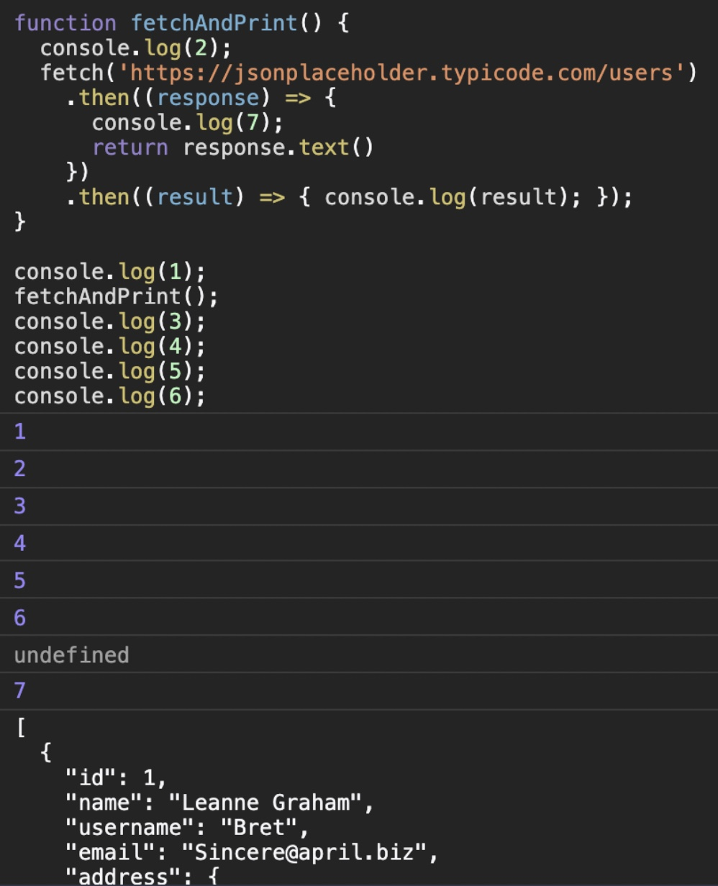

원래 모습이었을 코드를 보니까, 이제 왜 async/await가 있는 코드가 제가 말한 것처럼 실행되는지 이해가 될 것이다.

이번에 배운 것처럼 async/await 구문을 사용하면,

1. Promise 객체를 사용할 때, then 메소드 등을 사용하지 않고도
2. 마치 동기 실행 코드처럼 코드를 훨씬 더 간단하고 편하게 작성할 수 있다. 코드를 읽기에도 훨씬 편하다.

하지만 이런 편안함을 얻은 대신 한 가지 주의해야 할 점이 있다. 바로 이 **async/await** 구문 중에 비동기 실행되는 부분이 있다는 사실에 유의하며 코드를 작성 및 해석해야한다는 것이다. 아무리 **async/await** 구문이 동기 실행 코드처럼 생겼다고 해도 그 속에는 Promise 객체가 존재함을 절대 잊지 말아야한다.

다시한번 **async/await** 구문의 실행 원리를 정리하면,

**async** 함수 안의 코드가 실행되다가 **await**을 만나면, 일단 **await** 뒤의 코드가 실행되고, 코드의 실행 흐름이 **async** 함수 바깥으로 나가서 나머지 코드를 다 실행한다. 물론 함수 바깥에 더 이상 실행할 코드가 없을 수도 있다.

어느 경우든 그 이후로는, **await** 뒤에 있던 Promise 객체가 fulfilled 상태가 되기를 기다린다. 그리고 기다리던 Promise 객체가 fulfilled 상태가 되면 **await**이 Promise 객체의 작업 성공 결과를 리턴하는 것이다.

그런데 이때까지 Promise 객체가 fulfilled 상태가 되기만을 기다렸는데, **await** 뒤의 Promise 객체가 rejected 상태가 될 수도 있을 것이다. 이런 경우는 어떻게 해야하는지 아래에서 살펴보자.

## catch문과 finally문

만약 **async/await** 구문 사용시 promise 객체가 rejected 상태가 되는 경우에는 어떻게 될까?

이전 `promise chaining`에서는 promise 객체가 rejected 상태가 될 때를 대비해 catch 메소드를 사용했는데, **async/await** 구문에서는 **try catch**문을 사용하면 된다.

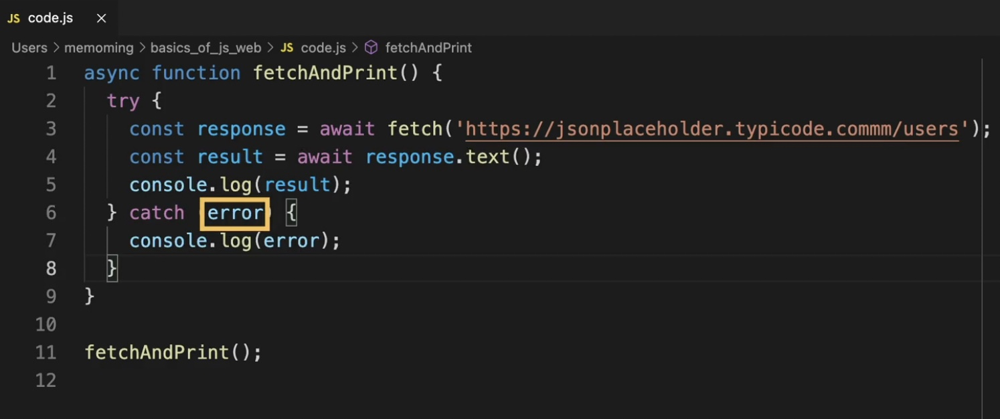

위와 같은 상황에서 try블록안의 **await** 구문이 붙은 promise 객체들 중 rejected 상태가 되는 것이 생기면 순간 코드의 흐름이 catch문으로 넘어가게 된다. 그리고 catch문의 파라미터 (위에서는 `error`)로 '작업 실패 정보'가 넘어온다.

마찬가지로 finally문을 사용할때도 이전과 같이 catch문 보다 뒤에 (가장 마지막에) 사용하고 프로미스 객체가 어떤 상태이든 해당 코드를 실행하게 된다.

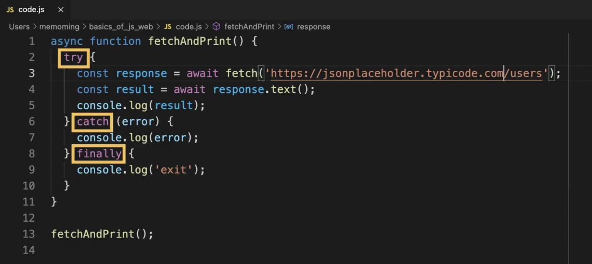

## async 함수는 promise 객체를 리턴

아래 코드를 보자.

```js
async function fetchAndPrint() {
  return 3;
}

fetchAndPrint();
```

위의 코드를 실행하면 어떻게 될까? 단순히 3을 리턴하는 것일까?

결론부터 말하면 그렇지 않다. 이는 **숫자 3을 '작업 성공 결과'로 가진 `fulfilled` 상태의 promise 객체를 리턴한다.**

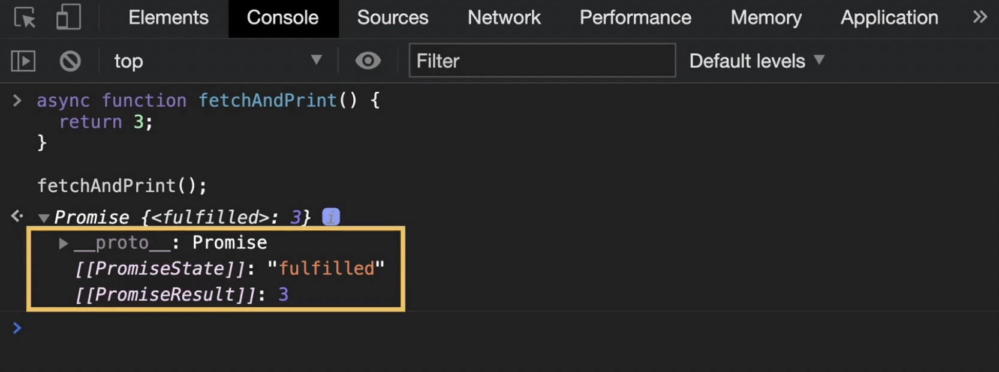

이처럼 **async가 붙은 함수는 항상 promise 객체를 리턴하게 되어있다.**

또 여기서 중요한 점은 **async 함수는 그 안에서 리턴하는 값에 따라 그에 맞는 promise 객체를 리턴**한다는 점이다. 이는 이전에 살펴본 then 메소드와 규칙이 유사하다. 아래 경우들을 살펴보자.

### 어떤 값을 리턴하는 경우

(1) Promise 객체를 리턴하는 경우

async 함수 안에서 Promise 객체를 리턴하는 경우에는 **해당 Promise 객체와 동일한 상태와 작업 성공 결과(또는 작업 실패 정보)를 가진 Promise 객체를 리턴**한다. (그냥 해당 Promise 객체를 리턴한다고 봐도 괜찮다.)

```js
async function fetchAndPrint() {
  return new Promise((resolve, reject) => {
    setTimeout(() => {
      resolve("abc");
    }, 4000);
  });
}

fetchAndPrint();
```

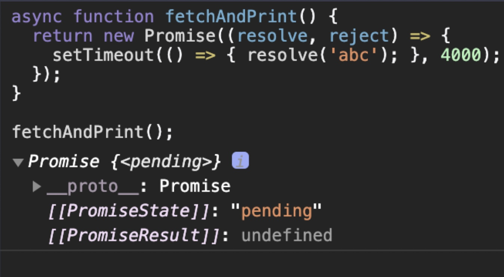

이렇게 pending 상태의 Promise 객체를 리턴하기도 하고 (리턴된 Promise 객체는 약 4초 후에 fulfilled 상태가 될 것이다.)

```js
async function fetchAndPrint() {
  return Promise.resolve("Success");
}

fetchAndPrint();
```

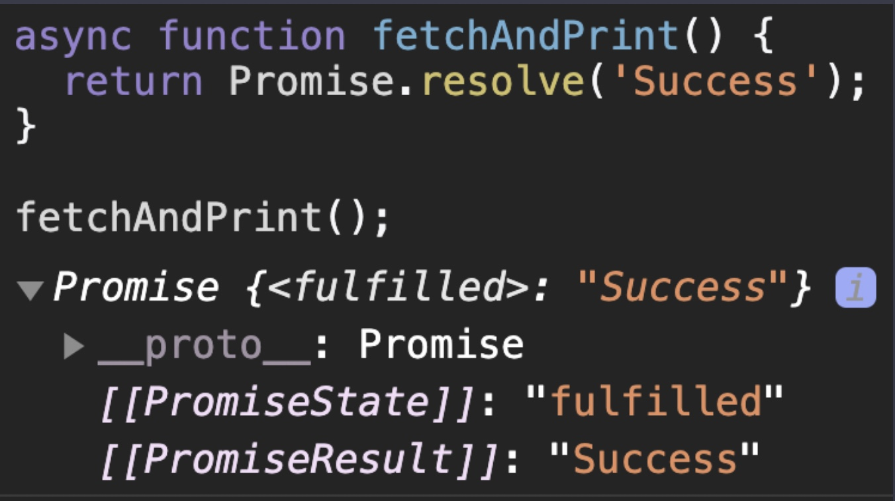

이미 fulfilled 상태인 Promise 객체나

```js
async function fetchAndPrint() {
  return Promise.reject(new Error("Fail"));
}

fetchAndPrint();
```

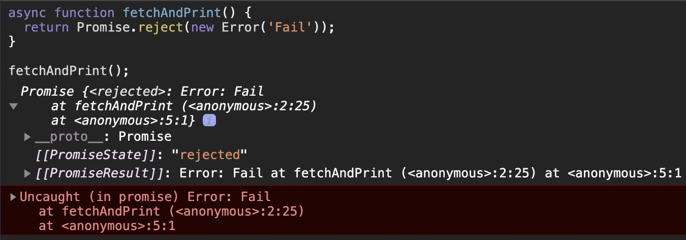

이미 rejected 상태인 Promise 객체를 리턴하는 경우 전부 다 해당한다. (위 이미지에서는 rejected 상태의 Promise 객체를 따로 처리해주지 않았기 때문에 에러가 발생한 것.)

(2) Promise 객체 이외의 값을 리턴하는 경우

async 함수 내부에서 Promise 객체 이외에 숫자나 문자열, 일반 객체 등을 리턴하는 경우에는, **fulfilled 상태이면서, 리턴된 값을 작업 성공 결과로 가진 Promise 객체를 리턴한다.**

```js
async function fetchAndPrint() {
  return 3;
}

fetchAndPrint();
```

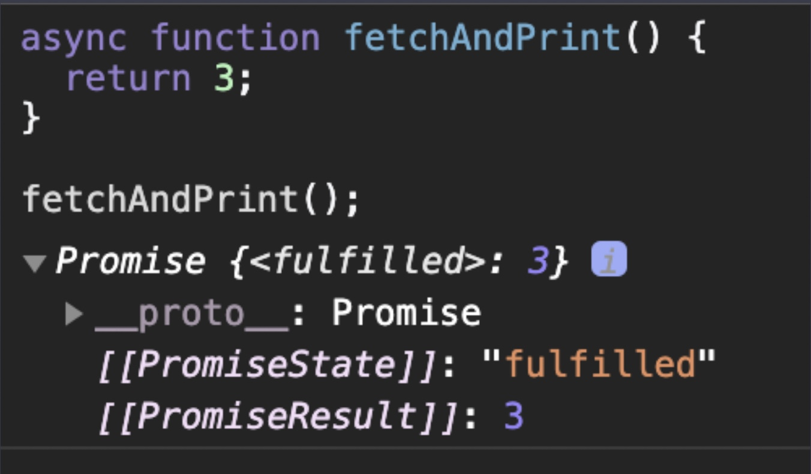

이런 코드나

```js
async function fetchAndPrint() {
  return "Hello";
}

fetchAndPrint();
```

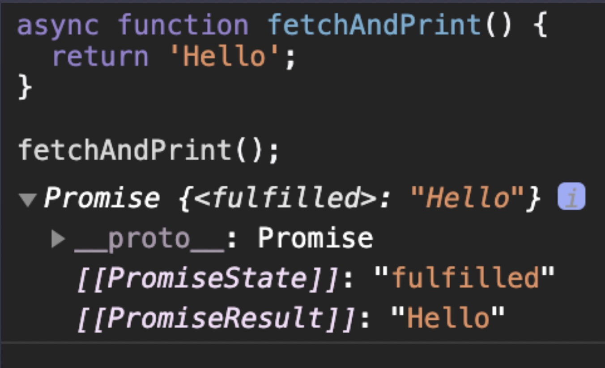

이런 코드,

```js
async function fetchAndPrint() {
  const member = {
    name: "Jerry",
    email: "jerry@codeitmall.kr",
    department: "sales",
  };

  return member;
}

fetchAndPrint();
```

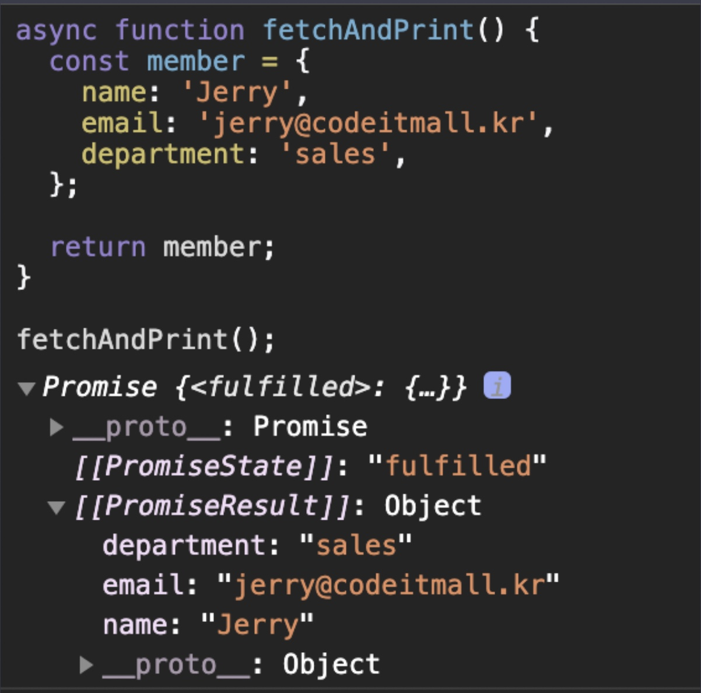

이런 코드들 모두 여기에 해당한다.

### 아무 값도 리턴하지 않는 경우

```js
async function fetchAndPrint() {
  console.log("Hello Programming!");
}

fetchAndPrint();
```

이렇게 함수에서 아무런 값도 리턴하지 않으면 자바스크립트에서 undefined를 리턴한 것으로 간주한다고 했다. 따라서

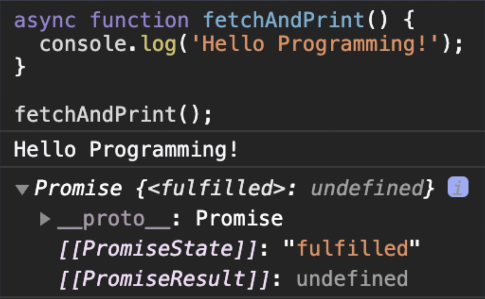

이 경우에는 fulfilled 상태이면서, undefined를 작업 성공 결과로 가진 Promise 객체가 리턴된다.

## async 함수 내부에서 에러가 발생했을 때

```js
async function fetchAndPrint() {
  throw new Error("Fail");
}

fetchAndPrint();
```

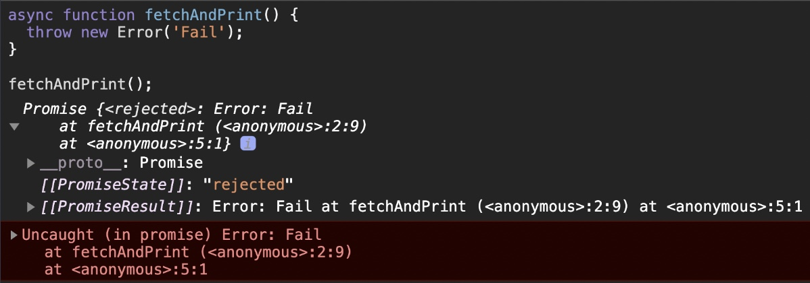

async 함수 안에서 에러가 발생하면, **rejected 상태이면서, 해당 에러 객체를 작업 실패 정보로 가진 Promise 객체가 리턴된다.**

자, 이때까지 async 함수 안에서 리턴하는 값에 따라, async 함수가 결국 어떤 Promise 객체를 리턴하는지 배웠는데,
이전에 then 메소드를 배울때 적용했던 내용과 비슷해서 크게 어렵지 않았을 것이다.

이렇게 async 함수가 결국 Promise 객체를 리턴한다는 사실은 아주 중요하다. 왜냐하면 이 말은 곧 async 함수 안에서 다른 async 함수를 가져다가 쓸 수 있다는 뜻이기 때문이다.

## async 함수 안의 async 함수

아래 코드를 살펴보자.

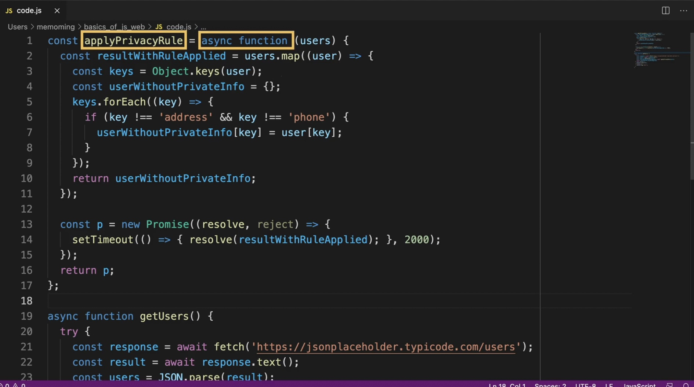

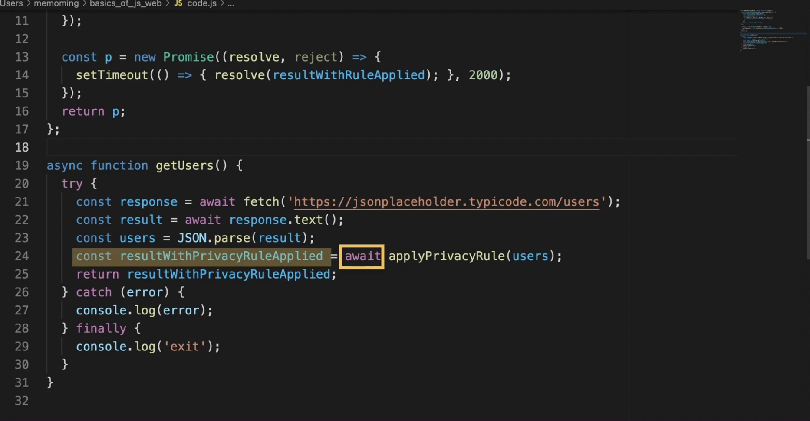
첫 번째 사진에서 맨 위의 `applyPrivacyRule` 함수는 프로미스 객체를 리턴하고 이 프로미스 객체가 fulfilled 상태가 되면 작업 성공 결과가 두 번째 사진의 `resultWithPrivacyRuleApplied` 변수에 담기게 된다.

이런식으로 하나의 async 함수 안에서 또 다른 async 함수를 사용할 수 있다. (두 번째 사진처럼 해당 함수 앞에 await을 붙여주면 된다.) 이는 **async 함수도 결국 프로미스 객체를 리턴하기 때문에 다른 async 함수 안에서 await을 붙여 사용 가능하다는 것.**

## async를 붙이는 위치

자바스크립트에서 함수를 표현하는 방법에는 여러 가지가 있는데,

1. **Function Declaration(함수 선언식)**,
2. **Function Expression(함수 표현식)**,
3. **Arrow Function(화살표 함수)**

등이 있다. 그리고

**Function Expression**의 경우에는

2-1. 함수에 이름이 붙어있는 Named Function Expression과

2-2. 함수에 이름이 없는 Anonymous Function Expression으로 나눌 수 있고,

**Arrow Functio**n의 경우 함수 내부의 내용에 따라 더 축약(shorten)해서 나타낼 수도 있다.

각각의 경우에 async 키워드를 어떻게 붙이는지 살펴보자.

```js
// 1) Function Declaration
async function example1(a, b) {
  return a + b;
}

// 2-1) Function Expression(Named)
const example2_1 = async function add(a, b) {
  return a + b;
};

// 2-2) Function Expression(Anonymous)
const example2_2 = async function (a, b) {
  return a + b;
};

// 3-1) Arrow Function
const example3_1 = async (a, b) => {
  return a + b;
};

// 3-2) Arrow Function(shortened)
const example3_2 = async (a, b) => a + b;
```

각 함수 표현 방식에서 async는 이런 식으로 붙이면 되는데요. 각각의 경우에 async를 어디에 붙였는지 기억해두자.

참고로, 자바스크립트에는 함수를 정의하면서 동시에 실행하는 즉시실행함수(Immediately-invoked function expression, IIFE)라는 개념도 있다.

```js
(function print(sentence) {
  console.log(sentence);
  return sentence;
})("I love JavaScript!");

(function (a, b) {
  return a + b;
})(1, 2);

((a, b) => {
  return a + b;
})(1, 2);

((a, b) => a + b)(1, 2);
```

이런 식으로 함수를 바로 정의와 동시에 실행하는 것을 의미한다. 보통 초기화 코드 등에서 함수를 단 한 번만 실행하기 위한 목적으로 이 즉시실행함수를 사용하는데, 이런 경우에도 async를 이렇게 붙일 수 있다.

```js
(async function print(sentence) {
  console.log(sentence);
  return sentence;
})("I love JavaScript!");

(async function (a, b) {
  return a + b;
})(1, 2);

(async (a, b) => {
  return a + b;
})(1, 2);

(async (a, b) => a + b)(1, 2);
```

## async 함수를 작성할 때 주의해야할 성능 문제

이때까지 async 함수에 관해서 많은 내용을 배웠는데, 그런데 async 함수의 내부 코드를 작성할 때는 특히 주의해야 하는 경우가 있다. 잠깐 아래의 코드를 보자.

```js
async function getResponses(urls) {
  for (const url of urls) {
    const response = await fetch(url);
    console.log(await response.text());
  }
}
```

이 `getResponses` 함수는 urls라는 파라미터로, 여러 개의 URL들이 있는 배열을 받아서, 순서대로 각 URL에 리퀘스트를 보내고, 그 리스폰스의 내용을 출력하는 함수이다. 그런데 이 코드는 하나의 문제점이 있다. 그건 바로 이전 URL에 리퀘스트를 보내고 리스폰스를 받아서 출력하고 나서야, 다음 URL에 대한 리퀘스트를 보낼 수 있다는 점이다. 즉, **순차적인 작업 처리를 한다는 점**인데, 왜냐하면 이전 URL에 대해서 await 문이 붙은 Promise 객체가 fulfilled 상태가 될 때까지는 그 다음 URL에 대한 작업들이 시작될 수 없기 때문이다.

만약 순차적인 처리를 해야 하는 경우라면 이 코드를 사용하는 게 맞겠지만, 만약 모든 리스폰스의 내용이 잘 출력되기만 하면 되고, **그 순서는 상관없는 경우라면 어떨까? 이 코드는 성능 관점에서 아쉬운 점이 있는 코드이다.**

만약 리스폰스의 내용의 순서가 중요하지 않은 경우라면 현재 코드를 이렇게 바꿔볼 수 있는데,

```js
async function fetchUrls(urls) {
  for (const url of urls) {
    (async () => {
      // 추가된 부분!
      const response = await fetch(url);
      console.log(await response.text());
    })(); // 추가된 부분!
  }
}
```

지금 각 url에 리퀘스트를 보내고 리스폰스를 받는 코드를, 별도의 즉시실행되는 async 함수로 감싸줬는데, 즉시실행함수는 정의와 동시에 실행되는 함수라고 배웠었다.

이렇게 코드를 고치면 일단 각 URL에 대해서 fetch 함수를 실행해서 리퀘스트를 보내는 것을 순서대로 바로 실행해버린다. 이전 코드처럼 이전 URL에 대한 리스폰스가 오기까지를 기다렸다가 다음 URL에 리퀘스트를 보내는 게 아닌 것. 이렇게 코드를 쓰면 일단 모든 URL에 대한 리퀘스트를 쭉 보내버리고, 먼저 리스폰스가 오는 순서대로 그 내용이 출력된다.

리스폰스의 순서를 보장하지 않아도 되는 경우에는 이 코드가 훨씬 성능이 좋을 것이다.

async 함수 안에서는 무언가를 반복 처리하는 코드를 쓸 때 유의해야 한다. 왜냐하면 의도치 않게 순차 처리를 수행하는 비효율적인 코드를 짜는 실수를 하게 되기 쉽기 때문이다. 만약 순차적인 처리가 필요한 경우가 아니라면 방금 본 것처럼 각 작업을 다시 async 함수로 묶어주면 된다는 사실을 기억해두자.

## 비동기 실행 관련 문법 정리

이때까지 비동기 실행에 관해 배운 내용들을 정리해보자. 일단 비동기 실행의 의미에 대해서 정리해보자. 사실 비동기 실행의 정의는 아래와 같이 다양한 방식으로 표현될 수 있다.

- 특정 작업이 시작되고, 그 작업이 모두 완료되기 전에 바로 다음 코드가 실행되는 방식의 실행, 나머지 작업은 나중에 콜백을 통해 수행되는 방식의 실행
- 특정 처리를 나중으로 미루는 방식의 실행
- 콜백을 등록해두고, 추후에 특정 조건이 만족되면 그 콜백으로 나머지 작업을 수행하는 방식의 실행

이렇게 다양한 표현으로 그 정의를 써볼 수 있는데, **특정 처리를 담당하는 존재(콜백)의 실행을 나중으로 미룬다는 점**만 잘 기억하시면 딱히 어려울 게 없다.

이제 이때까지 배웠던, 비동기 실행 관련 문법 3가지인

1. 파라미터로 바로 콜백을 전달하는 형태의 전통적인 비동기 실행 함수
2. Promise
3. async/await

에 대해 정리해보자

### 파라미터로 바로 콜백을 전달하는 형태의 전통적인 비동기 실행 함수

`setTimeout, setInterval` 함수, DOM 객체의 `addEventListener` 메소드 등이 여기에 해당.

```js
setTimeout(() => {
  console.log("asynchronously executed");
}, 2000);

button.addEventListener("click", (event) => {
  console.log("You Clicked");
});
```

이런 방식으로 함수의 파라미터로 콜백을 바로 집어넣는 코드들을 봤었다.

이렇게 함수의 파라미터로 콜백을 바로 전달하는 방식은 여전히 많은 경우에 쓰이고 있지만,
**여러 비동기 작업의 순차적인(sequential) 처리가 필요한 경우**에 이런 함수들로 코드를 작성하면,

```js
fs.readFile("file1.txt", "utf8", (error1, data1) => {
  if (error1) {
    console.log(error1);
  } else {
    console.log(data1);
    fs.readFile("file2.txt", "utf8", (error2, data2) => {
      if (error2) {
        console.log(error2);
      } else {
        console.log(data2);
        fs.readFile("file3.txt", "utf8", (error3, data3) => {
          if (error3) {
            console.log(error3);
          } else {
            console.log(data3);
          }
        });
      }
    });
  }
});
```

위와 같이 코드의 가독성이 급격하게 떨어지는 **콜백 헬(callback hell)** 문제가 발생할 가능성이 높다고 했다.

### Promise

```js
fetch("https://www.google.com")
  .then((response) => response.text())
  .then((result) => {
    console.log(result);
  })
  .catch((error) => {
    console.log(error);
  })
  .finally(() => {
    console.log("exit");
  });
```

**Promise 객체를 사용하면 콜백 헬 문제를 방지하면서, 여러 비동기 작업을 순차적으로 처리할 수 있다**고 배웠다.

그리고 기존의 1.과 같은 전통적인 비동기 실행 함수들 중에서도 그 콜백이 단 한 번만 실행되는 함수들은

```js
function readFile_promisified(filename) {
  const p = new Promise((resolve, reject) => {
    fs.readFile(filename, "utf8", (error, data) => {
      if (error) {
        reject(error); // 에러 발생 시 -> rejected
      } else {
        resolve(data); // 파일 내용 읽기 완료 -> fulfilled
      }
    });
  });
  return p;
}
```

이런 식으로 **Promisify**해서 콜백 헬의 가능성을 없애고, Promise Chain 안에서 그 콜백의 리턴값을 사용할 수 있다는 것도 배웠었다.

그리고 rejected 상태의 Promise 객체에 대비하기 위한 catch 메소드, 어느 상황이든 항상 마지막에 실행해야 할 코드가 있을 때 사용하는 finally 메소드도 배웠다.

### async / await 구문

```js
async function fetchAndPrint() {
  try {
    const response = await fetch("https://www.google.www");
    const result = await response.text();
    console.log(result);
  } catch (error) {
    console.log(error);
  } finally {
    console.log("exit");
  }
}

fetchAndPrint();
```

async/await 구문은 **Promise 객체를 다루는 코드(Promise Chaining 코드 등)를 사람들이 좀더 익숙하게 느끼는 동기 실행 스타일의 코드로 작성할 수 있게 해주는 Syntactic sugar**라고 했다. 하지만 동기 실행 코드처럼 보인다고 실제로 코드가 보이는 순서대로 실행되는 것은 아니라고 했었다.

async 함수 안의 내용이 순차적으로 실행되다가도, **await 문을 만나면 await 바로 뒤에 붙은 코드를 실행해두고, 일단은 함수 바깥으로 코드 흐름이 바뀐다**고 했던 점을, 반드시 기억하셔야 한다.

이런 점만 주의하면 사실 **Promise 기반의 코드들은 가능한 경우에 모두 async/await 구문으로 전환해서 작성하는 게 더 좋다.**

참고로 async/await(ES2017, 2017년 도입)은 Promise(ES6, 2015년 도입)에 비해 보다 더 최근에 자바스크립트 표준에 도입된 문법인데, 이렇게 같은 기능을 더 편하게 구현할 수 있도록 자바스크립트 문법은 늘 발전하고 있다.

자, 이때까지 자바스크립트로 비동기 실행 코드를 작성할 수 있는 방법 3가지를 살펴봤는데요.

2021년 1월을 기준으로 아직 위의 3가지 비동기 실행 관련 문법들은 서로 상호보완적인 것들이라고 할 수 있다. 왜냐하면 아직 아래와 같이 하나가 다른 하나를 완벽히 대체하지 못하는 측면이 있기 때문이다.

1. 콜백을 함수의 파라미터로 바로 전달하는 전통적인 방식의 비동기 실행 함수들 중에서도 `setInterval, addEventListener`처럼 그 콜백이 단 한번이 아니라 여러 번 실행되어야 하는 것들은 Promisify해서 사용하면 안 된다. Promise 객체는 한번 fulfilled 또는 rejected 상태가 되고나면 그 상태와 결과가 다시는 바뀌지 않기 때문.

2. async/await 구문의 경우, await은 async 함수 안에서만 사용할 수 있고, 코드의 top-level(어떤 함수 블록 안에 포함된 것이 아닌 코드의 최상위 영역)에서는 사용될 수는 없다. 그래서 코드의 top-level에서 async 함수가 리턴한 Promise 객체의 작업 성공 결과를 가져오려면 await을 사용할 수는 없고, 여전히 then 메소드를 사용해야한다.

그러니까 이 3가지 모두 잘 알아둬야하는 것이다. 그리고 실제 개발을 할 때는 여러분이 사용하려는 문법이 어느 웹 브라우저에서 지원을 하고 안 하는지를 체크해야 하는데, 자바스크립트의 각 문법별 브라우저 지원 현황을 이런 사이트 (https://kangax.github.io/compat-table/es6/) 등을 통해 조사하고 개발을 시작하는 게 좋다. 다행히 이때까지 배운 3가지 종류의 문법은 대다수의 웹 브라우저에서 지원한다.

사실 비동기 실행에 관해서 중요한 것은 어느 문법의 코드를 작성하든 그 개념을 제대로 이해하고 코드를 작성해야 한다는 점이다.
콜백 헬 문제를 해결하기 위해 Promise 객체가 등장했고, Promise를 좀 더 편하게 다루기 위해서 async/await 구문이 등장했지만,
각 문법을 제대로 이해하지 못하고 코드를 작성한다면, 그것은 또다서 Promise hell, async/await hell이 될 뿐입니다.

하지만 각각의 문법을 제대로 이해하고 코드를 작성한다면 개발 실력과 생산성은 한층 업그레이드될 것이다.

## 두 가지 종류의 콜백

이때까지 우리는 '비동기 실행'에 대해서 많은 것을 배웠다. 그런데 한 가지 짚고 넘어가야할 사실이 하나 있는데 **나중에 실행될 작업을 처리하는 함수를 '콜백(callback)'**이라고 했었다. 그런데 이것은 콜백의 한 가지 종류일 뿐 원래 콜백이라는 단어는 더 넓은 의미를 갖고 있다.

자바스크립트에서 **콜백은 어떤 함수의 파라미터로 전달되는 모든 함수를 의미하는 개념**이다. 그러니까 어떤 함수의 파라미터로 전달되기만 한다면 해당 함수는 그 함수의 콜백이 되는 것입니다. 이런 콜백은

1. **동기 실행되는 콜백과**
2. **비동기 실행되는 콜백**

으로 나뉘는데, 위에서는 비동기 실행에 대해 자세히 설명하기 위해서 2번 관점에서만 콜백을 설명했었다. 이때까지 우리가 본 콜백들은 모두 2번에 해당하는 콜백들이었다.

그렇다면 1번에 해당하는 콜백에는 어떤 것들이 있을까? 예를 들어, 자바스크립트 배열의 메소드 중에서 `filter`라는 메소드를 생각해보자. 이 메소드는 배열의 여러 요소들 중에서 특정 조건을 만족하는 요소들만을 추려서 그 요소들로만 이루어진 새로운 배열을 리턴하는 메소드인데,

아래 코드를 보자.

```js
const arr = [1, 2, 3, 4, 5, 6];

const newArr = arr.filter(function isOdd(num) {
  return num % 2 === 1;
});

console.log(newArr); // [1, 3, 5]
```

이 코드는 arr라는 배열에서 홀수만을 추출해서 해당 홀수들만으로 이루어진 새로운 배열을 리턴한다. `filter` 함수의 파라미터 부분을 보면 `isOdd`(홀수인가요?)라는 함수가 들어있다는 것을 알 수 있는데, `filter` 함수는 arr 배열에서 각 요소를 하나씩 순회하면서 매 요소마다 `isOdd` 함수를 실행하고, 해당 함수가 true를 리턴하는 요소들만을 추출한다. 여기서는 해당 숫자를 2로 나누었을 때 나머지가 1인(=홀수인) 것들만 추출한다는 뜻이다.

이 코드는 **Arrow Function** 형식으로 이렇게 간략하게 나타낼 수도 있다.

```js
const arr = [1, 2, 3, 4, 5, 6];

const newArr = arr.filter((num) => num % 2);

console.log(newArr); // [1, 3, 5]
```

자, 형식이 어찌되었든 이렇게 함수 안에 들어간 함수는 모두 콜백이다.
현재 `filter` 메소드 안의 콜백은 앞서 말했듯이 **'동기 실행되는 콜백'**인데
즉, 이 콜백은 우리가 위에서 배웠던 **'비동기 실행되는 콜백'**과는 달리, 아주 정직하게 순서대로 실행된다.

`filter` 함수는 파라미터로 받은 콜백을, 매 요소를 순회하면서, 매 요소를 대상으로 실행한다. 어떤 처리를 나중에 특정 조건이 만족되었을 때 남은 작업을 처리하기 위해서 사용하는 것이 아닌 것.

만약 `isOdd` 콜백이 비동기 실행되는 콜백이었다면 그 뒤의 `console.log(newArr);`가 먼저 실행되었을 것이다.

이렇게 콜백에는 동기 실행되는 콜백도 있다는 점에 유의해야한다.

정리하자면, 사실 **콜백이란 함수의 파라미터로 전달되는 함수를 의미하는 넓은 의미의 개념**이고, 이때 그것이

1. 동기 실행되는지
2. 비동기 실행되는지

에 따라 두 종류로 나뉘는 것이다. 위에서는 비동기 실행에 집중된 개념 설명을 위해 2번의 경우가 마치 콜백의 전부인 것처럼 설명했지만, 사실은 동기 실행되는 콜백도 있다는 점을 기억해두자.

그렇다면 '2. 비동기 실행되는 콜백은 어떤 원리로 비동기 실행되는 걸까?' 이제 자바스크립트에서 비동기 실행되는 코드가 있다고 할 때, 각 줄의 코드가 어떤 순서로 실행되는지는 알게 되었다. 그렇다면 동기 실행, 비동기 실행 이런 것들은 자바스크립트 실행 환경에서 실제로 어떻게 구현되고 있는 걸까? 이것은 추후에 좀 더 정리해보도록 하자.
