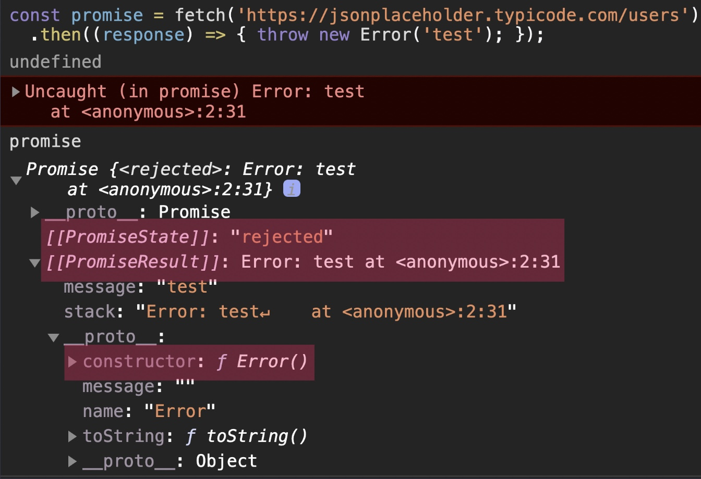
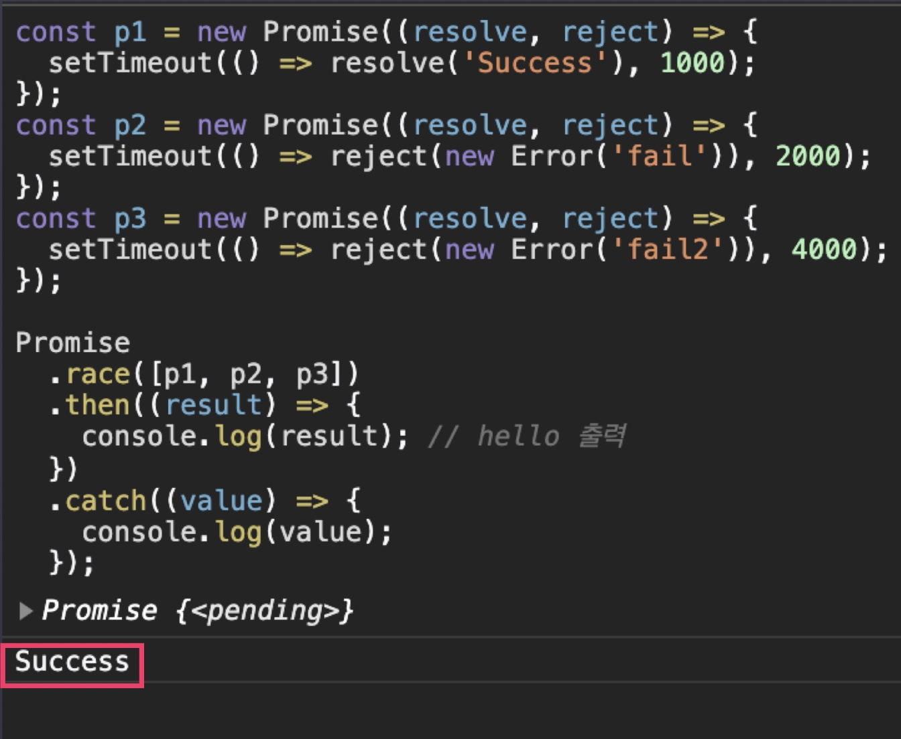

# 비동기 실행과 Promise 객체

## 비동기 실행

한번 시작된 작업이 완료되기 전에 바로 다음 코드로 실행이 넘어가고 나중에 콜백이 실행됨으로써 작업이 마무리되는 것을 비동기 실행이라고 한다.

## 동기 실행과 비동기 실행

```js
console.log("Start!");

fetch("https://www.google.com")
  .then((response) => response.text())
  .then((result) => {
    console.log(result);
  });

console.log("End");
```

지금 이 코드에는 다음과 같은 2개의 콜백이 있다.

1. `(response) ⇒ response.text()`
2. `(result) ⇒ { console.log(result); }`

fetch 함수가 리퀘스트를 보내고, 서버의 리스폰스를 받게 되면 그때서야 이 콜백들이 순서대로 실행되는데,

이 사실을 바탕으로, 전체 코드의 실행 순서를 다시 정리하자면

1. `console.log('Start');`
2. fetch 함수(리퀘스트 보내기 및 콜백 등록)
3. `console.log('End');`
4. 리스폰스가 오면 2. 에서 then 메소드로 등록해뒀던 콜백 실행

이렇게 된다. 이렇게 **특정 작업을 시작(리퀘스트 보내기)하고 완벽하게 다 처리(리스폰스를 받아서 처리)하기 전에, 실행 흐름이 바로 다음 코드로 넘어가고, 나중에 콜백이 실행되는 것을 '비동기 실행'**이라고 한다. 이에 반해 한**번 시작한 작업은 다 처리하고 나서야, 다음 코드로 넘어가는, 우리에게 익숙한 방식의 실행은 '동기 실행'**이라고 하는데, 만약 이 코드에서 fetch 함수가 비동기 실행되지 않고, 동기 실행되는 함수였다고 가정한다면 실행 흐름이 어떻게 됐을까?

1. console.log('Start');
2. fetch 함수(리퀘스트 보내기)
3. 리스폰스가 올 때까지 코드 실행이 잠시 '정지'되고, 리스폰스가 오면 필요한 처리 수행
4. console.log('End');

이런 순서로 코드가 실행되었을 것이다. 동기 실행은 한번 시작한 작업을 완료하기 전까지 코드의 실행 흐름이 절대 그 다음 코드로 넘어가지 않는다. 일단 시작한 작업을 완벽하게 처리하고 난 다음에야 그 다음 코드로 실행 흐름이 넘어가는데, 따라서 동기 실행의 경우 코드가 보이는 순서대로, 실행된다.

이와 다르게 비동기 실행은 한번 작업을 시작해두고, 그 작업이 완료되기 전이더라도 콜백만 등록해두고, 코드의 실행 흐름이 바로 그 다음 코드로 넘어간다. 그리고 추후에 특정 조건이 만족되면 콜백이 실행됨으로써 해당 작업을 완료하는 방식인것. 따라서 비동기 실행에서는 코드가 꼭 등장하는 순서대로 실행되는 것이 아니다. 그래서 코드를 해석할 때 주의해야 하는데,

그렇다면 '비동기 실행'이라는 건 왜 존재하는 걸까? 그건 바로 보통 '비동기 실행'이 '동기 실행'에 비해, 동일한 작업을 더 빠른 시간 내에 처리할 수 있기 때문이다. 방금 전 fetch 함수가 '동기 실행'된다고 가정했을 때를 생각해보자. fetch 함수가 실행되고 리스폰스가 올 때까지 기다린다는 것은 무슨 의미일까? 바로 리스폰스가 올 때까지는 아무런 작업도 할 수 없다는 뜻이다. 그만큼 시간을 낭비하게 되는 셈인 것이다.

하지만 만약 비동기 실행이라면 일단 리퀘스트 보내기, 콜백 등록까지만 해두고, 바로 다음 작업(`console.log('End');`)을 시작함으로써 시간을 절약할 수 있다. 이 설명을 도식화하면 다음과 같다.


이미지 상단은 fetch 함수가 동기 실행된다고 가정했을 때의 경우,
이미지 하단은 fetch 함수가 비동기 실행되는 실제의 모습을

의미한다. 지금 동기 실행에서는 모든 작업이 순차적으로 수행되고 있는 게 한눈에 볼 수 있는데 이에 비해, 비동기 실행에서는 리스폰스를 기다리는 시간 동안 그 이후의 작업을 미리 처리하고 있다. 그래서 비동기 실행이 최종 작업 종료 시간이 더 짧다는 것을 알 수 있다.(물론 실제로는 비동기 실행의 경우에는 콜백을 등록하는 시간적 비용이 존재하지만 일단은 이해를 위해서 이런 부분은 생략하고 넘어가자.)

참고로, 현재 보라색 박스로 나타낸 fetch 함수 바로 다음 코드의 실행이 지금보다 더 오래 걸리는 작업이라고 가정한다면, 비동기 실행의 상대적인 작업 효율성은 더 올라간다. 보라색 영역이 둘 다 더 길어진다고 생각해보면 이해하실 수 있을 것.

자바스크립트로 웹 통신을 하는 코드를 작성하려면 이런 비동기 실행의 원리와 그 장점에 대해 잘 이해하고 있어야 한다. 이제부터는 자바스크립트에서 비동기 실행을 다루기 위해 알아야 하는 Promise 객체, async/await 구문 등에 대해 배워보자.

## 알아야하는 비동기 함수들

### setTimeout 함수

setTimeout 함수는, 특정 함수의 실행을 원하는 시간만큼 뒤로 미루기 위해 사용하는 함수.

```js
console.log("a");
setTimeout(() => {
  console.log("b");
}, 2000);
console.log("c");
```

예를 들어 이런 코드가 있을 때, 지금 가운데에 있는 setTimeout 함수는 첫 번째 파라미터에 있는

```
() ⇒ { console.log('b'); },
```

이 콜백의 실행을, 두 번째 파라미터에 적힌 2000 밀리세컨즈(=2초) 뒤로 미룬다. 그래서 이 코드를 실행하면


이렇게 a와 c가 먼저 출력되고, 약 2초가 지난 후에 b가 출력됩니다. 실제로 확인하고 싶은 분들은 직접 코드를 복사해서 개발자 도구에서 확인해보자.

fetch 함수에서는 콜백이 실행되는 조건이, '리스폰스가 도착했을 때'였다면, setTimeout에서 콜백이 실행되는 조건은, '설정한 밀리세컨즈만큼의 시간이 경과했을 때'이다. 어쨌든 둘 다 콜백의 실행을 나중으로 미룬다는 점에서는 비슷하다. 이 setTimeout 함수는 아주 자주 활용되는 비동기 실행 함수이므로 기억해두자.

### setInterval 함수

setInterval 함수는 특정 콜백을 일정한 시간 간격으로 실행하도록 등록하는 함수. Interval는 '간격'이라는 뜻인데, 바로 위에서 봤던 예시 코드에서 setTimeout 부분만 setInterval로 바꿔서 실행해보자.

```js
console.log("a");
setInterval(() => {
  console.log("b");
}, 2000);
console.log("c");
```

이렇게 쓰면 이제 b를 출력하는 콜백이 2초 간격으로 계속 실행된다. 실제로 확인해보면


a와 c가 출력되고, 약 2초 뒤에 b가 출력된 후 그 뒤로 계속 2초 간격으로 b가 반복 출력되는 것을 볼 수 있다. (현재 b 왼쪽에 쓰여 있는 5는 b가 다섯 번 출력되었음을 개발자 도구가 간단하게 나타낸 것)

### addEventListener 메소드

addEventListener 메소드는 DOM 객체의 메소드.

만약 사용자가 웹 페이지에서 어떤 버튼 등을 클릭했을 때, 실행하고 싶은 함수가 있다면,

1. 해당 DOM 객체의 onclick 속성에 그 함수를 설정하거나,
2. 해당 DOM 객체의 addEventListener 메소드의 파라미터로 전달하면 된다.

이런 식으로 말이다.

1. onclick 속성

```js
...

btn.onclick = function (e) { // 해당 이벤트 객체가 파라미터 e로 넘어옵니다.
console.log('Hello Codeit!');
};

// 또는 arrow function 형식으로 이렇게 나타낼 수도 있습니다.
btn.onclick = (e) => {
console.log('Hello Codeit!');
};

...
```

2. addEventListener 메소드

```js
...

btn.addEventListener('click', function (e) { // 해당 이벤트 객체가 파라미터 e로 넘어옵니다.
console.log('Hello Codeit!');
});

// 또는 arrow function 형식으로 이렇게 나타낼 수도 있습니다.
btn.addEventListener('click', (e) => {
console.log('Hello Codeit!');
});

...
```

이렇게 클릭과 같은 특정 이벤트가 발생했을 때 실행할 콜백을 등록하는 addEventListener 메소드도 비동기 실행과 관련이 있다. 파라미터로 전달된 콜백이 당장 실행되는 것이 아니라, 나중에 특정 조건(클릭 이벤트 발생)이 만족될 때(마다) 실행되기 때문이다.

이때까지 자바스크립트의 대표적인 비동기 실행 함수들을 살펴봤는데, 이때까지 배운 fetch 함수와 이번에 살펴본 함수들을 보면 차이점이 있다. 일단 이번 노트에서 배운 함수들을 보면

```js
setTimeout(콜백, 시간)
setInterval(콜백, 시간)
addEventListener(이벤트 이름, 콜백)
```

이런 식으로, 함수의 아규먼트로 바로 콜백을 넣는다. 그런데 fetch 함수는 이 함수들과는 전혀 다르게 생겼다. 지금 보면,

```js
fetch("https://www.google.com")
  .then((response) => response.text()) // fetch 함수가 리턴하는 객체의 then 메소드를 사용해서 콜백을 등록
  .then((result) => {
    console.log(result);
  });
```

fetch 함수는 콜백을 파라미터로 바로 전달받는 게 아니라, **fetch 함수가 리턴하는 어떤 객체의 then 메소드를 사용해서 콜백을 등록**하는데,

위에서 본 함수들처럼, fetch 함수도 이런 식으로 코드를 써야할 것만 같은데.

```js
fetch("https://www.google.com", (response) => response.text());
```

왜 fetch 함수만 사용하는 형식이 다른 걸까? 그건 바로 fetch 함수는, 좀 더 새로운 방식으로 비동기 실행을 지원하는 자바스크립트 문법과 연관이 있기 때문이다. 사실 **fetch 함수는 Promise 객체라는 것을 리턴하고, 이 Promise 객체는 비동기 실행을 지원하는 또 다른 종류의 문법에 해당**하는데, 이게 무슨 말인지 이후에 밑에서 살펴보자.

## Promise 객체

**어떤 작업에 관한 '상태 정보'를 갖고 있는 객체를 말한다.** 예를 들어 fetch 함수를 사용할때 작업이 성공할 수도 있고 인터넷 끊김 등으로 인해 작업이 실패할 수도 있는데 이런 작업의 결과가 fetch 함수가 return하는 promise 객체에 저장된다. 그래서 promise 객체를 보면 이 작업이 실패했는지 성공했는지 여부를 알 수 있다.

promise 객체는 크게 3가지 상태를 가진다.

1. `pending` : 작업이 진행중
2. `fulfilled` : 작업이 성공
3. `rejected` : 작업이 실패

맨 처음, fetch 함수가 return한 promise 객체는 작업이 진행 중이므로 `pending` 상태가 된다. 이후 작업이 성공하면 (response를 정상적으로 잘 받으면) `fulfilled`상태가 되고 '작업의 성공 결과'도 같이 가지게 된다. (response에 담김) 하지만 네트워크가 끊기거나 서버의 문제 등 response를 제대로 받지 못한다면 promise객체는 `rejected` 상태가 되고 '작업의 실패 정보'도 같이 가지게 된다.

이 관점으로 아래 코드를 다시 살펴보자.

```js
fetch("https://www.google.com")
  .then((response) => response.text())
  .then((result) => {
    console.log(result);
  });
```

promise의 then 메소드를 사용하면 나중에 해당 promise객체가 `pending `상태에서 `fulfilled` 상태가 됬을때 실행할 콜백을 등록할 수 있다.


이후 response가 와서 실제로 `fulfilled` 상태가 되면 등록해둔 콜백이 실행되고 '작업 성공 결과'가 콜백의 파라미터로 넘어오게 된다.

 

## Promise Chaining

Pormise Chaining이란 프로미스 객체들을 계속해서 연결해 나간다는 뜻이다.
사실 **모든 then 메소드들은 각각 별개의 promise 객체를 리턴**하는데,

 

이렇게 promise 객체의 then 메소드가 결국 또 새로운 promise 객체를 리턴하기 때문에 then 메소드 뒤에 또 then 메소드들을 붙여나갈 수 있다.

또 한가지 중요한 사실은 then 메소드가 리턴한 promise 객체는 가장 처음에는 `pending` 상태이지만 **등록한 콜백이 실행되고 콜백에서 어떤 값을 리턴하면 then 메소드가 리턴했던 promise 객체가 영향을 받는데, 이때 콜백에서 어떤 값을 리턴하느냐에 따라 영향이 달라진다.** 이를 아래와 같이 2가지 경우로 나눌 수 있는데,

1.  콜백안에서 promise 객체를 리턴하는 경우
2.  promise 객체가 아닌 값을 리턴하는 경우

 

우선 promsie 객체를 리턴하는 경우를 살펴보자. 이 경우 then 메소드가 리턴했던 promise 객체는 콜백이 리턴한 프로미스 객체와 동일한 상태 결과를 갖게 된다.

 
 

그럼 2번째 경우인 promise 객체가 아닌 값을 리턴하는 경우를 보자. 만약, 콜백에서 단순 숫자, 문자열, 일반 객체등을 리턴하게 되면 then 메소드가 return한 promise 객체는 `fulfilled` 상태가 되고 콜백의 리턴 값을 '작업 성공 결과'로 갖게 된다.

 

또한, 지금까지 봐왔던 `response.text()` 의 text 메소드는 사실 promise 객체를 리턴하는 메소드라는 사실도 알아두자.

아래와 같이 콜백이 순서대로 실행되는 것이 promise chaining 코드의 특징

 

## text, json 메소드도 promise 객체를 리턴

```js
console.log("Start!");

fetch("https://jsonplaceholder.typicode.com/users")
  .then((response) => response.text())
  .then((result) => {
    const users = JSON.parse(result);
    // ...
  });

console.log("End");
```

위 코드에서 보이는 것처럼 response 객체의 text 메소드로 리스폰스의 내용을 추출(`response.text();`)하고 이것을 Deserialize하거나(`JSON.parse(result);`)

```js
console.log("Start!");

fetch("https://jsonplaceholder.typicode.com/users")
  .then((response) => response.json())
  .then((users) => {
    // ...
  });

console.log("End");
```

response 객체의 json 메소드로 리스폰스의 내용 추출과 Deserialize를 한 번에 수행(`response.json())`할 수 있다는 사실을 배웠다.

그런데 그 때 배우지 않았던 중요한 사실 하나가 있는데, 바로 이 **text 메소드와 json 메소드가 사실은 Promise 객체를 리턴하는 메소드라는 사실**이다. 이게 무슨 말인지 하나씩 살펴보자.

### text 메소드

fetch 함수로 리스폰스를 잘 받으면, response 객체의 **text 메소드는, fulfilled 상태이면서 리스폰스의 바디에 있는 내용을 string 타입으로 변환한 값**을 '작업 성공 결과'로 가진 Promise 객체를 리턴한다. 문장이 조금 기니까 반복해서 읽어보자. 이때 그 작업 성공 결과는 string 타입인데, 이때 그 값이 만약 JSON 데이터라면 이전에 배운 것처럼 JSON 객체의 parse 메소드로 Deserialize를 해줘야한다.(`JSON.parse(result);`)

### json 메소드

fetch 함수로 리스폰스를 잘 받으면, response 객체의 **json 메소드는, fulfilled 상태이면서, 리스폰스의 바디에 있는 JSON 데이터를 자바스크립트 객체로 Deserialize해서 생겨난 객체**를 '작업 성공 결과'로 가진 Promise 객체를 리턴한다. 만약 리스폰스의 바디에 있는 내용이 JSON 타입이 아니라면 에러가 발생하고 Promise 객체는 rejected 상태가 되면서 그 '작업 실패 정보'를 갖게 된다.

자, 이때까지 우리가 계속 봐온 **response 객체의 text 메소드와 json 메소드가 사실 Promise 객체를 리턴하는 메소드였다**는 사실을 기억하자.

바로 이 내용을 이전에 배웠던 내용인 'then 메소드가 리턴했던 Promise 객체(A)는 그 콜백에서 리턴한 Promise 객체(B)와 동일한 상태와 결과를 갖게 된다'는 규칙과 연관지어서 생각해보자. 이 말은 곧, 콜백에서 리턴한 Promise 객체로부터 새로운 Chain이 시작된다는 말과도 같은데,

이때문에 response 객체의 text 메소드 또는 json 메소드 이후에 등장하는 then 메소드부터는 string 타입의 값이나 자바스크립트 객체를 갖고 바로 원하는 작업을 할 수 있는 것이다. **text, json 메소드가 Promise 객체를 리턴하는 메소드라는 사실**을 꼭 기억해두자!

### Promise Chaining이 필요한 이유?

결론부터 말하면 **비동기 작업을 순차적으로 수행해야할때, 전체 코드를 좀 더 깔끔하게 하기 위해 사용한다.** (순차적으로 처리해야할 비동기 작업의 수가 아무리 많다하더라도 계속해서 then 메소드를 붙여 나감으로써 깔끔한 코드 작성이 가능)


위의 코드를 아래와 같이 표현할 수도 있음


## rejected 상태가 되면 실행할 콜백

만약 promise 객체가 `rejected`상태가 됬을때, 실행하고 싶은 콜백이 있다면 어떻게 해야할까?

아래와 같이 then 메소드의 두 번째 파라미터로 원하는 콜백을 넣어주면 된다.


이때 중요한 것은, 첫 번째 콜백 프로미스 객체가 `fulfilled` 상태가 될 때 실행되기 때문에 파라미터로(response) 그 작업 성공 결과가 넘어오지만 두 번째 콜백은 프로미스 객체가 `rejected` 상태가 될 때 실행되므로 그 파라미터로(error) 작업 실패 정보가 넘어온다.

## then 메소드 완벽하게 이해하기

Promise 객체를 배울 때는 then 메소드에 관해서만 확실히 알면 딱히 어려운 내용이 없다. Promise의 then 메소드에 관한 규칙을 제대로 깊이있게 배워보자.

```js
const successCallback = function () {};
const errorCallback = function () {};

fetch("https://jsonplaceholder.typicode.com/users") // Promise-A
  .then(successCallback, errorCallback); // Promise-B
```

이때까지 배운 내용을 바탕으로 이 코드를 해석해보자. 일단, 이 코드에서

(1) fetch 메소드가 리턴하는 Promise 객체를 Promise-A 객체라고 하고,

(2) then 메소드가 리턴하는 Promise 객체를 Promise-B 객체라고 해보자.

그리고 fetch 함수의 작업이 성공하는 경우와 실패하는 경우로 나누어서 생각해보자.

1. fetch 함수의 작업이 성공해서 Promise-A 객체가 fulfilled 상태가 된 경우 : then 메소드 안의 "첫 번째" 콜백인 successCallback이 실행.
2. fetch 함수의 작업이 실패해서 Promise-A 객체가 rejected 상태가 된 경우 : then 메소드 안의 "두 번째" 콜백인 errorCallback이 실행.

여기서 중요한 점은 **Promise-B는, 실행된 successCallback 또는 errorCallback에서 무엇을 리턴하느냐**에 따라

- 그 상태(fulfilled or rejected)와
- 결과(작업 성공 결과 or 작업 실패 정보)가

결정된다는 점.

then 메소드가 리턴한 Promise 객체가, 콜백이 리턴하는 값에 따라 어떻게 달라지는지 경우를 나누어서 살펴보자.

### 실행된 콜백이 어떤 값을 리턴하는 경우

successCallback이 실행되든, errorCallback이 실행되든, 실행된 콜백에서 어떤 값을 리턴하는 경우. 이때 그 값의 종류에 따라

1. Promise 객체인 경우와
2. Promise 객체 이외의 경우,

이 2가지 경우로 다시 나눌 수 있다.

(1) Promise 객체를 리턴하는 경우

```js
fetch("https://jsonplaceholder.typicode.com/users")
  .then((response) => response.json())
  .then((result) => {
    console.log(result);
  });
```

위 코드에서 `(response) ⇒ response.json()` 이 콜백은 Promise 객체를 리턴하는 코드. response 객체의 json 메소드가 Promise 객체를 리턴한다는 사실은 이전에 배웠다. 이렇게 콜백에서 Promise 객체를 리턴하는 경우에는 그 콜백을 등록한 then 메소드가 리턴했던 Promise 객체가 **콜백이 리턴한 Promise 객체의 상태와 결과를 똑같이 따라 갖게 된다.** 즉, 위 코드의 첫 번째 then 메소드가 리턴했던 Promise 객체는, response 객체의 json 메소드가 리턴한 Promise 객체가 추후에 갖게 되는 상태와 결과를 그대로 따라서 갖게 된다는 뜻.

좀 더 편하게 기억하기 위해서는 그냥 콜백에서 리턴하는 Promise 객체를 then 메소드가 그대로 리턴한다고 생각해도 된다. 그럼 이제 그 다음부터는 콜백에서 리턴한 Promise 객체로부터 다시 Promise Chain이 쭉 이어져 나간다고 보면 되는 것.

(2) Promise 객체 이외의 값을 리턴하는 경우

콜백이 꼭 Promise 객체만을 리턴하는 것은 아닐 것이다. 그냥 단순한 숫자, 문자열, 일반 객체 등을 리턴할 수도 있는데, 이런 경우에 then 메소드가 리턴했던 Promise 객체는 fulfilled 상태가 되고 작업 성공 결과로 그 값을 갖게 된다.

```js
// Internet Disconnected

fetch("https://jsonplaceholder.typicode.com/users")
  .then(
    (response) => response.json(),
    (error) => "Try again!"
  )
  .then((result) => {
    console.log(result);
  });
```

예를 들어, 지금 인터넷이 안 되는 상황에서 이 코드를 실행했다고 해보자. 그럼 fetch 함수의 작업이 실패해서 두 번째 콜백인 `(error) ⇒ 'Try again!` 이 실행될 것이다. 두 번째 콜백은 `'Try again!'`이라는 문자열을 리턴하고 있는데, 이렇게 하면 해당 콜백을 등록한 then 메소드가 리턴했던 Promise가 fulfilled 상태가 되고, 그 작업 성공 결과로 `'Try again'` 문자열을 갖게 된다.

자, 이때까지는 이전에 모두 배운 내용들이다. 아래부터는 조금 색다른 규칙들이 나오므로 자세히 살펴보자.

### 실행된 콜백이 아무 값도 리턴하지 않는 경우

```js
// Internet Disconnected

fetch("https://jsonplaceholder.typicode.com/users")
  .then(
    (response) => response.json(),
    (error) => {
      alert("Try again!");
    }
  )
  .then((result) => {
    console.log(result);
  });
```

방금 전과 같은 상황에서 콜백이 무언가를 리턴하는 게 아니라 이 코드에서처럼 단순히 alert 함수만 실행하고 끝난다고 해보자. 그럼 결과적으로 이 콜백은 아무런 값도 리턴하지 않은 것과 같은데, 자바스크립트에서는 함수가 아무것도 리턴하지 않으면 undefined를 리턴한 것으로 간주된다. 따라서 방금 전 **1. (2) 규칙에 따라 then 메소드가 리턴했던 Promise 객체는 fulfilled 상태가 되고, 그 작업 성공 결과로 undefined를 갖게 된다.**

### 실행된 콜백 내부에서 에러가 발생했을 때

콜백이 실행되다가 에러가 발생하는 경우가 있다. 예를 들어

```js
fetch('https://jsonplaceholder.typicode.com/users')
  .then((response) => {
        ...
        add(1, 2); // ReferenceError 발생
        ...
  });
```

이렇게 정의하지도 않은 함수를 콜백에서 사용해서 에러가 발생하거나

```js
fetch('https://jsonplaceholder.typicode.com/users')
  .then((response) => {
        ...
        throw new Error('failed');
        ...
  });
```

특정 경우에 인위적으로 throw 문을 써서 에러를 발생시키는 경우도 있을 것이다.

이렇게 콜백이 실행되다가 에러가 발생한다면, then 메소드가 리턴했던 Promise 객체는 어떻게 될까? 이 경우에는 **Promise 객체가 rejected 상태가 되고, 작업 실패 정보로 해당 에러 객체를 갖게 된다.** 잠깐 아래의 코드를 개발자 도구에서 실행해보자.

```js
const promise = fetch("https://jsonplaceholder.typicode.com/users").then(
  (response) => {
    throw new Error("test");
  }
);
```

promise 를 입력하여 then 메소드가 리턴한 Promise 객체의 내부를 살펴보면 이렇게 생겼는데,



지금 [[PromiseState]]는 Promise 객체의 상태를, [[PromiseResult]]는 Promise 객체의 결과(작업 성공 결과 또는 작업 실패 정보)를 나타내는 내부 슬롯이다. (내부 슬롯이란 자바스크립트 실행 엔진에서 내부적으로 관리하는 속성이라고 생각하면 된다. 지금 당장 알아야할 내용은 아니니 Promise 객체에 집중하자.)

자세히 보면 현재 Promise 객체가 rejected 상태이고, 발생한 Error 객체를 그 작업 실패 정보로 갖고 있다는 것을 알 수 있다. 이렇게 **콜백 실행 중에 에러가 발생하면, then 메소드가 리턴한 Promise 객체는 rejected 상태가 되고, 그 작업 실패 정보로 해당 Error 객체를 갖게 된다는 점**, 잘 기억해두자.

### 아무런 콜백도 실행되지 않을 때

```js
// Internet Disconnected

fetch("https://www.google.com") // Promise-1
  .then((response) => response.text()) // Promise-2
  .then(
    (result) => {
      console.log(result);
    },
    (error) => {
      alert(error);
    }
  );
```

then 메소드의 아무런 콜백도 실행되지 않는 경우가 있다. 지금 인터넷을 끊고 나서 위 코드를 실행했다고 하자. 그럼 fetch 함수가 리턴한 Promise-1 객체는 rejected 상태가 되기 때문에, 첫 번째 then 메소드의 두 번재 콜백이 실행되어야 한다.

그런데 지금 두 번째 콜백이 없기 때문에 이런 경우에는 아무런 콜백도 실행되지 않는다. 이런 경우에 then 메소드가 리턴한 Promise-2 객체는 어떻게 될까? 이런 경우에 then 메소드가 리턴했던 Promise-2 객체는, **이전 Promise 객체와 동일한 상태와 결과를 갖게 된다.** 그러니까 지금 Promise-2 객체는 Promise-1 객체처럼 rejected 상태가 되고, 똑같은 작업 실패 정보를 갖게 된다.

그럼 rejected 상태가 된 Promise-2의 then 메소드에는 이제 두 번째 콜백이 존재하기 때문에 그 두 번째 콜백이 실행된다. 이렇게 아무런 콜백도 실행되지 않는 경우에는 그 이전 Promise 객체의 상태와 결과가 그대로 이어진다는 사실, 잘 기억해두자.

이때까지 Promise 객체의 then 메소드가 리턴한 Promise 객체의 상태가, then 메소드 안의 콜백이 리턴하는 값에 따라 무슨 상태와 결과를 갖게 되는지 배웠는데, 사실 위의 내용을 이해하지 못해도, Promise 객체를 당장 사용하는 데는 문제가 없을 수도 있다. 하지만 나중에 Promise 객체를 사용하는 코드에서 문제가 생기거나 고난이도의 코드를 작성해야 할 때는 이런 기본적인 규칙을 모르면 내가 무엇을 잘못했는지조차 알 수 없게 되므로 제대로 배우고 넘어가도록하자.

## Catch 메소드

Catch 메소드란 promise 객체가 rejected 상태가 되면 실행할 콜백을 등록하는 메소드이다. (then 메소드의 두 번째 콜백을 넣는 방법 말고 이렇게 catch 메소드를 실행하는 방법도 있다.)

```js
// Internet Disconnected

fetch("https://jsonplaceholder.typicode.com/users")
  .then((response) => response.text())
  .catch((error) => {
    console.log(error);
  })
  .then((result) => {
    console.log(result);
  });
```

그런데 어떻게 fetch 함수에서 발생한 에러가 catch 메소드 안의 콜백에까지 전달될 수 있는 걸까? 지금 이 코드를 이렇게 수정해보자.

```js
// Internet Disconnected

fetch("https://jsonplaceholder.typicode.com/users") // Promise-A
  .then((response) => response.text()) // Promise-B
  .then(undefined, (error) => {
    console.log(error);
  }) // Promise-C
  .then((result) => {
    console.log(result);
  }); // Promise-D
```

catch 메소드는 사실 then 메소드의 첫 번째 인자로 undefined을 넣은 것과 같다. 그래서 위 코드는 catch 메소드를 then 메소드로 변환해 본 것이다. 이 코드에서 fetch 함수와 각각의 then 메소드가 리턴하는 Promise 객체를 순서대로 Promise-A, B, C, D라고 하자. 그리고 각각의 Promise의 상태가 어떻게 변하는지 살펴보자.

일단 fetch 함수의 작업이 실패해서 Promise-A 객체가 rejected 상태가 되면, 첫 번째 then 메소드의 두 번째 콜백이 실행되어야 한다. 하지만 지금 첫 번째 then 메소드에는 두 번째 콜백이 없기 때문에 아무 콜백도 실행되지 않는데, 이런 경우에는 **Promise-B 객체가 Promise-A와 똑같은 rejected 상태가 되고, 동일한 작업 실패 정보를 갖게 된다.**

그럼 이제 rejected 상태가 된 Promise-B에 붙은 then 메소드에는 두 번째 콜백이 있기 때문에 이 두 번째 콜백이 실행된다. 즉, catch 메소드의 콜백이 실행되는 것.

어떻게 fetch 함수의 에러가 catch 메소드의 콜백에까지 전달될 수 있는지 이제 알 수 있을 것이다. then 메소드의 작동 원리만 잘 기억하고 있다면 딱히 어려운 내용은 아니다.

그렇다면 이 코드를 실행하면 최종적으로 무엇이 출력될까?

```js
// Internet Disconnected

fetch("https://jsonplaceholder.typicode.com/users") // Promise-A
  .then((response) => response.text()) // Promise-B
  .then(undefined, (error) => {
    console.log(error);
  }) // Promise-C
  .then((result) => {
    console.log(`Quiz: ${result}`);
  }); // Promise-D
```

방금 전과 동일한 코드이고, 대신 마지막 `console.log`에 `Quiz:`라는 단어가 붙어있다. 이 단어 옆의 result로 무엇이 출력되는지가 문제인데, 코드를 실행해보면


undefined가 출력된다. 왜 그런 걸까?

catch 메소드는 사실 then 메소드라고 했으니까 이것을 기억하면 이해할 수 있다. 지금 catch 메소드 안의 콜백이 실행되었을 때 무슨 값을 리턴했을까? 아무 값도 리턴하지 않았는데, 이렇게 **자바스크립트에서는 아무 값도 리턴하지 않은 경우에는 undefined를 리턴한 것으로 간주한다고 했었다.**

따라서 이전에 배운 것처럼 catch 메소드가 리턴한 Promise 객체는 fulfilled 상태가 되면서, undefined를 작업 성공 결과로 가지게 되는 것이다. 그래서 그 뒤의 then 메소드의 콜백의 파라미터로 undefined가 넘어가서 undefined가 출력된 것.

이렇게 결국 catch 메소드도 then 메소드의 실행 원리를 정확히 알아야 잘 해석할 수 있다.

### catch 메소드의 위치?

catch 메소드를 가장 아래에 위치해 사용해야 모든 에러에 대응할 수 있으므로 가장 마지막 두고 사용하는 것이 좋다.


### catch 메소드를 여러개 쓰는 경우

우리는 이제 catch 메소드를 Promise Chain 가장 마지막에 붙임으로써, 중간에 에러가 발생해서 어느 Promise 객체가 rejected 상태가 되더라도 항상 대처할 수 있도록 해야 한다는 걸 배웠다.

하지만 catch 메소드를 마지막뿐만 아니라 Promise Chain 중간중간에 쓰는 경우도 존재한다. **만약 중간에 에러가 발생해도 catch 메소드가 그 대안을 뒤로 넘겨줄 수 있으면 catch 메소드를 중간에 써도 되는데**,

아래 코드를 잠깐 보자.

```js
fetch("https://friendbook.com/my/newsfeeds")
  .then((response) => response.json()) // -- A
  .then((result) => {
    // -- B
    const feeds = result;
    // 피드 데이터 가공...
    return processedFeeds;
  })
  .catch((error) => {
    // -- C
    // 미리 저장해둔 일반 뉴스를 보여주기
    const storedGeneralNews = getStoredGeneralNews();
    return storedGeneralNews;
  })
  .then((result) => {
    /* 화면에 표시 */
  }) // -- D
  .catch((error) => {
    /* 에러 로깅 */
  }); // -- E
```

이 코드는 어떤 SNS 웹 사이트에서 나에게 최적화된 뉴스피드(newsfeed)를 보여주는 코드라고 가정해보자.

만약 서버로부터 뉴스피드가 잘 조회되면 현재 코드에서 A, B, D 줄에 있는 콜백들이 잘 실행되고, 사용자에게 뉴스피드가 잘 표시될 것이다. 하지만 만약 사용자의 컴퓨터가 인터넷에 연결되어 있지 않은 상태라서 fetch 함수의 작업이 실패한다면 어떻게 될까? 그럼 이제 이 Promise Chain의 작업은 실패했다고 생각하고, 이전에 배운 것처럼 그냥 마지막에만 catch 메소드를 두고 끝내면 되는 걸까? 꼭 그렇지는 않습니다. 만약 작업을 살릴 수 있는 방법이 있다면 살리는 게 좋을 것이다.

지금 **C줄에 있는 콜백을 보자.** fetch 함수의 작업이 실패하면 C 줄의 콜백이 실행된다. 사실, 이 SNS 서비스의 웹 페이지에서는 사용자가 매번 뉴스피드를 볼 때마다, 나중에 오프라인 상태가 될 때를 대비해서 모든 사람이 공통으로 볼 수 있는, 텍스트로만 이루어진 최근 일반 뉴스 데이터를 갱신해서 웹 브라우저에 저장한다고 해보자. C줄의 콜백은 바로 이렇게 저장해둔 일반 뉴스 데이터를 그대로 가져오는 기능을 한다. **이렇게 되면 인터넷이 안 되는 상황에서도 나만을 위한 최적화된 뉴스피드는 못 보지만 일반적인 세상 뉴스는 사용자가 볼 수 있게 될 것이다.**

이렇게 Promise Chain 중에서 **비록 에러가 발생했다고 해도 만약 실패한 작업 대신 다른 방법을 통해서 작업을 정상적으로 끝마칠 수 있는 상황이라면 catch 메소드를 중간에 사용하기도 한다.** 그러니까 Promise Chain 중에서 단 하나의 작업이라도 실패하면 전체 작업이 실패했다고 봐도 되는 경우에는 그냥 Promise Chain 마지막에만 catch 메소드를 써주면 되겠지만, 어떤 작업들은 에러가 발생하더라도 다른 방식으로 복구해서 살려낼 방법이 있다면 catch 메소드 안의 콜백에서 그런 복구 작업을 해주면 되는 것이다. 지금 위 코드에서는 미리 저장해둔 일반 뉴스 데이터를 구해오는 `getStoredGeneralNews` 함수를 실행하는 것처럼 말이다.

**catch 메소드를 Promise Chain의 마지막에 늘 써줘야 하는 것은 맞지만, 작업을 살릴 방법이 있다면 Promise Chain 중간에 catch 메소드를 써도 된다는 사실**, 잘 기억해두자.

## finally 메소드

만약 어떤 작업이 성공하든 실패하든 (`fulfilled` 이건 `rejected` 이건)
항상 실행하고 싶은 콜백이 있다면 finally 메소드를 사용하면 된다.

```js
fetch('https://jsonplaceholder.typicode.com/users')
  .then((response) => response.text())
  .then((result) => { console.log(result); });
  .catch((error) => { console.log(error); })
  .finally(( => {console.log('exit')}));
```

이런식으로 **보통 finally 메소드는 catch 메소드 보다도 더 뒤에 사용하는데, 이렇게 쓰면 finally 메소드 안에 콜백은 그 전에 promise 객체가 어떤 상태이든 상관없이 항상 실행되게 된다.** (즉, 위의 경우에는 어떤 상태이든 마지막에 `'exit'` 문구가 콘솔에 출력될 것.)

그리고 finally 메소드 안의 콜백은 작업 실패 혹은 작업 성공 결과가 필요하지 않기 때문에 딱히 파라미터가 필요하지 않다.


위와 같이 작업이 성공하든 실패하든 finally 메소드안의 콜백이 실행됨.

## Promise 객체는 왜 등장했을까?

이때까지 우리는 Promise Chaining, then/catch/finally 메소드 등 Promise 객체에 관한 많은 것들을 배웠다. 그런데 여기서 궁금한 점이 하나 있을 수 있는데, Promise 객체는 왜 등장한 걸까?

사실 Promise 객체가 등장하기 전에도 비동기적인 처리를 할 수 있는 방법은 있었다.

이전 노트에서 배운 setTimeout 함수나, addEventListener 메소드처럼 말이다.

```js
setTimeout(callback, milliseconds);
addEventListener(eventname, callback);
```

이것들은 모두 직접 파라미터에 콜백을 전달하는 형식으로 정의되어 있는데, 만약 fetch 함수를 이런 식으로 만들었다면

```js
fetch("https;//first.com", callback);
```

fetch 함수도 이런 식으로 사용했었을 것이다. 그런데 왜 이런 방법이 선택되지 않고, 굳이 Promise 객체라는 문법이 도입된 것일까?
그 이유는 바로 함수에 콜백을 직접 넣는 형식은 **콜백 헬(callback hell)**이라고 하는 문제를 일으킬 수도 있기 때문이다.

잠깐 이 코드를 보자. 만약 fetch 함수가 지금과 같이 Promise 객체를 리턴하는 게 아니라 setTimeout 함수처럼 콜백을 직접 집어넣는 형식의 함수였다면 우리는 여러 비동기 작업을 순차적으로 수행해야할 때

```js
fetch("https://first.com", (response) => {
  // Do Something
  fetch("https://second.com", (response) => {
    // Do Something
    fetch("https;//third.com", (response) => {
      // Do Something
      fetch("https;//fourth.com", (response) => {
        // Do Something
      });
    });
  });
});
```

이런 식의 코드를 작성해야 했을 것이다. 지금 fetch 함수 안의 콜백에 fetch 함수가 있고 그 함수의 콜백 안에 fetch 함수가 있고 또.. 계속 이런 식으로 들어가있다. 그런데 이 코드를 보면 어떤 느낌이 드나? 뭔가 읽기 어렵고 복잡해 보인다. 한마디로 **가독성이 떨어지는 것**이다. 그나마 지금은 실제 코드가 들어가야 할 자리에 `"// Do Something"` 이라는 주석이 들어가 있어서 괜찮지만, 실제로 필요한 코드들까지 들어가게 되면 이 코드의 가독성은 현저하게 떨어지게 되는데, 이런 현상을 **콜백 지옥 또는 콜백 헬(callback hell)** 이라고 한다. 또는 지옥의 피라미드(Pyramid of Doom)라고도 한다.

하지만 우리가 배웠던 대로 fetch 함수는 Promise 객체를 리턴하기 때문에

```js
fetch("https://first.com")
  .then((response) => {
    // Do Something
    return fetch("https://second.com");
  })
  .then((response) => {
    // Do Something
    return fetch("https://third.com");
  })
  .then((response) => {
    // Do Something
    return fetch("https://third.com");
  });
```

이런 식으로 Promise Chaining을 해서 좀 더 깔끔한 코드로 여러 비동기 작업을 순차적으로 처리할 수 있는데.
이렇게 **Promise 객체를 사용하면 callback hell 문제를 해결할 수 있다.**

이 뿐만 아니라 기존에 콜백을 직접 넣는 방식에 비해 Promise 객체의 문법은 비동기 작업에 관한 좀 더 세밀한 개념들이 반영되어 있다. 이전의 방식에서는 콜백에 필요한 인자를 넣어주고 실행하면 되는 단순한 방식이었다면, Promise 객체 문법에는 `pending, fulfilled, rejected` 상태, 작업 성공 결과 및 작업 실패 정보(이유), `then, catch, finally` 메소드 등과 같은 비동기 작업에 관한 보다 정교한 설계가 문법 자체에 반영되어 있다는 것을 알 수 있다.

바로 이렇게 Promise 객체라는 개념은,

**(1) callback hell 문제를 해결하고, 이에 더해서**

**(2) 비동기 작업 처리에 관한 좀 더 세밀한 처리를 자바스크립트 문법 단에서 해결하기 위해 등장했고,**

그 유명한 자바스크립트의 2015년도 표준인 ES6(=ES2015)에 추가되었다.

오늘날 Promise는 자바스크립트 비동기 실행에 있어서 아주 핵심적인 문법이다.

## Promisify

자주 있는 일은 아니지만 Promise 객체를 직접 만드는 경우도 있는데 그렇다면 언제 이런 식으로 Promise 객체를 직접 만들게 되는 걸까? 다양한 경우들이 있지만, **전통적인 형식의 비동기 실행 함수를 사용하는 코드를, Promise 기반의 코드로 변환하기 위해 Promise 객체를 직접 만드는 경우**가 많다. 각각의 예시를 통해 이게 무슨 말인지 이해해보자.

### setTimeout 함수 예시

예를 들어 이런 wait이라는 함수가 있다고 하자.

```js
function wait(text, milliseconds) {
  setTimeout(() => text, milliseconds);
}
```

wait 함수는 특정 밀리세컨즈만큼 시간이 지난 후에 text 파라미터로 전달받은 값을 리턴하는 함수이다. 이 wait 함수를 Promise Chaining 코드에서 사용해보자.

```js
fetch("https://jsonplaceholder.typicode.com/users")
  .then((response) => response.text())
  .then((result) => {
    console.log(result);
  });
```

바로 이 Promise Chaining 코드에 wait 함수를 추가해볼 건데, 이렇게 써보자.

```js
function wait(text, milliseconds) {
  setTimeout(() => text, milliseconds);
}

fetch("https://jsonplaceholder.typicode.com/users")
  .then((response) => response.text())
  .then((result) => wait(`${result} by Codeit`, 2000)) // 2초 후에 리스폰스의 내용 뒤에 'by Codeit' 추가하고 리턴
  .then((result) => {
    console.log(result);
  });
```

기존 코드에 두 번째 then 메소드를 추가하고, 그 안에서 wait 함수를 호출했다. 이렇게 쓰면 2초 후에 리스폰스의 내용 뒤에 by Codeit이라는 문구를 붙여서 출력될 것 같은데, 정말 그렇게 되는지 확인해보자.

코드를 실행해보면,


**리스폰스의 내용과 by Codeit이 출력되지 않았다. 그 대신 undefined가 출력되었는데,**

왜 그런 걸까?

그 이유는 바로 wait 함수에 있다.

```js
function wait(text, milliseconds) {
  setTimeout(() => text, milliseconds);
}
```

이 wait 함수는 내부에서 setTimeout 함수를 호출한다. 그리고 setTimeout 함수의 첫 번째 파라미터로 들어간 콜백이 2초 후에 text를 리턴한다. 그런데 여기서 혼동하면 안 되는 것은 wait 함수가

```js
...
  .then((result) => { return wait(`${result} by Codeit`, 2000); })
...
```

**이 두 번째 then 메소드 안의 콜백에서 실행될 때,**

**wait 함수는 setTimeout 함수를 실행할 뿐 아무것도 리턴하지 않는다는 사실이다.**
setTimeout 함수 안의 콜백이 2초 후에 리턴하는 **text는, wait 함수의 리턴값이 아니다.**

이 사실에 유의해야 하는데요. wait 함수는 단지 setTimeout 함수를 실행하고 아무것도 리턴하지 않는 함수일 뿐이다. 그리고 자바스크립트에서는 이전에 배운대로 함수에서 아무것도 리턴하지 않으면 undefined를 리턴하는 것으로 간주하기 때문에 wait 함수의 리턴값은 undefined이다.

따라서 세 번째 then 메소드의 콜백으로 undefined가 넘어가고, 그래서 위 이미지에서 보이는 것처럼 undefined가 출력된 것이다.

setTimeout은 비동기 실행되는 함수인데요. **Promise Chaining 안에서 이렇게 비동기 실행되는 함수를 바로 사용하면, 나중에 실행되는 부분의 리턴값(여기서는 text)를 Promise Chain에서 사용할 수 없게 된다.**

이 문제를 해결하려면 이전 영상에서 배웠던 Promise 객체를 직접 생성하는 방법을 사용하면 됩니다. wait 함수를 이렇게 수정해보자.

```js
// function wait(text, milliseconds) {
//   setTimeout(() => text, milliseconds);
// }

function wait(text, milliseconds) {
  const p = new Promise((resolve, reject) => {
    setTimeout(() => {
      resolve(text);
    }, 2000);
  });
  return p;
}
```

지금 wait 함수 안에서 Promise 객체를 직접 생성했고, executor 함수 안에서 setTimeout 함수를 호출했다. 그리고 setTimeout 함수 안의 콜백에서 resolve 함수를 호출하는데 이 때 그 아규먼트로 text를 넣었다. 그렇다면 Promise 객체 p는 2초 후에 fulfilled 상태가 될 것이고, 그 작업 성공 결과는 파라미터 text의 값이 될 될 것입니다. wait 함수는 이제 Promise 객체 p를 리턴한다.

자, 이 상태에서 코드를 다시 실행해보면

```js
function wait(text, milliseconds) {
  const p = new Promise((resolve, reject) => {
    setTimeout(() => {
      resolve(text);
    }, 2000);
  });
  return p;
}

fetch("https://jsonplaceholder.typicode.com/users")
  .then((response) => response.text())
  .then((result) => wait(`${result} by Codeit`, 2000)) // 2초 후에 리스폰스의 내용 뒤에 'by Codeit' 추가하고 리턴
  .then((result) => {
    console.log(result);
  });
```


이번에는 약 2초 후에 리스폰스의 내용이 잘 출력되고,


리스폰스의 내용 맨 마지막에는 by Codeit이라는 문구가 잘 붙어서 출력되는 것을 알 수 있다.

방금처럼 기존의 비동기 실행 함수(여기서는 setTimeout)의 콜백이 리턴하는 값을 Promise Chain에서 사용하고 싶다면, 해당 함수를 감싸서 Promise 객체를 직접 생성하는 코드를 작성해야 한다. 그리고 그 Promise 객체를 리턴해야 방금처럼 Promise Chain에서 해당 리턴값을 받아서 사용할 수 있다.

이렇게 **전통적인 형식의 비동기 실행 함수를 Promise 객체로 감싸서 그 Promise 객체를 리턴하는 형식으로 만드는 작업을 Promisify(프로미스화하다)**라고 한다. 앞으로도 이 Promisify라는 용어를 사용하도록 하겠다.

### 콜백 헬(callback hell)과 Promise

이번에는 Promisify의 또 다른 예시를 보자. 그런데 이번에는 브라우저가 아니라 조금 다른 환경에서의 코드를 볼 건데, 바로 Node.js라고 하는 환경이다. 오늘날 자바스크립트가 실행되는 환경에는 웹 브라우저뿐만 아니라 Node.js라고 하는 것도 있다. 이 Node.js는 오늘날 자바스크립트를 서버에서도 실행할 수 있게 해주는 또 다른 '자바스크립트 실행 환경'인데, 이 Node.js에서는 브라우저에서와는 또 다른 비동기 함수들이 제공된다.

Node.js에는 다음과 같이 특정 파일의 내용을 읽기 위해 사용되는 readFile이라는 비동기 실행 메소드가 있다.

```js
fs.readFile("file1.txt", "utf8", (error, data) => {
  if (err) {
    console.log(err);
  } else {
    console.log(data);
  }
});
```

여기서 fs는 readFile 메소드를 가진 객체로, 파일에 관한 기능들을 갖고 있다. 일단 여기서 당장 중요한 내용은 아니니까 readFile 메소드에만 집중하자. readFile 메소드는 첫 번째 파라미터로 파일의 이름, 두 번째 파라미터로 파일 해석 기준(인코딩 기준), 세 번째 파라미터로 콜백을 받는데, readFile 함수는 파일을 읽다가 에러가 발생하면 콜백의 첫 번째 파라미터(error)에, 해당 에러 객체를 전달하고 콜백을 실행한다. 만약 파일을 정상적으로 다 읽었으면 콜백의 두 번째 파라미터(data)에, 읽어들인 파일 내용을 전달하고 콜백을 실행하는데,

이 readFile 메소드도, 콜백을 파라미터에 바로 넣는 비동기 실행 함수라는 점에서 setTimeout 함수, addEventListener 메소드와 비슷하다. 그런데 이런 형식의 함수(또는 메소드)들은 한 가지 단점이 있다고 했었다. 그건 바로 콜백 헬(callback hell) 문제인데 예를 들어, 위 코드에서 이제 `file1.txt` 파일의 내용을 출력하고 나서 그 다음에 `file2.txt`라는 파일의 내용을 또 출력해야한다고 해보자. 그럼 코드가 이렇게 될 것이다.

```js
fs.readFile("file1.txt", "utf8", (error1, data1) => {
  if (error1) {
    console.log(error1);
  } else {
    console.log(data1);
    fs.readFile("file2.txt", "utf8", (error2, data2) => {
      if (error2) {
        console.log(error2);
      } else {
        console.log(data2);
      }
    });
  }
});
```

이렇게 코드를 쓰면 `file1.txt`의 내용이 출력되고, 그 다음에 `file2.txt`의 내용이 출력될 것이다. 코드가 좀 복잡해졌지만 아직은 읽을만한 것 같다. 그런데 이제 그 다음으로 `file3.txt`의 내용도 출력해야 한다고 해보자.

그렇다면

```js
fs.readFile("file1.txt", "utf8", (error1, data1) => {
  if (error1) {
    console.log(error1);
  } else {
    console.log(data1);
    fs.readFile("file2.txt", "utf8", (error2, data2) => {
      if (error2) {
        console.log(error2);
      } else {
        console.log(data2);
        fs.readFile("file3.txt", "utf8", (error3, data3) => {
          if (error3) {
            console.log(error3);
          } else {
            console.log(data3);
          }
        });
      }
    });
  }
});
```

코드가 이렇게 됩니다. 이제 코드를 읽기 너무 어려워지지 않았나?

콜백을 바로 파라미터에 집어넣는 전통적인 형식의 비동기 실행 함수들은 이런 문제가 있다. 바로 순차적으로 비동기 실행 함수들을 실행하려고 하면 콜백 안에 또 콜백이 있고, 그 안에 또 콜백이 있는 **콜백 헬(콜백 지옥, callback hell)** 현상을 초래하게 된다는 것이다.

실제로 실무에서 개발을 하다 보면 이런 콜백 헬이 아주 큰 문제가 된다. 그런데 이런 함수들은 Promise 객체를 리턴하는 것도 아니고 애초에 이런 형식으로 정의되어 있기 때문에 문제를 해결하기가 어려워 보이는데, **이 문제에 대한 대표적인 해결책이 바로 우리가 배운 Promisify**이다.

지금 이 readFile 메소드를 Promisify해보자.

```js
function readFile_promisified(filename) {
  const p = new Promise((resolve, reject) => {
    fs.readFile(filename, "utf8", (error, data) => {
      if (error) {
        reject(error); // 에러 발생 시 -> rejected
      } else {
        resolve(data); // 파일 내용 읽기 완료 -> fulfilled
      }
    });
  });
  return p;
}
```

이런 식으로 `readFile_promisified`라는 이름의 함수를 정의했는데, 지금 함수 안에서는 Promise 객체를 직접 생성하고 있다.

그리고 Promise 객체가 생성될 때 실행되는 `executor` 함수 안에서는 fs 객체의 readFile 메소를 호출했다.

여기서 중요한 것은 작업을 수행하다가 에러가 나면 readFile 함수의 콜백에서

```js
...                         (error, data) => {
  if (error) {
    reject(error); // 에러 발생 시 -> rejected
  } else {
    resolve(data); // 파일 내용 읽기 완료 -> fulfilled
  }
}
```

reject 함수를 호출하고, 파일의 내용을 정상적으로 다 읽었을 때는 resolve 함수를 호출한다는 사실이다. 그리고 reject 함수의 파라미터에는 error 객체를, resolve 함수의 파라미터에는 파일의 내용인 data를 전달했는데, 이 각각은, 생성된 Promise 객체의 작업 실패 정보 또는 작업 성공 결과가 될 것이다.

이제 readFile 메소드를 Promisify해서 만든 `readFile_promisified` 함수를 사용해서 위의 콜백 헬 코드에서 작성했던 내용을 똑같이 작성해보자.

```js
readFile_promisified("file1.txt")
  .then((data) => {
    console.log(data);
    return readFile_promisified("file2.txt");
  })
  .then((data) => {
    console.log(data);
    return readFile_promisified("file3.txt");
  })
  .then((data) => {
    console.log(data);
  })
  .catch((error) => {
    console.log(error);
  });
```

어떤가? 코드가 훨씬 깔끔해졌다. `readFile_promisified` 함수는 Promise 객체를 리턴하기 때문에 이렇게 자유롭게 Promise Chain 안에서 사용할 수 있다.

이렇게 원하는 경우에는 전통적인 형식의 비동기 실행 함수를 Promisify해서 콜백 헬을 방지하고, 가독성 높은 코드를 작성할 수 있다.

### Promisify를 하면 안 되는 함수들도 있다.

이제 기존의 전통적인 형식의 비동기 실행 함수도 원하는 경우에는 Promisify해서 콜백 헬을 방지할 수 있다는 것을 알게 되었다. 하지만 전통적인 형식의 비동기 실행 함수라고 해서 모두 Promisify해서 사용해도 되는 것은 아니다.

기존의 비동기 실행 함수들 중에서도 그 콜백을 한번만 실행하는 것들(setTimeout, readFile 등)만 Promisify해서 사용해도 되는데,

이것들과 달리 만약 콜백을 여러 번 실행하는 함수들(setInterval, addEventListener 등)인 경우에는 이렇게 Promisify하면 안 된다. 왜냐하면 **Promise 객체는 한번 pending 상태에서 fulfilled 또는 rejected 상태가 되고나면 그 뒤로는 그 상태와 결과가 바뀌지 않기 때문**이다. 이게 무슨 말인지 다음 코드를 보고 이해해보자.

```js
const box = document.getElementById("test");
let count = 0;

function addEventListener_promisified(obj, eventName) {
  // 이런 Promisify는 하지 마세요
  const p = new Promise((resolve, reject) => {
    obj.addEventListener(eventName, () => {
      // addEventListener 메소드
      count += 1;
      resolve(count);
    });
  });
  return p;
}

addEventListener_promisified(box, "click").then((eventCount) => {
  console.log(eventCount);
});
```

이 코드에서 보이는 addEventListener_promisified 함수는 DOM 객체의 addEventListener 메소드를 Promisify한 함수인데,

지금 Promise 객체가 생성될 때 실행되는 executor 함수 안에서는, DOM 객체에 어떤 이벤트가 발생할 때, 실행할 콜백을 등록하고 있다.
특정 이벤트가 발생할 때마다 count라고 하는 변수의 값을 1씩 늘려서 resolve 함수의 파라미터로 전달해서 실행하도록 하는 내용이 들어있는데,

마지막 코드를 보면,

```js
addEventListener_promisified(box, "click").then((eventCount) => {
  console.log(eventCount);
});
```

이렇게 addEventListener_promisified 함수의 아규먼트로 DOM 객체 box와 문자열 'click'을 넣어서 box 객체가 클릭 이벤트에 반응하도록 했다.
(HTML 코드는 생략된 상태.)

하지만 이 코드를 실행하고 box를 클릭해보면
**처음에 1이 딱 출력되고 나서 그 다음 count 값들은 출력되지 않는다.**

왜냐하면 pending 상태에 있던 Promise 객체(여기서는 p 객체)가 한번 fulfilled 상태 또는 rejected 상태가 되고 나면
Promise 객체의 상태 및 결과가 고정되어 그 뒤로는 바뀌지 않기 때문이다.

따라서 지금 위 코드에 보이는 resolve(count)라고 하는 코드가 box 버튼을 클릭할 때마다 여러 번 실행된다고 해도 p 객체가 갖고 있는 상태와 결과는 변하지 않는다. 그래서 then 메소드 안의 콜백도 처음 클릭했을 때 딱 한번 실행되고 끝인 것이다.

이렇게 콜백이 여러 번 실행되어야하는 비동기 실행 함수인 경우에는 Promisify를 하면 안 된다. Promisify를 하고 싶은 경우라도, 콜백이 딱 한 번 실행되는 함수인 경우에만 해야한다는 사실, 잘 기억해두자.

## 이미 상태가 결정된 Promise 객체

이때까지 우리는 pending 상태에 있다가 fulfilled 상태 또는 rejected 상태가 되는 Promise 객체를 직접 만드는 법을 배웠다. 그런데 아예 **처음부터 바로 fulfilled 상태이거나 rejected 상태인 Promise 객체를 만드는 것도 가능한데**, 어떻게 할 수 있는지 살펴보자.

### 이미 상태가 결정된 Promise 객체 만들기

(1) fulfilled 상태의 Promise 객체 만들기

```js
const p = Promise.resolve("success");
```

Promise의 **resolve**라는 메소드를 사용하면 바로 fulfilled 상태의 Promise 객체를 만들 수 있다. 위와 같이 쓰면 fulfilled 상태이면서, 작업 성공 결과로 문자열 `'success'`를 가진 Promise 객체를 만들 수 있다.

(2) rejected 상태의 Promise 객체 만들기

```js
const p = Promise.reject(new Error("fail"));
```

Promise의 **reject**라는 메소드를 사용하면 바로 rejected 상태의 Promise 객체를 만들 수 있다. 위와 같이 쓰면 rejected 상태이면서, 작업 실패 정보로, `fail`이라는 메시지를 가진 Error 객체를 가진 Promise 객체를 만들 수 있다.

Promise 객체를 직접 생성하는 방법에는 이전에 배웠던 것처럼

```js
const p = new Promise((resolve, reject) => {});
```

new 생성자와 executor 함수를 사용하는 것 말고도 resolve 메소드나, reject 메소드를 사용하는 방법도 있다는 사실을 기억해야 한다
.
resolve 메소드나 reject 메소드로 생성한 Promise 객체도 이때까지 우리가 배운 것과 동일하게 작동한다.

```js
const p = Promise.resolve("success");
p.then(
  (result) => {
    console.log(result);
  },
  (error) => {
    console.log(error);
  }
);
```

이 코드에서는 첫 번째 콜백이 실행되어서 작업 성공 결과인 문자열 success가 출력되고

```js
const p = Promise.reject(new Error("fail"));
p.then(
  (result) => {
    console.log(result);
  },
  (error) => {
    console.log(error);
  }
);
```

이 코드에서는 두 번째 콜백이 실행되어서 작업 실패 정보인 Error 객체의 내용이 출력될 것이다.

어떤 비동기 작업을 처리할 필요가 있다면, new 생성자와 executor 함수를 사용해서 Promise 객체를 만들어야 하지만, 그렇지 않고 바로 상태가 이미 결정된 Promise 객체를 만들고 싶을 때는 이 resolve 또는 reject 메소드를 사용한다.

구체적으로 예를 들자면, 함수 안에서 리턴하는 값이 여러 개인 경우 모든 리턴값을 Promise 객체로 통일하고 싶을 때, 종종 resolve 또는 reject 메소드를 쓰는데 예를 들어,

```js
function doSomething(a, b) {
    //~~
  if (problem) {
    throw new Error('Failed due to..'));
  } else {
    return fetch('https://~');
  }
}
```

이렇게 문제(problem이 falsy인 경우)가 없는 경우에만 fetch 함수를 호출해서 Promise 객체를 리턴하는 함수가 있다고 해보자. 만약 문제가 발생하는 경우에는 바로 Error 객체를 throw해 버리고 있다. 만약 문제가 존재하는 경우에도 Promise 객체를 리턴하고 싶다면 reject 메소드를 써서 이렇게 작성할 수 있다.

```js
function doSomething(a, b) {
  // ~~
  if (problem) {
    return Promise.reject(new Error("Failed due to.."));
  } else {
    return fetch("https://~");
  }
}
```

지금 문제가 있는 경우에도 에러를 바로 throw하는 게 아니라, 생성한 에러를 Promise 객체의 작업 실패 정보로 설정해서, 그 Promise 객체를 리턴하는 것으로 바꿔줬다. 만약 어떤 함수가 어떤 상황이든 항상 Promise 객체를 리턴하는 것으로 통일하고 싶은 경우에는 resolve나 reject 메소드를 유용하게 사용할 수 있다.

### Promise 객체의 작업 성공 결과 또는 작업 실패 정보

간혹 Promise 객체를 공부하는 중에, Promise 객체가 pending 상태일 때 미리 then 메소드가 붙어있어야만 나중에 이 Promise 객체가 fulfilled 상태 또는 rejected 상태가 되었을 때 그 결과(작업 성공 결과 또는 작업 실패 정보)를 콜백의 파라미터로 받을 수 있고, 이미 fulfilled 상태 또는 rejected 상태가 된 Promise 객체의 경우에는 then 메소드를 붙여도 그 결과를 콜백에서 받지 못한다고 오해할 수 있다.

하지만 방금 resolve, reject 메소드에서도 봤듯이 이미 fulfilled 또는 rejected 상태가 결정된 Promise 객체라도 then 메소드를 붙이면, 콜백에서 해당 작업 성공 결과 또는 작업 실패 정보를 받아올 수 있다. **시점과는 전혀 상관이 없는 개념**인 것.

Promise 객체의 상태가 fulfilled 또는 rejected 상태이기만 하면, 어느 시점이든, 몇 번이든 then 메소드를 붙여서 해당 결과를 가져올 수 있다. 예를 들어,

```js
const p = new Promise((resolve, reject) => {
  setTimeout(() => {
    resolve("success");
  }, 2000); // 2초 후에 fulfilled 상태가 됨
});

p.then((result) => {
  console.log(result);
}); // Promise 객체가 pending 상태일 때 콜백 등록
setTimeout(() => {
  p.then((result) => {
    console.log(result);
  });
}, 5000); // Promise 객체가 fulfilled 상태가 되고 나서 콜백 등록
```

이 코드를 실행하면 Promise가 pending 상태일 때 등록한 콜백이든, fulfilled 상태가 된 후에 등록한 콜백이든 잘 실행되는 것을 알 수 있다.

이렇게 어느 시점이든, 몇 번의 then 메소드를 붙이든 상관없이, pending 상태만 아니라면 항상 then 메소드로 Promise 객체의 결과를 추출할 수 있다.

Promise 객체는 항상 결과를 줄 수 있는 공급자(Provider)이고 그것의 then 메소드는 그 결과를 소비하는 콜백인 소비자(Consumer)를 설정하는 메소드라는 사실을 잘 기억해야 한다. 시점과는 전혀 연관이 없으니까 오해하지 말자.

## 여러 Promise 객체를 다루는 방법

이때까지 우리는 하나의 Promise 객체를 다루기 위해 알아야 하는 지식들을 배웠다.
하지만 실무 개발에서는 **여러 개의 Promise 객체를 동시에 다뤄야 하는 경우도 있다.**
이번 노트에서는 여러 개의 Promise 객체를 다뤄야 할 때 사용되는 Promise의 메소드들을 배워보자.

### all 메소드

설명을 하기에 앞서 바로 코드를 보자.

```js
// 1번 직원 정보
const p1 = fetch("https://learn.codeit.kr/api/members/1").then((res) =>
  res.json()
);
// 2번 직원 정보
const p2 = fetch("https://learn.codeit.kr/api/members/2").then((res) =>
  res.json()
);
// 3번 직원 정보
const p3 = fetch("https://learn.codeit.kr/api/members/3").then((res) =>
  res.json()
);

Promise.all([p1, p2, p3]).then((results) => {
  console.log(results); // Array : [1번 직원 정보, 2번 직원 정보, 3번 직원 정보]
});
```

지금 이 코드에는 서로 다른 3개의 URL로 리퀘스트를 보내는 fetch 함수들이 보인다. 지금 1번, 2번, 3번 직원의 정보를 각각 요청하고 있다.

그 다음 부분을 보면, Promise의 **all**이라는 메소드를 호출하고 있고, all 메소드의 아규먼트로는 배열 하나가 들어있다. 그 배열의 요소들은, 각 직원 정보를 요청하고 받아서 Deserialize까지 수행한 작업 성공 결과를 담고 있는 Promise 객체들인 p1, p2, p3 객체이다.

이 all 메소드는 무슨 기능을 하는 걸까? **all 메소드도 then 메소드처럼 새로운 Promise 객체를 리턴하는데,
all 메소드는 이렇게 아규먼트로 들어온 배열 안에 있는 모든 Promise 객체가 pending 상태에서 fulfilled 상태가 될 때까지 기다린다.**

그리고 모든 Promise 객체들이 fulfilled 상태가 되면, all 메소드가 리턴했던 Promise 객체는 fulfilled 상태가 되고,
각 Promise 객체의 작업 성공 결과들로 이루어진 배열을, 그 작업 성공 결과로 갖게 된다.

이 코드를 직접 실행해보면,


이렇게 all 메소드가 리턴한 Promise 객체는,

(1) 각 개별 Promise 객체의 작업 성공 결과로 이루어진 배열을
(2) 자신의 작업 성공 결과로 갖는다는 것을 알 수 있다.

배열의 각 요소로 각 직원 정보 객체가 잘 보인다. 이렇게 **all 메소드는 여러 Promise 객체의 작업 성공 결과를 기다렸다가 모두 한 번에 취합하기 위해**서 사용한다.

그런데 만약 p1~3 객체들 중 하나라도, rejected 상태가 되면 어떻게 될까요?

```js
// 1번 직원 정보
const p1 = fetch("https://learn.codeit.kr/api/members/1").then((res) =>
  res.json()
);
// 2번 직원 정보
const p2 = fetch("https://learn.codeit.kr/api/members/2").then((res) =>
  res.json()
);
// 3번 직원 정보
const p3 = fetch("https://learnnnnnn.codeit.kr/api/members/3").then((res) =>
  res.json()
);

Promise.all([p1, p2, p3]).then((results) => {
  console.log(results); // Array : [1번 직원 정보, 2번 직원 정보, 3번 직원 정보]
});
```

마지막 fetch 함수에 존재하지 않는 URL 주소를 적고 코드를 다시 실행해보자. 코드를 실행해보면


마지막 fetch 함수에서 문제가 발생해서 p3가 rejected 상태가 되면,
all 메소드가 리턴한 Promise 객체는 p3 객체처럼 rejected 상태가 되고 동일한 작업 실패 정보를 갖게 된다.

이렇게 all 메소드는 하나의 Promise 객체라도 rejected 상태가 되면, 전체 작업이 실패한 것으로 간주해야 할 때 사용한다.
그리고 이렇게 Promise 객체가 하나라도 rejected 상태가 되는 경우에 대비하려면
이전에 배웠던 것처럼

```js
// 1번 직원 정보
const p1 = fetch("https://learn.codeit.kr/api/members/1").then((res) =>
  res.json()
);
// 2번 직원 정보
const p2 = fetch("https://learn.codeit.kr/api/members/2").then((res) =>
  res.json()
);
// 3번 직원 정보
const p3 = fetch("https://learnnnnnn.codeit.kr/api/members/3").then((res) =>
  res.json()
);

Promise.all([p1, p2, p3])
  .then((results) => {
    console.log(results); // Array : [1번 직원 정보, 2번 직원 정보, 3번 직원 정보]
  })
  .catch((error) => {
    console.log(error);
  });
```

그냥 이렇게 catch 메소드를 붙여주면 된다. 어차피 all 메소드도 Promise 객체를 리턴하니까 특별히 새로울 건 없을 것이다.

### race 메소드

race 메소드도 all 메소드와 마찬가지로 여러 Promise 객체들이 있는 배열을 아규먼트로 받는다. 그리고 race 메소드도 all 메소드처럼 Promise 객체를 리턴하는데, 하지만 그 적용 원리가 다르다.
race 메소드가 리턴한 Promise 객체는 아규먼트로 들어온 배열의 여러 Promise 객체들 중에서
**가장 먼저 fulfilled 상태 또는 rejected 상태가 된 Promise 객체와 동일한 상태와 결과를 갖게 된다.**

예를 들어 이런 코드가 있다고 할 때,

```js
const p1 = new Promise((resolve, reject) => {
  setTimeout(() => resolve("Success"), 1000);
});
const p2 = new Promise((resolve, reject) => {
  setTimeout(() => reject(new Error("fail")), 2000);
});
const p3 = new Promise((resolve, reject) => {
  setTimeout(() => reject(new Error("fail2")), 4000);
});

Promise.race([p1, p2, p3])
  .then((result) => {
    console.log(result); // hello 출력
  })
  .catch((value) => {
    console.log(value);
  });
```

지금 race 메소드 안의 배열에 들어있는 Promise 객체들 중에서 무엇이 가장 빨리 fulfileld 또는 rejected 상태가 될까?

답은 1초 후에 fulfilled 상태가 되는 p1 객체이다.

p1 객체는 1초 후에 fulfilled 상태가 되고, 그 작업 성공 결과로 문자열 Success를 가지게 되는데,
p2는 2초 후에, p3는 4초 후에 rejected 상태가 된다.

race 메소드가 리턴한 Promise 객체는 이 중에서 가장 빨리 상태 정보가 결정된 p1 객체와 동일한 상태와 결과를 가진다.

말그대로 race 메소드는 여러 Promise 객체들을 레이스(race, 경쟁)시켜서 가장 빨리 상태가 결정된 Promise 객체를 선택하는 메소드이다.
이 코드를 실행하면



p1 객체의 작업 성공 결과였던 문자열 Success가 잘 출력된다.

만약 setTimeout에 넣었던 밀리세컨즈를 이렇게 바꾼다면

```js
const p1 = new Promise((resolve, reject) => {
  setTimeout(() => resolve("Success"), 6000);
});
const p2 = new Promise((resolve, reject) => {
  setTimeout(() => reject(new Error("fail")), 2000);
});
const p3 = new Promise((resolve, reject) => {
  setTimeout(() => reject(new Error("fail2")), 4000);
});

Promise.race([p1, p2, p3])
  .then((result) => {
    console.log(result); // hello 출력
  })
  .catch((value) => {
    console.log(value);
  });
```

이번에는 p2가 p1보다 더 빨리 상태가 결정된다. 그럼 결국 race 메소드가 리턴한 Promise 객체는 p2처럼 rejected 상태가 되고 동일한 작업 실패 정보를 갖게 된다. 이 코드를 실행해보면


Error 객체의 정보가 잘 출력되는 것을 알 수 있다.

이제 all 메소드와 race 메소드가 잘 이해될 것이다. 실무에서는 이렇게 여러 Promise 객체들을 한꺼번에 다뤄야할 때도 있다. 그럴 때 각 용도에 적합한 메소드를 사용하면 되는데,
all 메소드나 race 메소드 말고 allSettled, any라는 메소드도 있다.
이것들도 all, race 메소드처럼 Promise 객체 배열을 아규먼트로 받고 Promise 객체를 리턴하는데,

이것들도 간단하게 살펴보자.

각 메소드가 리턴한 Promise 객체가 A라고 할 때,

allSettled 메소드 : 배열 내의 모든 Promise 객체가 fulfilled 또는 rejected 상태가 되기까지 기다리고, pending 상태의 Promise 객체가 하나도 없게 되면, A의 상태값은 fulfilled 상태가 되고 그 작업 성공 결과로, 하나의 배열을 갖게 된다.
이 배열에는 아규먼트로 받았던 배열 내의 각 promise 객체의

1. 최종 상태를 status 프로퍼티,
2. 그 작업 성공 결과는 value 프로퍼티,
3. 그 작업 실패 정보는 reason 프로퍼티

에 담은 객체들이 요소로 존재한다.
이런 식으로 말이다.

```js
[
   {status: "fulfilled", value: 1},
   {status: "fulfilled", value: 2},
   {status: "fulfilled", value: 3},
   {status: "rejected",  reason: Error: an error}
]
```

참고로 **fulfilled 상태와 rejected 상태를 묶어서 settled 상태**라고 하는데, allSettled 메소드는 말 그대로 배열 속 Promise 객체들이 settled 상태가 되기만 하면 되는 것. 이에 반해 위에서 배운 all 메소드는 모든 Promise 객체들이 fulfilled 상태가 되기를 기다리는 것이다.

`any` 메소드 : 여러 Promise 객체들 중에서 가장 먼저 fulfilled 상태가 된 Promise 객체의 상태와 결과가 A에도 똑같이 반영된다. 만약 모든 Promise 객체가 rejected 상태가 되어버리면 AggregateError라고 하는 에러를 작업 실패 정보로 갖고 rejected 상태가 된다. any라는 단어의 뜻처럼 배열 속의 Promise 객체 중 단 하나라도 fulfilled 상태가 되면 되는 것이다.

자, 각 메소드의 이름과 그 성질을 매칭해서 기억해보자. 나중에 혹시 정확한 성질이 기억나지 않더라도 다시 찾아보면 되니까 지금 잘 이해해두는 것이 중요하다. 참고로 **어떤 메소드든 결국 하나의 Promise 객체를 리턴하기 때문에 그 리턴 결과를 Promise Chain에서 자유롭게 사용할 수 있다는 점**을 기억하자.

## Axios

우리는 이때까지 fetch 함수를 사용해서 Promise 공부를 했다. 여기서 잠시 **Ajax** 부분을 떠올려보자.

여기서 fetch 함수가 Ajax 통신을 하는 함수라고 했는데, 그런데 오늘날 개발 실무에서는 이 fetch 함수 말고도 Ajax 통신을 할 수 있는 방법이 존재한다고 했다. 그것은 바로 **axios** 라고 하는 외부 패키지를 사용하는 것. 잠깐 간단하게 axios 패키지를 사용한 코드를 살펴보자.

```js
axios
  .get("https://jsonplaceholder.typicode.com/users")
  .then((response) => {
    console.log(response);
  })
  .catch((error) => {
    console.log(error);
  });
```

이 코드는 axios 패키지에서 제공하는 axios 객체를 사용해서 GET 리퀘스트를 보내고 그 리스폰스를 받는 코드인데,
자세히 보면 지금 코드에서 `axios.get`이라고 쓰여 있는 부분만 fetch로 바꾸면 fetch 함수와 사용법이 비슷하다

사실 **axios 객체에서 리퀘스트를 보내는 많은 메소드들이 fetch 함수처럼 Promise 객체를 리턴한다.**
그래서 fetch 함수의 사용법과 비슷한 점이 많은데,

다만, axios 객체에는 fetch 함수에는 없는 다음과 같은 몇 가지 기능 및 장점들이 있다.

- 모든 리퀘스트, 리스폰스에 대한 공통 설정 및 공통된 전처리 함수 삽입 가능
- serialization, deserialization을 자동으로 수행
- 특정 리퀘스트에 대해 얼마나 오랫동안 리스폰스가 오지 않으면 리퀘스트를 취소할지 설정 가능(request timeout)
- 업로드 시 진행 상태 정보를 얻을 수 있음
- 리퀘스트 취소 기능 지원

그리고 이 밖에도 다양한 장점들이 있다.

혹시 axios를 배워보고 싶다면 아래링크를 참고하자.

- axios 링크
  - https://github.com/axios/axios

페이지를 자세히 읽어보면 fetch 함수와 유사한 작동 원리, 개발 실무에 특화된 추가 기능 등을 볼 수 있을 것이다.

axios가 이렇게 fetch에 비해 다양한 기능을 지원하는 것은 맞지만 단점도 있다. 바로 별도의 다운로드가 필요한 패키지라는 점이다.

fetch 함수는 웹 브라우저에서 바로 지원되는 함수이기 때문에 별도로 패키지를 다운로드받지 않아도 되지만,
axios는 별도로 패키지를 다운로드해줘야 한다.

그래서 **axios에서 제공하는 추가 기능이 필요한 경우에는 axios를 쓰고,
그런 기능이 필요하지 않고 별도의 패키지 다운로드를 원하지 않는 경우에는 fetch 함수를 사용한다.**

실무에서는 fetch 이외에 axios도 많이 쓴다는 점,
그리고 axios 또한 리퀘스트를 보내는 주요 메소드들이 Promise 객체를 리턴한다는 점을 기억하자.
