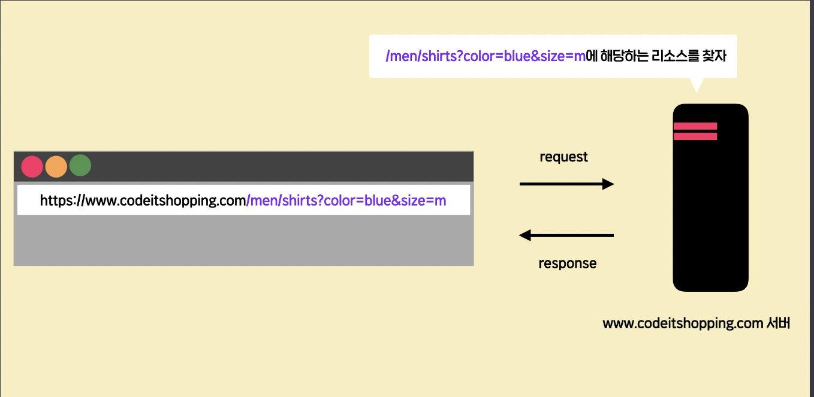
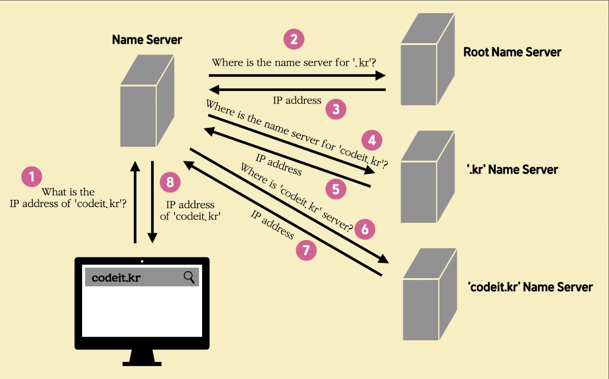
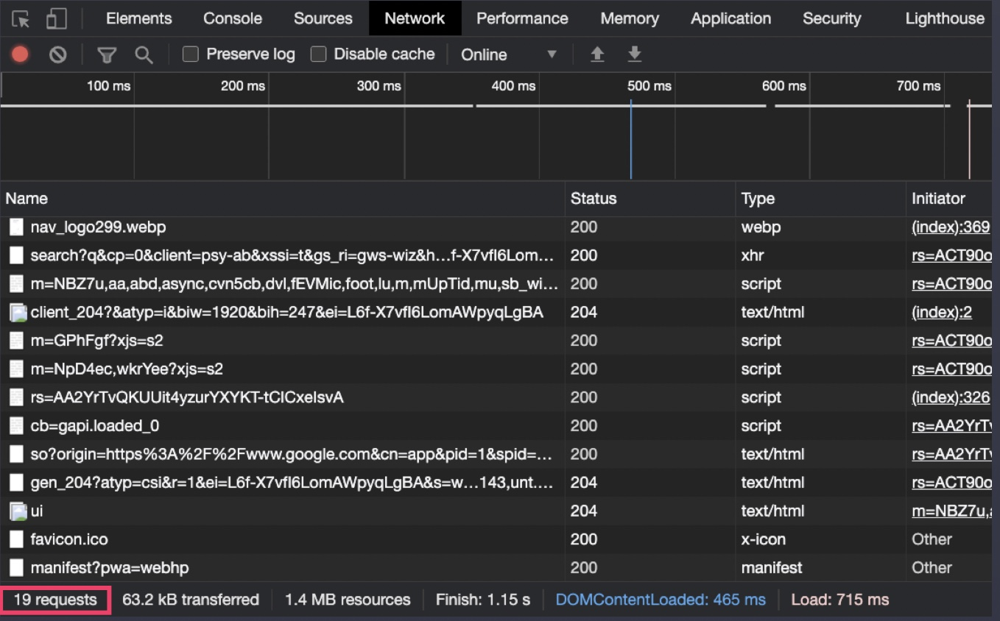
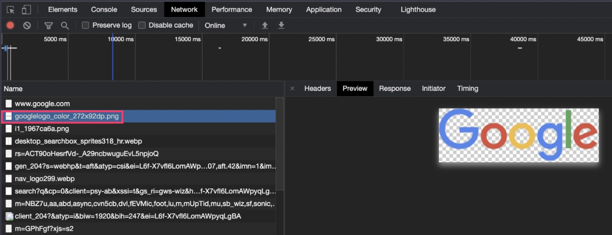

# 웹 기초

## fetch

서버에 request를 보내고 response를 받을 때 사용하는 함수.

```js
fetch("https://www.google.com")
  .then((response) => response.text())
  .then((result) => {
    console.log(result);
  });
```

### response 객체

fetch 함수의 실행 원리를 정리하면,

1. `fetch` 함수는 어떤 객체를 리턴하는데(Promise 객체)
2. 이 객체의 `then` 메소드로, '리스폰스가 왔을 때 실행할 콜백'을 등록할 수 있다.
3. 이렇게 등록된 콜백들은 then 메소드로 등록한 순서대로 실행되고, 이때 이전 콜백의 리턴값을 이후 콜백이 넘겨받아서 사용할 수 있다.

그런데 이 코드를 보고 이런 궁금증이 생겼을 수도 있다.

위 코드처럼 적지 않고 그냥

```js
fetch("https://www.google.com").then((response) => {
  console.log(response);
});
```

'이렇게 코드를 적어도 리스폰스의 내용을 출력할 수 있지 않나?' 라는 생각을 할 수 있는데,

사실 이 response 파라미터로는 리스폰스의 실제 내용 자체가 넘어오는 게 아니다. **response 파라미터에는, 리스폰스에 관한 각종 부가 정보들과, 실제 내용을 함께 갖고 있는 하나의 객체(object)가 넘어오게 된다.** 그래서 우리가 원하는 리스폰스의 실제 내용을 보려면,

```js
fetch("https://www.google.com")
  .then((response) => response.text())
  .then((result) => {
    console.log(result);
  });
```

이렇게 reponse 객체의 text라는 메소드를 호출해야 한다. 그리고 이 text 메소드의 리턴값이 바로 리스폰스의 실제 내용이다.(사실은 실제 내용을 갖고 있는 Promise 객체이지만, 이는 이후에 더 자세히 명시하도록 하겠다.)

## 웹이란?

World Wide Web의 약자로 전 세계적인 연결망을 나타내는 말. (웹 브라우저를 통해 돌아다니는 가상의 연결망 세계). 웹 페이지에 적혀있는 text들을 'Hyper Text'(다른 텍스트에 대한 참조를 가지고 있는 텍스트)라고 함. 오늘날에는 텍스트 외에도 이미지, 소리, 영상들을 포함한 다양한 종류의 데이터들을 웹에서 다룰 수 있게 되었음.

## URL과 리퀘스트

**웹에 존재하는 수많은 데이터 중에서 원하는 데이터를 특정하기 위해 URL을 사용한다**. 그리고 URL은 크게

1. 호스트(host)
2. 패스(path)
3. 쿼리(query)

로 이루어져있다. (다른 구성 요소들도 있지만 일단은 일반적으로 보게 되는 것들만 살펴보자.)

### 전 URL을 직접 입력한 적이 거의 없는데요?

URL의 의미와 구조에 대해 배울 때, 이런 의문을 가졌을 수도 있다.

'내가 URL을 직접 입력한 적은 거의 없는데?' 하는 의문이다.

웹 서핑을 할 때를 생각해보자. 보통 웹 브라우저의 주소창에 `www.naver.com`나 `www.google.com` 처럼, URL에서의 **호스트(host)** 부분까지만 입력하고, 어떤 서비스의 메인 페이지로 진입할 것 이다. 그리고 그 뒤로는 마우스로 화면에 있는 이미지나 버튼 등을 클릭할 뿐, 더이상 URL을 직접 입력할 일이 많지는 않은데, 그 이유는 바로, **이미 화면에서 클릭하는 버튼 등에 어느 URL로 새로운 리퀘스트를 보낼지, HTML 코드 또는 Javascript 코드로 다 작성이 되어있기 때문**이다. 예를 들어, 화면에서 클릭하는 버튼은 이런 식의 HTML 코드로 작성되어 있다.

```html
<a href="https://www.nazer.com/blogs/codeitOfficial/120" ...>...</a>
<a href="/codeitCommunity/threads/731" ...>...</a>
```

(지금 두 번째 URL은 상대 URL. 같은 서버 안에 존재하는 데이터의 경우 이렇게 path 이후의 부분만 표시해서 나타낼 수도 있다.)

우리가 웹 페이지에서 버튼을 클릭하면 지금 보이는 것 같은 a 태그의 href 속성에 적힌 URL 주소로 웹 브라우저가 알아서 리퀘스트를 보내서 리스폰스를 받아 새로운 웹 페이지를 로드한다. 이런 식으로 웹 페이지에 미리 모든 것이 세팅되어 있기 때문에 해당 서비스의 서버에서 요구하는 **path**의 형식, **query**의 형식을 알 필요가 없다. 다만 의식하지 않는 상태에서 우리는 계속 URL을 사용하고 있는 것 이다.

하지만 일반 사용자가 아닌 개발자라면, 이런 **path**에 관한 설계, **query**에 관한 설계를 직접 해야 하기 때문에 **URL**의 구조에 대해서 정확하게 알고 있어야 한다.

### 리퀘스트를 보내면 일어나는 일

우리가 웹 브라우저의 주소창에 URL을 입력하고 엔터를 치면, 실제로 어떤 일이 이루어지는 걸까?

잠깐 아래 그림을 살펴보자.



위 이미지에서 왼쪽 아이콘은 웹 브라우저를 나타내고, 오른쪽은 `codeitshopping`이라고 하는 서비스의 서버를 나타낸다고 가정해보자.

만약 우리가 위와 같은 URL을 입력하고 엔터를 치면 다음과 같은 일들이 순차적으로 발생한다.

(1) 웹 브라우저는 URL에서 **호스트(host, 위 그림에서 www.codeitshopping.com에 해당하는 부분)** 부분을 보고, 전 세계의 수많은 서버들 중에서 정확히 어느 서버와 통신을 해야 하는지를 찾는다.
이때 호스트 부분에 적힌 `www.codeitshopping.com` 같은 것을 **도메인 네임(Domain Name)**이라고 하는데요. 특정 서버를, 외우기 어려운 IP 주소가 아니라 외우기 쉬운 문자열로 나타낸 것이 바로 도메인 네임이다. 그럼 어떻게 웹 브라우저는 도메인 네임만으로 특정 서버를 식별할 수 있는 걸까? 이를 위해서는 `Domain Name Resolution`이라고 하는 작업을 수행해야 한다. 이 작업을 수행하면 해당 도메인 네임이 나타내는 특정 서버를 식별할 수 있는데, 이 부분은 밑 부분에 좀 더 자세히 적어두도록 하겠다.

(2) (1)에서 어떤 서버와 통신해야 하는지를 식별하고 나면, 웹 브라우저는 해당 서버로 리퀘스트를 보낸다. 이때 **URL**에서 **path** 이후의 부분들(보라색 표시한 부분, path와 query)을 리퀘스트에 담아서 보낸다.

(3) 리퀘스트를 받은 서버는 리퀘스트에 담긴 **path** 이후의 부분들을 보고, 그것이 의미하는 데이터를 찾고, 찾은 결과를 리스폰스에 담아서 보내준다.

(4) 그럼 웹 브라우저는 받은 리스폰스의 내용을 갖고 사용자에게 보여준다. 이때 리스폰스의 내용이 HTML 코드, Javascript 코드 등에 해당하면 그에 맞는 예쁜 화면을 사용자에게 그려서 보여주는 것이다.

### 도메인 네임과 IP 주소

1. 도메인 네임(Domain Name)

```
http://example.com/business/mart/item?category=14&id=2965
```

이 URL을 예시로,

여기서 `example.com` 이 부분이 호스트(host), 그러니까 특정 서버를 나타내는 부분이다.

이 '호스트' 부분에는 `example.com`과 같은 문자열들이 들어가도 되고,

```
https://bakey-api.codeit.kr/api/files/resource?root=static&seqId=3720&directory=Untitled.png&name=Untitled.png
```

`127.0.0.1` 같은 IP 주소를 넣어도 된다. `127.0.0.1`은 내 컴퓨터를 나타내기 때문에, 다른 서버에 접속하려면 그 서버의 IP 주소를 넣어주면 된다. 예를 들어, 브라우저에서 우리가 흔히 접속하는 `https://www.google.com` 대신 `https://172.217.175.100` 라고 쓰고 접속해보자.(보안 경고 창이 뜨면 '고급' 버튼을 누르고 접속을 강제 시도하자.)

그래도 여전히 구글 메인 페이지에 잘 접속할 수 있을 것이다. 왜냐하면 `www.google.com`이라고 치고 접속하면 결국 `172.217.175.100`라는 IP 주소를 가진 서버에 접속하는 것이기 때문이다.(상황에 따라 IP 주소는 달라진다)

그런데 여기서 한 가지 궁금한 점이 생길 수 있다. 어떻게 `example.com` 같은 문자열 주소만으로 하나의 서버를 특정할 수 있는 걸까? 사실 `example.com` 같은 것을 **도메인 네임(Domain Name)**이라고 하는데, 우리가 흔히 보는 `www.google.com, www.daum.net, www.naver.com` 등이 모두 도메인 네임이다. 도메인(Domain)이란 우리 말로 '영역, 범위' 이런 뜻인데, **도메인 네임은 Domain Name System이라고 하는 체계를 바탕으로 생성되는 문자열 이름으로, 인터넷 세계에 존재하는 수많은 영역을 추상적으로 나타내기 위해 사용되는 개념**이다.

하나의 도메인 네임은 여러 개의 도메인으로 구성된다. 그리고 더 상위의 도메인일수록 도메인 네임 중에서 오른쪽에 있다. 코드잇 사이트의 주소인 `codeit.kr` 도메인 네임을 예로 들어보자.

도메인에는 최상단에 **루트 도메인(root domain)** 이라는 것이 있다. 이 루트 도메인은 그냥 인터넷 전체를 나타내는 단위라고 생각하면 되는데, 루트 도메인은 사실 그냥 '빈 문자열'로 나타내고 우리가 도메인 네임을 입력할 때도 표시하지 않는 경우가 많다. 만약 도메인 네임에서 루트 도메인까지 나타내려면 도메인 네임의 오른쪽 끝에 점을 하나 더 찍어주면 된다. 그러니까 `codeit.kr`도 `codeit.kr.`로 바꾸어 쓰면 루트 도메인까지 나타낸 이론적으로 더욱 완벽한 도메인 네임이 된다. 실제로 브라우저에서 어떤 도메인 네임이든 이렇게 맨 끝에 점을 하나 더 쓰고 엔터를 쳐도 잘 접속이 되는데, 자주 쓰는 도메인 네임으로 한번 직접 실험해자.

루트 도메인 바로 하위에는 **Top-Level Domain(TLD)**이라는 것이 있다. 도메인 네임 끝에서 일반적으로 볼 수 있는 `.kr, .jp, .net, .gov` 등이 Top-level Domain에 해당하는데, 이런 Top-Level Domain은 사이트가 속한 국가 또는 사이트가 제공하는 서비스의 카테고리를 나타낸다.

그리고 각각의 Top-level Domain 하위에는 **Second-Level Domain**이 있는데, `codeit.kr`에서는 codeit이 Second-Level Domain이다. 인터넷에서는 무수히 많은 Second-level Domain들이 있다. `codeit, naver, daum, google` 등 서비스를 대표하는 이름이 바로 Second-Level Domain이 되는 것이다.

그리고 여기서 한 단계씩 더 내려가서 `www.codeit.kr`의 www(Third-Level 도메인), `test.www.codeit.kr`의 test(Fourth-Level 도메인)까지 쭉 도메인이 생겨날 수 있는데, 하지만 실제 서비스에서는 보통 Third-Level 도메인 정도까지만 사용하는 경우가 많다.

매번 **검색창에 입력했던 것이 도메인 네임**이라는 사실과 **도메인 네임을 쓰는 것이 사실은 계층적인 구조를 이루고 있는 각 도메인의 이름을 오른쪽부터(상위 도메인부터), 왼쪽으로(점점 하위 도메인으로), 점(dot)으로 구분하면서 써나가는 작업**이었다는 사실을 이제 알게 되었다. 도메인 네임은 사람이 IP 주소보다는 의미 있는 문자열을 외우기가 더 쉽기 때문에 사용된다. 아까 살펴본 예처럼 구글 메인 페이지를 보여주는 서버의 주소로, IP 주소인 `172.217.25.100`은 기억하기 어렵지만, 도메인 네임인 `www.google.com`은 기억하기 쉽기 때문이다.

2. Domain Name Resolution의 원리

도메인 네임이 뭔지 배웠으니, 이제 `codeit.kr` 같은 도메인 네임만으로 어떻게 특정 서버와 통신할 수 있는지 알아보자. 우리가 브라우저에서 도메인 네임만으로도 특정 컴퓨터와 통신할 수 있는 것은 본격적인 통신을 시작하기 전에 도메인 네임을 IP 주소로 변환해주는 절차가 존재하기 때문이다.

우리가 브라우저에 `codeit.kr` 이라고 쓰고 엔터를 치면, 가장 먼저 어떤 일이 발생하는지, 이미지와 함께 순서대로 살펴보자.



**1단계** : 일단 내 컴퓨터는 기본적으로 설정된 `네임 서버(Name Server)`에 `codeit.kr` 의 IP 주소를 알려달라는 요청을 보낸다. 네임 서버라는 건 도메인 네임을 IP 주소로 변환하는 과정에 참여하는 서버들이다. 내 컴퓨터에서 맨 처음 어떤 네임 서버에 요청할 것인지는 미리 설정되어 있고, 기존의 설정에서 다른 네임 서버로 바꾸는 것도 가능하다. 내 컴퓨터가 사용하는 네임 서버에 관한 설정은 OS마다 다른데, 이 부분은 별도로 검색해보기를 추천한다.

**2, 3단계** : 내 컴퓨터의 요청을 받은 네임 서버는 이제 `루트 네임 서버(Root Name Server)`에 이런 요청을 보냅니다. `'.kr'`로 끝나는 도메인 네임들을 관리하는 네임 서버의 주소를 알려달라는 요청을 말이다. 그럼 루트 네임 서버는 `'.kr'` 네임 서버의 IP 주소를 알려준다.

**4, 5단계** : 그럼 네임 서버는 `'.kr'` 네임 서버에게 `'codeit.kr'`의 IP 주소를 알려줄 수 있는, `'codeit.kr'` 네임 서버의 IP 주소를 알려달라고 요청한다. 그럼 `'.kr'` 네임 서버는 `'codeit.kr'` 네임 서버의 IP 주소를 알려준다.

**6, 7단계** : 그럼 네임 서버는 `'codeit.kr'` 네임 서버에게 `'codeit.kr'`의 IP 주소를 알려달라고 요청한다. 마침내, 네임 서버는 `'codeit.kr'`의 실제 IP 주소를 응답으로 얻게 된다.

**8단계** : 네임 서버는 제 컴퓨터에게 `codeit.kr`의 IP 주소를 알려주고, 내 컴퓨터는 이 IP 주소를 갖고 코드잇 서버와 본격적인 통신을 시작한다.

방금 살펴본 이런 과정을 조금 어려운 말로, **Domain Name Resolution** 이라고 한다. 참고로, `codeit.kr`에 접속할 때마다 매번 1부터 8까지의 단계가 항상 발생하는 것은 아니다. 왜냐하면 이미 한번 `codeit.kr`의 IP 주소를 받은 후에는 제 컴퓨터의 OS가 그 IP 주소를 보통 별도로 저장해두고 계속 사용하기 때문이다. 이뿐만 아니라 제 컴퓨터가 사용하는 가장 근처의 네임 서버 또한 자주 요청받는 도메인 네임에 대해서는 별도로 외부에 요청할 필요가 없도록 캐시(cache)로 관리하는 경우가 많다. 즉, 1~8 까지의 과정이 일어나는 경우는 일반적으로 처음 접속하는 도메인 주소인 경우에만 그렇다.

## 한번의 접속, 여러 번의 request

우리가 어떤 웹 페이지를 보기 위해 URL을 입력하고 엔터를 치면 보통 한 번 이상의 리퀘스트와 리스폰스가 오고 간다. 딱 한 번의 리퀘스트와 리스폰스만 오고 가면 될 것 같은데, 이게 무슨 말일까?

개발자 도구의 Network탭을 열어보자. (Network 탭에서는 브라우저가 구체적으로 어떻게 생긴 리퀘스트를 보내고, 어떻게 생긴 리스폰스를 받는지를 보여준다.) 이 상태에서 웹 브라우저를 새로고침해보자.



그럼 구글 메인 페이지로 재접속하게 되고, 이제 Network 탭에 여러 개의 줄(row)들이 뜨는데, 이때 각각의 한 줄이, **하나의 '리퀘스트-리스폰스' 쌍**이라고 보면 된다. 전 딱 한 번 엔터를 쳤을 뿐인데 정말 많은 수의 리퀘스트와 리스폰스가 오고 갔음을 확인할 수 있다. 화면 하단을 보면 총 19번의 리퀘스트가 전송된 것을 알 수 있는데, 왜 이런 일이 발생하는 걸까?

사실 웹 브라우저가 처음으로 리퀘스트를 보내고, 서버로부터 받는 첫 리스폰스의 내용만으로 온전한 화면을 그릴 수 있는 경우는 많지 않다. 보통은 받은 첫 리스폰스의 내용에 적힌 '추가적으로 필요한 데이터'들을 재차 요청해야 하는 것이 더 일반적이다. 예를 들어, 이런 식의 HTML 코드가 첫 리스폰스의 내용으로 왔다고 해보자.

```html
<html>
  <head></head>
  <body>
    ...
    <div>
      
    </div>
    ...
    <script src="http://www.server_B.com/c/d/main.js"></script>
  </body>
</html>
```

웹 브라우저는 당장 이 코드만으로는 완벽한 화면을 그릴 수 없다. 왜냐하면 새롭게 리퀘스트를 보내서 가져와야할 것들이 존재하기 때문이다.

예를 들어, 지금 여기서 이 `img` 태그의 `src` 속성에 있는 이미지를 그리려면

```html

```

img 태그의 src 속성에 적힌 URL로 다시 리퀘스트를 보내서 `example.png`에 해당하는 이미지를 받아와야 한다.

그리고

```html
<script src="http://www.server_B.com/c/d/main.js"></script>
```

이 script 태그의 src 속성에 적힌 URL로도 리퀘스트를 보내서 `main.js`라는 자바스크립트 파일을 받아와야 한다.

벌써 이렇게 2번의 추가적인 리퀘스트가 필요한 것 이다.

이런 식으로 보통 브라우저가 하나의 페이지를 그릴 때는 첫 리스폰스의 내용 안에서 또다시 요구되는, 여러 가지 다른 것들을 구하기 위해 다시 여러 개의 리퀘스트를 보내는 것이 일반적이다. 게다가 그렇게 또 받은 리스폰스의 내용에 따라 또 새로운 리퀘스트를 보내야 할 수도 있다. 바로 이런 원리 때문에 여러분이 어떤 웹 페이지를 딱 한번 접속했다고 해도 그 사이에는 수많은 리퀘스트와 리스폰스가 발생하는 것 이다.

예를 들어, 지금 Network 탭에 보이는 하나의 줄(하나의 '리퀘스트-리스폰스 쌍')을 클릭해보면



이렇게 Google 로고 이미지를 받기 위해 추가적인 리퀘스트를 보내고, 이 이미지를 받아온 것을 확인할 수 있다.

이렇게 우리가 웹 브라우저로 특정 페이지에 접속할 때, 보통 한 번 이상의 리퀘스트-리스폰스가 오고간다는 사실을 기억해두자.
