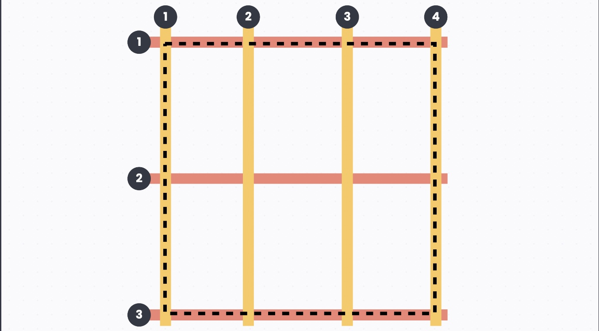
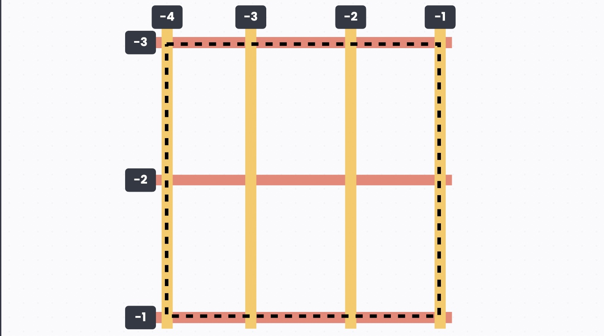
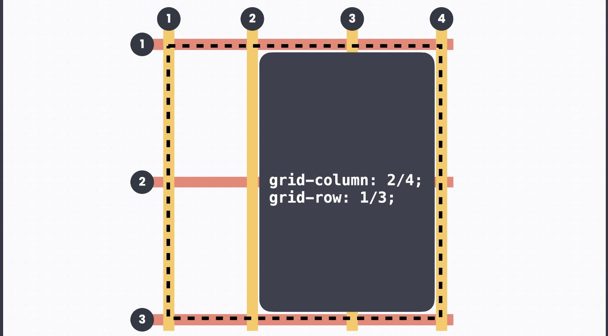
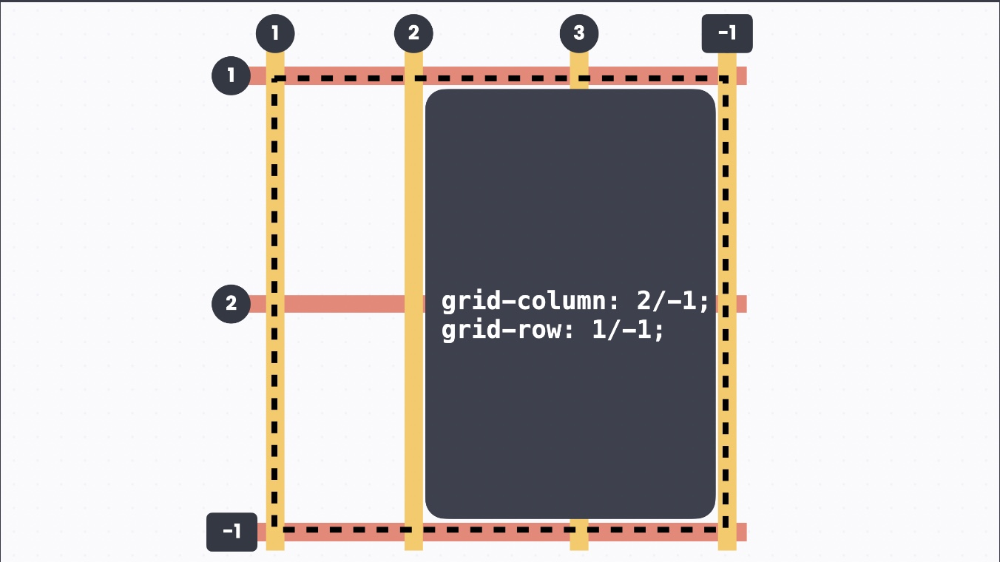

# Grid

## 그리드 나누기

`display` 속성을 `grid` 로 하고 `grid-template-columns` 속성으로 컬럼을, `grid-template-rows` 속성으로 로우를 나눌 수 있다. 예를 들어서 3 x 2 그리드를 만드는데, 컬럼 너비는 각각 `100px, 200px 100px`이고 로우 너비는 `150px 200px`이라면 아래와 같이 쓸 수 있다.

```css
display: grid;
grid-template-columns: 100px 200px 100px;
grid-template-rows: 150px 200px;
```

## 유연한 크기 단위

`fr` 이라는 단위를 사용하면 플렉스박스처럼 전체 크기에 대해 상대적인 값을 지정할 수 있다. 예를 들어서 3 x 2 그리드에서 컬럼의 너비를 1 : 1 : 1로 하고 싶다면 아래처럼 할 수 있다.

```css
display: grid;
grid-template-columns: 1fr 1fr 1fr;
grid-template-rows: 150px 200px;
```

## 반복되는 값을 한 번에 쓰기

`repeat()`으로 반복할 횟수와 값을 쓰면 코드를 깔끔하게 쓸 수 있다.

```css
display: grid;
grid-template-columns: repeat(3, 1fr);
grid-template-rows: 150px 200px;
```

## 최소, 최대값으로 크기 정하기

최솟값과 최댓값을 지정해두면 이 사이에서 유연하게 크기가 조절되도록 할 수 있다. 예를 들어서 아래 코드는 컬럼의 너비가 최소 `200px`인데, 화면 너비가 작아지더라도 컬럼의 너비는 `200px`보다 작아지지는 않고, 화면 너비가 넓어지면 컬럼의 너비는 1 : 1 : 1 비율로 늘어난다.

```css
display: grid;
grid-template-columns: repeat(3, minmax(200px, 1fr));
grid-template-rows: 150px 200px;
```

## 간격 넣기

`gap` 속성으로 간격을 넣는다. 플렉스박스와 마찬가지로 값을 한 개만 쓰면 세로 가로 모두 간격을 지정할 수 있고, 세로 그리고 가로 순으로 숫자를 두 개 쓰면 세로 간격이랑 가로 간격을 지정할 수 있다. 예를 들어서 아래 코드는 세로 간격 20px, 가로 간격 10px로 지정한 코드.

```css
display: grid;
grid-template-columns: repeat(3, minmax(200px, 1fr));
grid-template-rows: 150px 200px;
gap: 20px 10px;
```

## 원하는 위치로 배치하기

`grid-column` 과 `grid-row` 속성을 사용하면 원하는 위치에 요소를 배치할 수 있습니다.

### 그리드 라인 번호

컬럼 라인은 왼쪽에서부터 오른쪽으로 1, 2, 3, … 이렇게 번호를 붙이고, 로우 라인은 위에서부터 아래로 1, 2, 3, … 이렇게 번호를 붙입니다. **이때 테두리도 그리드 라인에 포함된다는 점에 주의해야한다.** (테두리부터 1번.) 예를 들어서 3 x 2 그리드리드에서는 컬럼 라인은 1, 2, 3, 4 이렇게 네 개가 있고, 로우 라인은 1, 2, 3 이렇게 세 개가 있습니다.



뒤에서부터 음수로 표기할 수 도 있다.



### 배치하기

예를 들어서 2번 컬럼 라인에서 시작해서 4번 컬럼 라인에서 끝나고, 1번 로우 라인에서 시작해서 3번 로우 라인에서 끝나는 배치를 생각해 보자. 시작 라인과 끝 라인을 슬래시로 구분해서 적어주면 됩니다.



음수 값의 라인 넘버를 섞어서 써도 된다.



`span` 이라는 키워드를 쓰면 시작하는 라인 번호와 차지할 크기를 적어 줄 수 있다. 예를 들어서 아래의 경우 컬럼 2칸, 로우 2칸을 차지하니까 각각 `span 2`로 쓸 수 있다.


## 이름으로 배치하기

`grid-area` 로 영역에 이름을 붙이고, `grid-template-areas` 로 이름을 사용해 배치할 수 있다. 아래 코드는 2 x 2 그리드를 만들고 `.sidebar` 와 `.main` 그리고 `.player` 를 배치한 예시. 참고로 셀을 비워놓고 싶다면 이름 대신 마침표(`.`)를 쓰면 된다.

```css
body {
  grid-template-areas:
    "s m"
    "p p";
}

.sidebar {
  grid-area: s;
}

.main {
  grid-area: m;
}

.player {
  grid-area: p;
}
```
