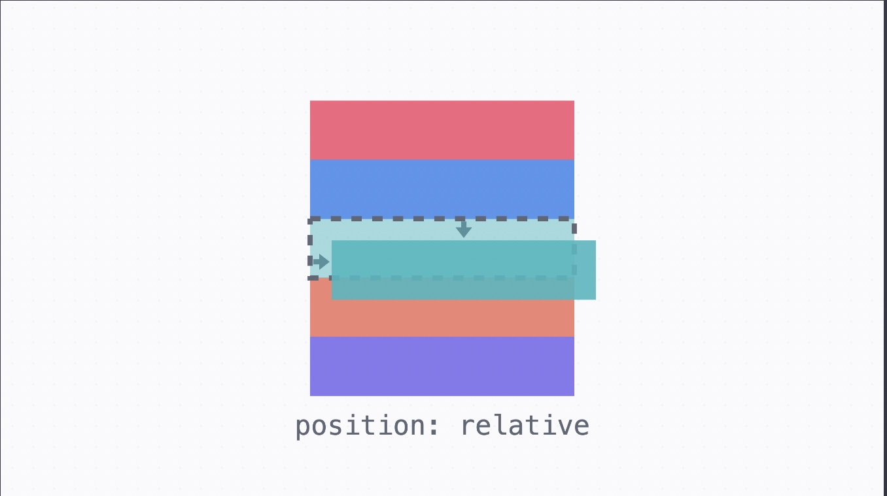
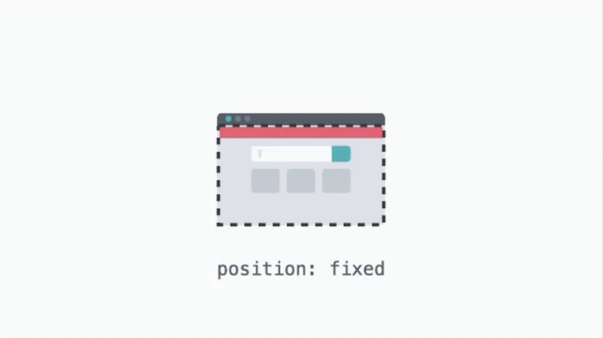
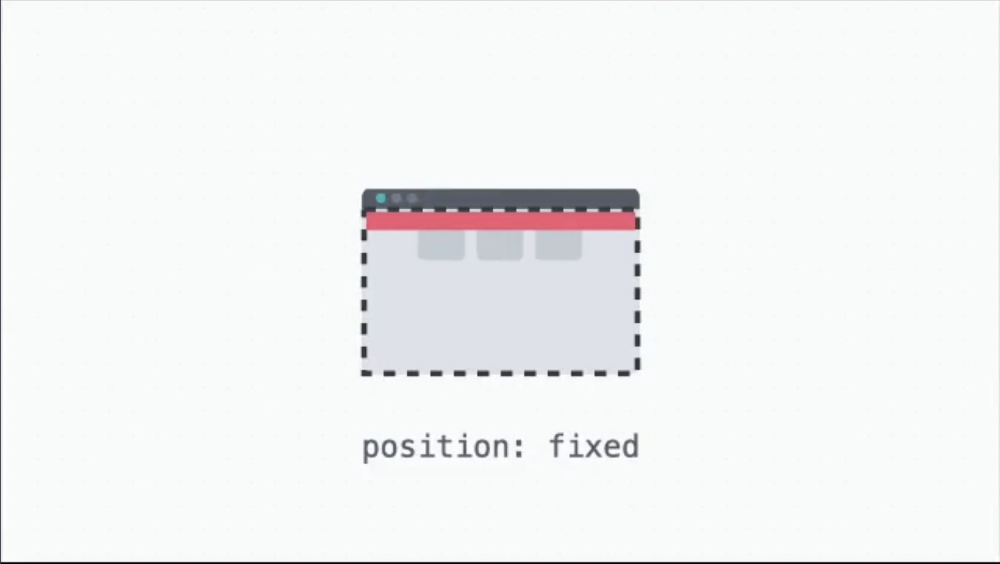
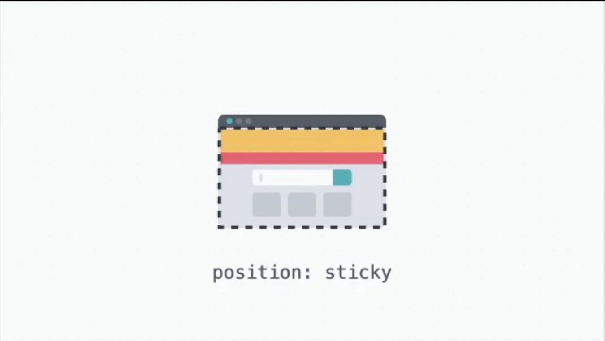
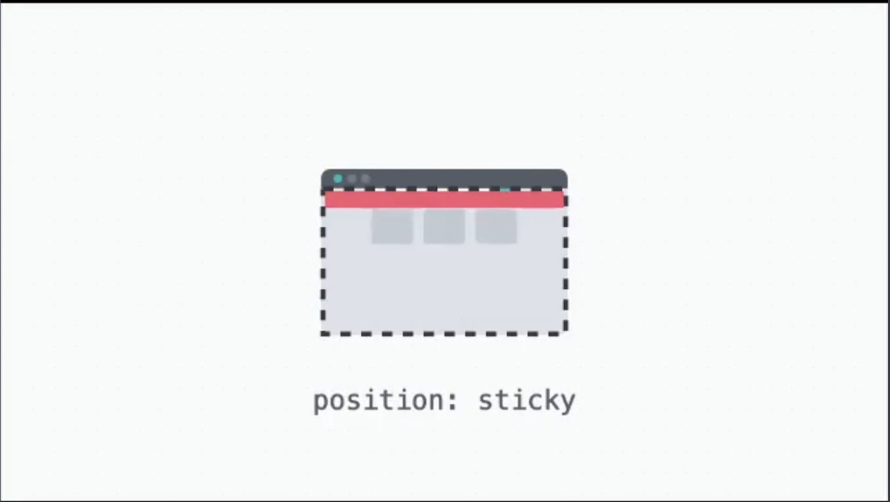
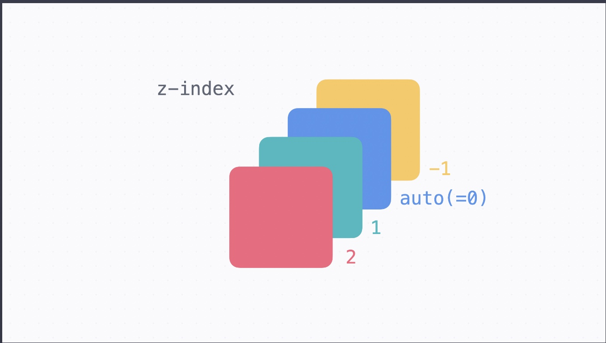

# Position

글의 흐름에서 벗어나서 요소를 자유롭게 배치할 때 쓰는 속성. `position`에 따라서 위치를 정하는 기준이 달라진다.

기본 값은 `static`이고, `static`인 경우 원래 있어야 할 위치에 배치된다.

## 위치 정하기

위치를 정하는 기준에 대해서 `top`, `right`, `bottom`, `left` 속성으로 위치를 정할 수 있다.

값이 모두 똑같은 경우 inset 속성을 씁니다.

## relative 포지션

요소의 원래 위치를 기준으로 배치. 이때 **요소의 원래 자리는 그대로 차지하고 있다.**



```css
.green {
  position: relative;
  top: 15px;
  left: 10px;
}
```

## absolute 포지션

**가장 가까운 포지셔닝이 된 조상 요소를 기준으로 배치.** 이때 포지셔닝이 되었다는 건 `static`이 아니라는 (`position` 속성을 지정했다는) 의미. 아래 예시에서는 `.red`가 `relative` 포지션이어서 `.blue`는 `.red`를 기준으로 배치. 이때 **글의 흐름에서 완전히 빠져서, 요소의 원래 자리는 차지하지 않는다.**

```css
.red {
  position: relative;
  top: 0;
  left: 10px;
}

.blue {
  position: absolute;
  right: 10px;
  bottom: 15px;
}
```

## fixed 포지션

**브라우저 화면을 기준으로 고정된 배치. 글의 흐름에서 완전히 빠져서, 요소의 원래 자리는 차지하지 않는다.** 그래서 내비게이션을 만들거나 할 때 본문 내용이 네비게이션과 겹치지 않도록 본문의 위쪽에 마진을 넣어준다.

```css
.red {
  position: fixed;
  top: 0;
  left: 0;
  width: 100%;
}
```

1. 기본 화면
   

2. 스크롤을 통해 페이지 내린 모습 (상단에 빨간색 네비게이션 부분이 고정되어 있음)
   

## sticky 포지션

`static`처럼 원래 위치에 배치되어 있다가, 정해진 위치에 브라우저가 스크롤되면 그때부터 `fixed`처럼 고정되어 배치. **기본적으로는 `static`처럼 배치되기 때문에 요소의 원래 자리를 차지.**

```css
.red {
  position: sticky;
  top: 0;
  left: 0;
  width: 100%;
}
```

1. 기본 화면
   

2. 스크롤 내린 모습 (빨간색 네비게이션 부분이 스크롤을 내리자 위쪽에 달라붙어서 fixed된 모습)
   

## z-index값

앞뒤 순서를 정할 때 쓰는 값. 순서이기 때문에 단위 없이 사용. 값이 높을수록 화면에서 앞쪽. 값이 같으면 코드에서 아래 줄에 있는 요소가 앞쪽에 보인다. (설정해주지 않으면 기본 값인 0)



```css
.red {
  z-index: 1;
}
```
