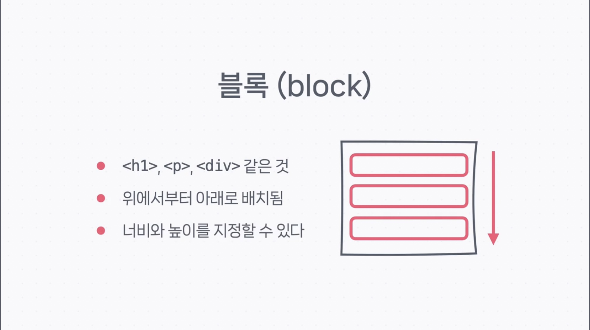
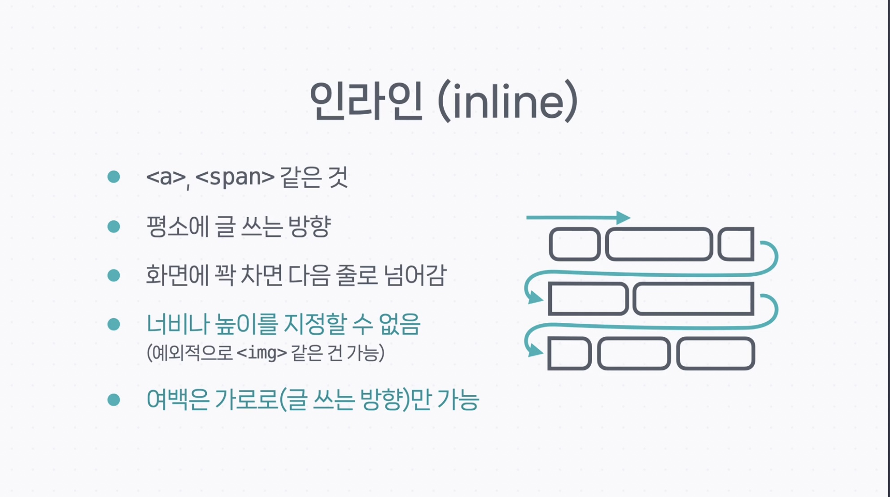
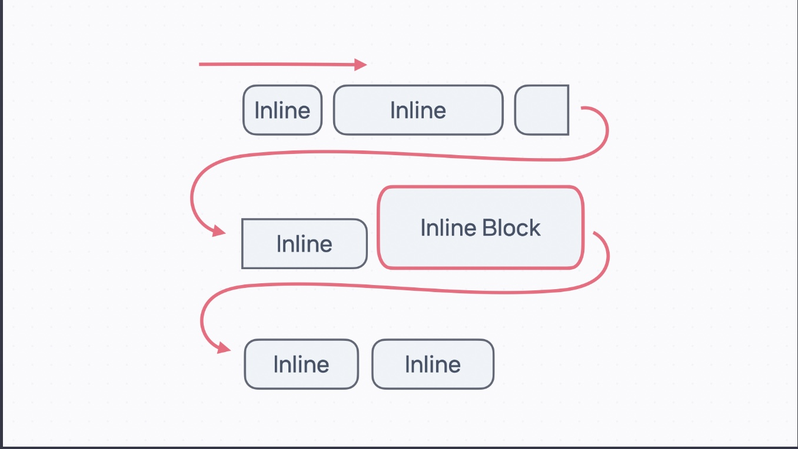
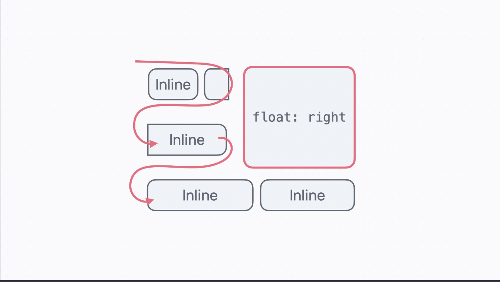
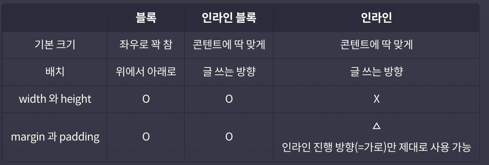

# 디스플레이(Display)

디스플레이 속성은 크게 2가지로 '블록'과 '인라인'으로 나눌 수 있는데
각각, 다음과 같다.

## 블록

- 위에서 아래로 차례대로 배치되는 요소
- 크기 지정 가능
- `<h1>,<h2>...<h6>`, `
`, `
` 등

## 인라인

- 글을 쓰는 방향으로 줄이 바뀌면서 배치
- **블록과 달리 크기 지정 불가 (``같이 외부 데이터를 보여주는 태그는 크기 지정 가능)**
- `<a>`, ` `, ``, `` 등

## 인라인 블록

- **인라인처럼 배치되지만 블록처럼 크기를 가지고 싶을 때 사용하는 속성**

## float

- 요소를 페이지 왼쪽이나 오른쪽에 삽화처럼 배치하고, 그 주변으로 인라인 요소들을 배치할 수 있다.

## 비교

