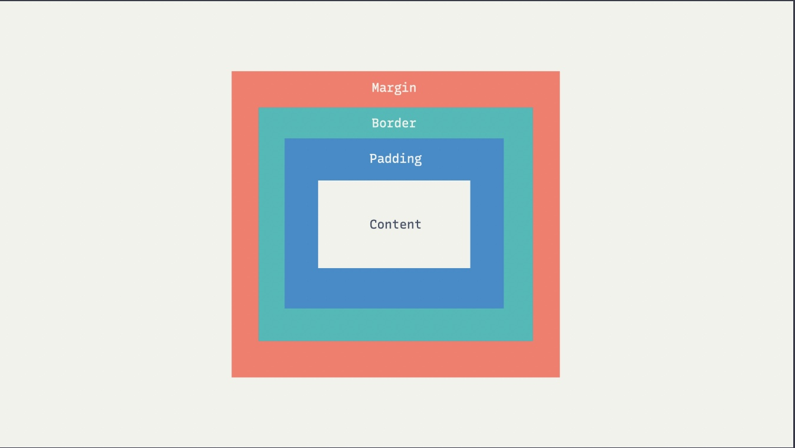
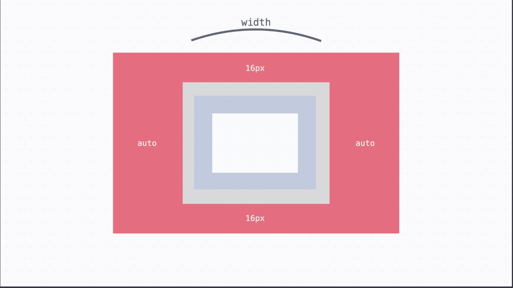
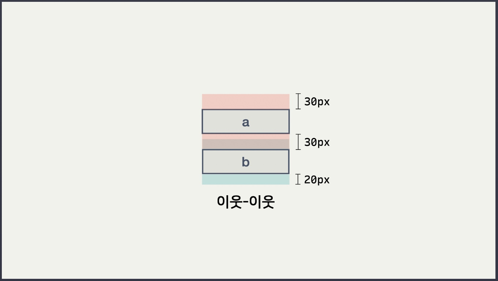

# Box 모델



HTML/CSS에서 요소는 기본적으로 박스 형태인데, 밖에서부터 차례대로 바깥 여백인 마진, 테두리인 보더, 테두리와 실제 내용 사이의 여백인 패딩, 그리고 실제 내용이 들어가는 콘텐트 박스가 있다.

## padding, margin 표기 법

`padding`은 안쪽 여백, `margin`은 바깥 여백을 넣을 때 사용한다.

사용법은 비슷한데, 아래 예시에서 padding값을 margin으로 바꿔 사용하면 margin 옵션을 설정할 수 있다.

### 상하좌우 한 번에

```css
padding: 8px;
```

### 상하,좌우 각각

```css
padding: 16px, 8px;
```

### 상, 좌우, 하

```css
padding: 16px 8px 24px;
```

숫자의순서는 시계 방향으로 0시 -> 3시 -> 6시 순

### 상,우,하,좌

```css
padding: 16px, 8px, 24px, 10px;
```

숫자의순서는 시계 방향으로 0시 -> 3시 -> 6시 -> 9시 순

### padding 각각 주기

아래 두 코드는 똑같은 코드이다.

```css
padding: 16px 8px 24px 10px;
```

```css
padding-top: 16px;
padding-right: 8px;
padding-bottom: 24px;
padding-left: 10px;
```

### margin 좌우 바깥 여백 자동 설정

margin을 통해 좌우 바깥 여백을 자동으로 채울 수 있다. **단, 여기서 주의할 점은 요소의 `width` 속성이 반드시 정해져 있어야 자동으로 채우는게 가능하다.**

```css
width: 520px;
margin: 16px auto;
```



## border 속성

주로 굵기, 테두리 종류, 색상 순서로 쓴다. 예를 들어서 아래 코드는 2px 굵기의 실선으로 옅은 회색(`#ededed`)을 사용한 것.

```css
border: 2px solid #ededed;
```

## border-radius 속성

박스 모델의 모서리를 둥글게 만들 때 사용. `border` 속성 없이도 쓸 수 있다. 아래 코드는 16px 만큼 둥글게 하는 코드.

```
border-radius: 16px;
```

### 팁 1. 타원 만들기

아래 코드는 50% 만큼 둥글게 하는 코드인, 이렇게 하면 타원 형태가 된다.

```
border-radius: 50%;
```

### 팁 2. 알약 만들기

아래 코드는 9999px 만큼 둥글게 하는 코드인데, 이렇게 아주 큰 값을 지정하면 알약 형태가 된다.

```
border-radius: 9999px;
```

## box-sizing속성

기본적으로 **요소에 크기를 지정하면 그 크기는 박스 모델에서 콘텐트 영역에 대한 크기이다. 예를 들어서 아래 #box 요소의 실제 너비는 100 + 30 + 30 = 160이 된다.**

```css
#box {
  margin: 20px;
  padding: 30px;
  width: 100px;
}
```

**만약에 이런 게 아니라 좀 더 직관적으로 크기를 지정하고 싶다면, `box-sizing` 속성을 바꿔 주면 됩니다. 기본 값인 `content-box` 대신에 `border-box`를 사용하면 된다.**

```css
#box {
  margin: 20px;
  padding: 30px;
  width: 100px;
  box-sizing: border-box;
}
```

이렇게 하면 테두리까지 모두 합친 영역의 크기가 `100px`이 된다. (이 옵션 매우 자주 사용하므로 알아두는 것이 좋다.)

## overflow 속성

박스의 크기를 지정했을 때 가끔 안에 있는 내용이 많아서 삐져나올 때가 있다. 이런 걸 오버플로우라고 하는데, 이때 박스에 스크롤이 되도록 하거나 삐져나온 걸 감춰줄 수 있다.

### 넘치는 것 감추기

```css
overflow: hidden;
```

### 넘치면 스크롤 하게 만들기

```css
overflow: auto;
```

### 항상 스크롤 하게 만들기

```css
overflow: scroll;
```

## 마진 상쇄 (Margin Collapsing)

일반적으로 세로 마진은 서로 겹쳐서 화면에 나타나는데 서로 이웃한 태그에서는 세로로 마진을 겹쳐서 적용하고, 부모 자식 관계인 태그에서도 세로로 마진을 겹쳐서 적용한다. **이때 부모에 padding이나 border가 있으면 경계가 있다고 생각하고 세로 마진을 겹치지 않는다.**

### 서로 이웃한 태그

`#a`와 `#b`의 마진을 겹치면 둘 사이의 마진은 30px이 된다.

```html
<div id="a">a</div>
<div id="b">b</div>
```

```css
#a {
  margin: 30px;
}

#b {
  margin: 20px;
}
```



### 부모자식 태그

`#b`와 `#c`는 부모 자식 관계이다. `#b`에는 따로 경계가 없으니까 둘의 마진을 겹쳐서 위쪽 마진은 40px이 된다. 이 마진 값을 이웃한 `#a`와 겹치면, `#a`와 `#b` 사이의 마진은 40px이 된다.

```html
<div id="a">a</div>
<div id="b">
  <div id="c">c</div>
  b
</div>
```

```css
#a {
  margin: 30px;
}

#b {
  margin: 20px;
}

#c {
  margin: 40px;
}
```

하지만 위에서 언급한대로 마약 부모에 `padding`, `border` 옵션이 있으면 경계가 있다고 생각하여 세로 마진을 겹치지 않게된다.
