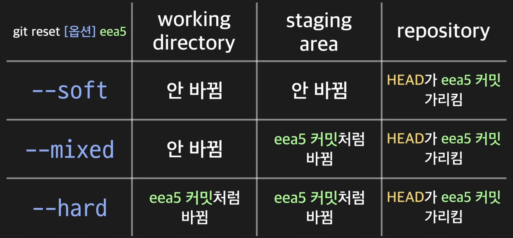

# 커밋

## 커밋 히스토리

프로젝트를 진행하며 했던 커밋들을 `커밋 히스토리`라고 한다.
`git log` 메세지를 통해 커밋 히스토리를 볼 수 있다. (가장 오래된 커밋이 가장 아래 있으며 위에 있을수록 가장 최신 커밋 내용이다.)

커밋 히스토리에서 `commit` 텍스트 다음에 긴 문자열이 나타나는데 이는 `커밋 아이디`(커밋 해시)로 깃이 각 커밋을 구분하기 위한 것이다.

커밋 내역 메뉴에서 나가기 위해서는 `q`를 누르면 된다.

커밋 히스토리를 좀 더 깔끔하게 보기 위해선 `git log --pretty=oneline` 명령어를 입력해주면 된다. (커밋 하나당 한 줄에 보이도록 내역이 수정됨)

커밋을 통한 변화 내역을 보고싶다면 `git show [커밋 아이디]` 명령어를 입력하면 된다. (커밋 아이디는 `git log`를 통해 확인하고 커밋 아이디를 모두 입력하지 않아도 앞에서부터 몇 글자만 입력하면 중복되는 커밋 아이디가 없는한 git이 알아서 판단하여 보여준다.) 해당 명령어를 통해 해당 커밋과 바로 이전 커밋의 차이를 확인할 수 있다. (- 기호가 붙은 내용이 해당 커밋 이전의 모습, + 기호가 붙은 내용이 해당 커밋의 모습)

## 커밋 메시지 작성

`git commit` 명령어를 사용할때 -m 옵션 없이 `git commit` 만으로도 커밋이 가능한데 해당 명령어를 입력 후 나오는 화면에서 커밋 메세지를 작성하고 해당 메세지 내역을 저장하기 위해서 `esc`를 누른 후 `:wq`를 입력, 엔터를 누르면 해당 메세지로 커밋이 진행된다.

-m 옵션 없이 `git commit` 명령어로 커밋을 할 경우 긴 커밋 메세지를 좀 더 쉽게 작성할 수 있다는 장점이 있다.

## 커밋 수정하기

git에서 이전 커밋 내역(가장 최신 커밋)을 수정하기 위해서는 해당 파일을 알맞게 수정한 후 `git commit --amend` 명령어를 입력하면 된다. 해당 명령어를 입력하면 텍스트 에디터에 이전 커밋 메세지가 나타나며 `i`(수정 모드) 를 눌러 해당 커밋 메시지를 수정할 수 있다. (커밋 메세지는 수정안해도 된다.) 이후에는 마찬가지로 수정한 `esc`를 눌러 해당 내역을 저장하고 `:wq`를 입력해 메뉴를 빠져나오면 된다.

## 커밋 가이드라인

`커밋(commit)`은 staging area의 현 상태를 그대로 하나의 버전으로 남기는 작업, 또는 그 결과물을 가리키는 말로 Git에서 가장 핵심적인 개념이다.

커밋에는 크게 다음과 같은 3가지 정보가 있다.

**(1) 커밋을 한 사용자 아이디**

**(2) 커밋한 날짜, 시간**

**(3) 커밋 메시지**

특정 프로젝트 디렉토리가 어떻게 변해왔는지를 한 눈에 잘 파악하기 위해서는 커밋의 이런 정보들이 아주 중요한데 (1), (2)는 커밋을 할 때 Git에서 자동으로 기록해주지만, (3) 커밋 메시지는 커밋을 하는 사람이 매번 직접 작성하는 것이기 때문에 사람마다 그 분량이나 스타일이 제각각일 수 있다.

개인 프로젝트의 경우에는 커밋 메시지를 어떻게 작성하든 큰 상관이 없을 수 있지만, 회사에서 여러 명이 참여하는 프로젝트의 경우에는 이 커밋 메시지가 아주 중요하기 때문에 커밋 메시지를 어떻게 작성해야하는지에 대한 규칙이 정해져있는 경우가 많다.

그 규칙들은 회사마다 전부 다를 수 있지만 커밋 메시지를 어떻게 작성하면 좋은지에 대한 일반론적인 가이드라인은 있다. 잠깐 살펴보자면 다음과 같다.

**1. 커밋 메시지 작성 가이드라인**

_(1) 커밋 메시지의 제목과 상세 설명 사이에는 한 줄을 비워두세요._

뭔가 상세한 설명이 필요한 커밋인 경우에는 커밋 메시지 한 줄보다는 제목과 상세 내용으로 구분해서 적어주면 좋은데 이럴 때 제목과 상세 내용 사이에 한 줄을 띄워놓아야 나중에 커밋 메시지를 볼 때 좀더 편하게 볼 수 있다. 그리고 이렇게 비어있는 한 줄을 두는 것이 Git에서 공식적으로 권장하는 사항(예를 들어, 특정 명령어가 이 한 줄을 기준으로 제목과 상세 내용을 구분해서 사용한다고 합니다)이기도 하니까 꼭 지켜주는 것이 좋다.

_(2) 커밋 메시지의 제목 뒤에 온점(.)을 붙이지 마세요._

_(3) 커밋 메시지의 제목의 첫 번째 알파벳은 대문자로 작성하세요._

_(4) 커밋 메시지의 제목은 명령조로 작성하세요.(Fix it / Fixed it / Fixes it)_

_(5) 커밋의 상세 내용에는 이런 걸 적으면 좋습니다._

- 왜 커밋을 했는지?
- 어떤 문제가 있었고, 적용한 해결책이 어떤 효과를 가지는지

_(6) 다른 사람들이 자신의 코드를 바로 이해할 수 있다고 가정하지 말고 최대한 친절하게 작성하세요._

커밋 메시지를 작성하는 방법뿐만 아니라 커밋을 남기는 것 자체에 관해서도 일종의 가이드라인이 있다.

**2. 커밋할 때 알아야할 가이드라인**

_(1) 하나의 커밋에는 하나의 수정사항, 하나의 이슈(issue)를 해결한 내용만 남기도록 하세요. 다양하게 수정을 하고나서 하나의 커밋으로 남기는 것은 좋지 않습니다. 하나의 커밋이 하나의 사실만을 갖고 있어야 나중에 이해하기 쉽습니다._

이 말은 결국 최대한 작은 단위의 변화를 기준으로 커밋을 하라는 뜻이다. 예를 들어 A라는 파일에서 기존 함수를 3개 삭제하고, B라는 파일에서 기존 함수 2개를 삭제, C라는 파일에서 기존 함수를 1개 삭제했다고 가정하자. 그 다음 프로그램을 실행해봤는데 오류가 생겼다면 과연 A, B, C 파일 중 무엇때문에 문제가 생긴건지 일일이 확인해보지 않는 이상 알 수 없다. 이처럼 다양한 종류의 수정을 다 하고나서야 커밋을 하면 바로 그 다음에 프로그램에 문제가 생겼을 때 그 원인을 파악하는데 시간이 더 오래 걸린다. 그리고 이렇게 하면 커밋 간의 독립성이 사라져서 나중에 프로젝트의 이력을 파악하는 일도 어려워지기도 하죠.

하지만 어느 정도의 수정사항을 하나의 단위로 볼 것인지는 상황에 따라 조금씩 다를 수 있으며 회사의 규칙에 따라 다를 수도 있다. 어찌 됐든 너무 많은 작업의 결과를 하나의 커밋으로 담지 않아야겠다는 생각을 하면서 커밋을 해야한다.

_(2) 현재 프로젝트 디렉토리의 상태가 그 내부의 전체 코드를 실행했을 때 에러가 발생하지 않는 상태인 경우에만 커밋을 하도록 하세요. 나중에 동료 개발자가 특정 커밋의 코드로 실행했을 때 에러가 발생한다면 혼란을 줄 수 있습니다._

커밋으로 보관된 특정 시점의 전체 코드는 항상 문제없이 실행되는 상태여야 한다. 이미 과거의 커밋이 되어버렸다고 우리에게 쓸모없는 커밋이 되는 건 절대 아니다. 과거의 커밋이라도 과거 버전의 프로그램을 사용해야하거나
과거 커밋을 시작점으로 한 다른 방향의 별도 프로젝트를 시작하거나
아예 그 커밋으로 현재 프로젝트를 리셋할 수도 있다.
따라서 매 커밋의 코드들은 항상 정상 실행되는 상태의 코드여야 한다. 그렇지 않으면 나중에 그 커밋을 위와 같은 용도로 사용하려고 할 때 문제가 생길 수 있다. 또한 협업하는 상황을 생각해봐도 내가 남긴 커밋을 동료 개발자가 실행해봤는데 에러가 나고 실행이 되지 않는다면 불편할 수 있기 때문에 커밋을 하기 전에 프로그램이 정상 실행되는지 점검하고 커밋하는 것이 좋다.

사실 이런 가이드라인은 회사마다 다를 수 있고, 절대적인 규칙이 있는 것도 아니다. 어떤 경우든지 본인이 다니는 회사의 가이드라인을 잘 준수하는 것이 좋고 혹시 가이드라인이 없다고 할지라도 나중에 다시 봤을 때 이해하는데 어려움이 없도록 다른 동료 개발자와 협업하는 데 방해가 되지 않도록 커밋을 남기고, 그 때마다 커밋 메시지를 잘 작성하는 것이 중요하다.

## alias 설정

커밋 하나당 한 줄씩 보기 위해 `--pretty=oneline`
이라는 옵션을 붙여서 사용하고 있는데 이렇게 긴 옵션을 매번 붙여서 사용하는 건 좀 힘들 수 있다.

Git에는 이렇게 길이가 긴 경우의 커맨드 전체에 별명을 붙여서 그 별명을 사용할 수 있도록 해주는 기능이 있는데 이 때 붙이는 별명을 `alias`라고 하고, 별명을 붙이는 행위를 `aliasing`이라고 합니다.

`git log --pretty=oneline`을`git history`라는 별명으로
`aliasing`하기 위해서는 `config` 명령어를 사용하면 된다.

Git으로 가장 첫 번째 커밋을 하기 전에 했던 설정 중

```
git config user.name 'codeit'
git config user.email 'codeit@codeit.kr'
```

가 있었는데 누가 커밋을 남기는지 그 사용자 정보를 저장하기 위해 했던 설정으로 사용자의 아이디와 이메일 주소를 설정하는 커맨드이다.

`aliasing`을 할 때도 이렇게 `git config`
커맨드를 사용하면 된다.

```
git config alias.history 'log --pretty=oneline'
```

이렇게 쓰고 실행하고 나면 앞으로 `git histroy`라고만 써도 자동으로 `git log --pretty=oneline`을 실행하게 된다.

`git history`는 원래 git에 있는 커맨드가 아니라 단지 만든 alias라는 걸 기억해야 한다.

앞으로 여러 커맨드와 옵션들을 배울 때 길이가 너무 길어서 짧게 나타내고 싶은 것이 생기면 `aliasing`을 활용하면 좋다.

## 두 커밋 간 차이 보기

두 커밋 간의 변화를 확인 하기 위해선 `git diff` 명령어를 확인하면 되는데 이를 사용하면 특정 커밋에서 어떤 변경사항이 있었는지 확인하는 `git show`와 다르게 확인 하고 싶은 두 커밋 간의 변화를 파악할 수 있다.

```
git diff [두 커밋 아이디 중 이전에 커밋된 커밋 아이디] [두 커밋 아이디 중 최근에 커밋된 커밋 아이디]
```

(커밋 아이디는 `git log`를 통해 확인 -> 위에 있을수록 최신 커밋)

작성하면 `git show`와 마찬가지로 - 기호가 붙은 내용은 이전 커밋의 모습 + 기호가 붙은 내용은 이후 커밋의 모습이다.

## HEAD의 의미

위에서 언급한대로 `alias`로 설정한 `git history` 명령어 혹은 git log를 통해 살펴보면 맨 위(가장 최신 커밋) 커밋의 커밋 메세지 앞에 `HEAD`라는 문구를 볼 수 있는데 이는 상황에 따라 다르지만 **보통 가장 최근에 한 커밋**을 가리키며. (커밋을 할때마다 매번 더 새로운 커밋을 가리키게 됨) `HEAD`가 가리키는 커밋에 따라 working directory(project directory)의 구성된다.

위의 말이 무슨말이냐면 만약 `HEAD`가 가리키는 곳을 가장 최근의 커밋 내용이 아닌 이전 커밋으로 바꾸게된다면 working directory 또한 가장 최근의 커밋한 상태가 아닌 `HEAD`가 가리키는 이전 커밋의 상태로 구성되게 된다. (즉, 파일의 내용이 이전 버전으로 돌아간다는 소리)

`HEAD`를 변경하는 깃 명령어

```
git reset --hard [가리키고 싶은 커밋 아이디]
```

`git reset` 명령어를 통해 `HEAD`가 과거의 커밋을 가리키게 할 수 있다. -> working directory의 내용도 과거의 커밋 상태로 돌아감.
(특정 시점 이후로 작업한 내용이 마음에 들지 않을때 돌아가고 싶은 특정 시점을 선택하여 과거 커밋으로 아예 돌아가고 싶을 때 사용한다.)

### staging area 파일은?

우리는 프로젝트 디렉토리 안의 파일을 수정하고 git add를 해서 staging area에 올린 다음 커밋을 하게 된다. 그런데 커밋을 하고 나면 staging area에 있던 파일들은 어떻게 될까? 사라지는 것일까?

결론적으로는 아니다. 그냥 그 상태 그대로 남아있으며 커밋을 했다고 staging area가 초기화되거나 하지는 않는다.

계속 git add를 할 때마다 staging area에서는 새로운 파일이 추가되거나 원래 있던 파일이 더 새로운 버전의 것으로 교체되거나 할 뿐 원래 있던 게 사라지는 것은 아니다.

**staging area에 있던 것들은 커밋을 하더라도 그것과 상관없이 계속 남아있다는 점을 제대로 알고 있어야한다.**

## git reset의 3가지 옵션

위에서 `HEAD`를 변경할때 사용한 깃 명령어의 옵션중 `--hard` 말고도 2가지 옵션이 더 있는데 바로 `--soft`, `--mixed`이다. 이는 깃의 3가지 작업 영역(working directory, staging area, respository)중 몇 개의 영역을 reset하는지로 구분할 수 있다.

1. `--soft`: HEAD가 과거의 특정 커밋을 가리키도록 한다.
2. `--mixed`: staging area를 과거의 특정 커밋의 내용과 똑같게 만든다.
3. `--hard`: working directory를 과거의 특정 커밋의 내용과 똑같게 만든다.
   (hard는 특정 커밋 이후 working directory의 내용까지 모두 사라지게되므로 권장되지 않는다.)



만약 실수로 `--hard` 옵션을 써서 working directory까지 모두 초기화 해버렸다면 어떻게할까? 이러한 일을 방지하기위해서 커밋을 할때마다 git을 통해 remote repository에 local repository에서 작업한 진행물들을 push해두었다면 `git pull`을 통해 최신 커밋을 가리키는 remote repository의 작업물을 초기화된 local repository에 가져올 수 있다.

## HEAD 기준 git reset

위에서 git reset을 할때 아래와 같은 형식으로 한다고 명시해두었는데

```
git reset [옵션] [커밋 아이디]
```

이렇게 할 경우 매번 커밋 아이디를 찾아야하는 불편함이 있다. 이를 위해서 `HEAD`를 기준으로 이를 작성할 수 있는 방법이 있다.

```
git reset [옵션] [HEAD^]
```

로 사용할 경우 현재 `HEAD`가 가리키고 있는 커밋의 바로 이전 커밋을 가리키도록 변경할 수 있다.

```
git reset [옵션] [HEAD~2]
```

비슷하게 현재 `HEAD`가 가리키는 커밋보다 2단계 전에 있는 커밋을 가리킬 수 있다.

이와 같이 git reset을 활용시 커밋 아이디를 확인하기 귀찮을때는

- `HEAD^` : 가리키고 있는 HEAD 바로 이전 커밋
- `HEAD~x` : 현재 HEAD가 가리키는 커밋보다 x단계 전에 있는 커밋

을 활용하면 좀 더 편리하게 사용 가능하다.

## 커밋에 tag달기

커밋을 할 때 해당 커밋에 관한 정보를 커밋 메세지로 남기게되는데 일반적인 커밋과는 다르게 좀 더 중요한 의미가 필요한 커밋들이 있다. 이런 커밋에는 커밋 메세지를 포함하여 `태그(tag)`를 추가로 달 수 있다.

**보통 프로젝트에서 주요 버전의 시작점이 되는 커밋에 이렇게 태그를 단다.**

```
git tag [태그 이름] [커밋 아이디]
```

이와 같이 git tag를 통해 커밋에 태그를 달아줄 수 있다.

이후 프로젝트 디렉토리에 있는 모든 태그를 조회하기 위해서는 아래와 같은 명령어를 사용하면 된다.

```
git tag
```

위와 같이 사용하면 추가했던 [태그 이름] 목록들을 전부 확인할 수 있다.
이후 각 태그와 연결된 커밋이 보고 싶으면

```
git show [태그 이름]
```

을 통해 확인하고 싶은 태그가 가리키는 커밋을 살펴볼 수 있다.

이렇게 새 버전의 시작점이 되는 커밋처럼, 특히 그 의미가 중요한 커밋들에는 태그를 달아주면 프로젝트의 이력을 파악할때 도움이 된다.
